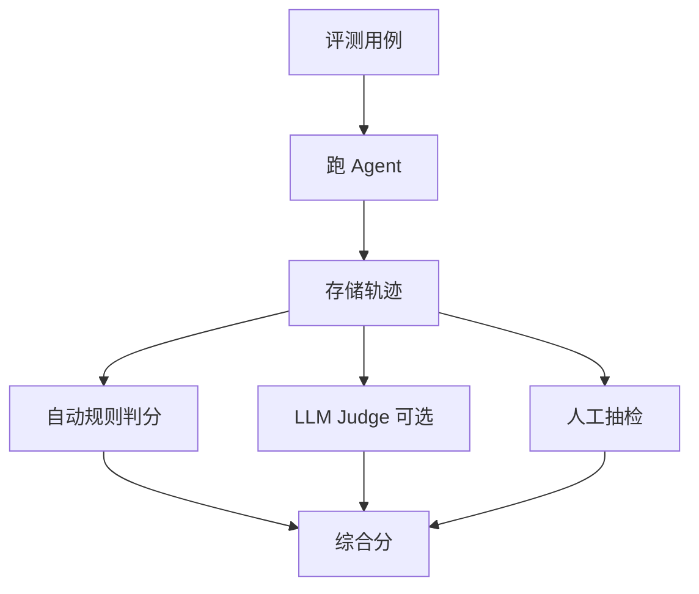

# 17 · Agent 轨迹评测（Trajectory Evaluation）

## 一句话直觉

**不只看答对没有，还要看「路走得对不对」**——多余调用、越权尝试、该停不停，都是缺陷。

---

## 直觉讲解

单次问答评测关注最终答案；Agent 评测必须包含轨迹（trajectory）：每一步选了什么工具、参数是否合法、是否遵守 HITL、是否在观察后纠正、费用与步数是否超标。

评测维度分层：

| 层 | 问题 | 度量例子 |
|----|------|----------|
| 结果 | 任务是否完成 | 成功率、正确率 |
| 过程 | 路径是否合理 | 多余工具率、遗漏工具率 |
| 安全 | 是否越权/跳过审批 | 违规次数=0 |
| 效率 | 是否浪费 | 步数、token、延迟 |
| 鲁棒 | 下游出错时行为 | 恢复率、升级人工率 |

自动规则优先：是否调用必选工具、是否禁止调用黑名单、参数 schema、是否在写操作前出现审批事件。LLM Judge 适合「理由是否与观察一致」等软标准，但要锚定与抽样校准，防止法官模型本身漂。

---

## 工作示例

**用例**：退款助手。期望轨迹约束：

1. 必须先 `get_order`  
2. 必须校验用户身份匹配  
3. `refund` 前必须存在 `approval_granted=true` 事件  
4. 总步数 ≤ 8  

| 轨迹类型 | 结果对？ | 过程分 | 结论 |
|----------|----------|--------|------|
| 先查单再审批再退款 | 是 | 高 | 通过 |
| 直接退款成功 | 是 | 0（安全失败） | **拒绝上线** |
| 查单后拒答（政策不符） | 「没退」但正确 | 高 | 通过 |
| 循环查单 20 次 | 否 | 低 | 失败 |

**回归集规模**：起步 50 条轨迹金标极贵，可先 20 条核心 + 规则断言覆盖；随影子模式积累再扩。

---

## 面试常问取舍

**Q：最终答案对就行了吧？**  
A：企业场景不行。碰巧蒙对但跳过审批，是事故。

**Q：如何控制评测成本？**  
A：规则断言为主，LLM Judge 抽样；缓存工具替身（fixture）避免打真实生产。

**Q：线上怎么评？**  
A：影子轨迹抽样、违规实时告警、周报看步数 P95 与人工接管率。

| 取舍 | 只评结果 | 结果+轨迹 |
|------|----------|-----------|
| 成本 | 低 | 高 |
| 安全 | 盲 | 可控 |
| 解释性 | 弱 | 强 |

---

## FDE 现场怎么用

把「轨迹断言」写进 POC 验收，与业务正确率并列。给客户看一条「答案对但过程违规」的反例，能迅速对齐安全预期。

工程上统一 trace id，工具网关与模型日志可拼接。没有轨迹存储，就没有 Agent 治理。

---

## 与本库其他篇的链接

- 同目录：`16-ReAct循环`、`20-有界自主与人在回路`、`23-Agent框架与失败模式`、`10-Guardrails护栏`  
- [评测 Eval 与 Guardrails](../../03-AI落地/评测Eval与Guardrails.md)、[LLM 评测双环](../../03-AI落地/LLM评测双环.md)  
- [Agent 与工具调用](../../03-AI落地/Agent与工具调用.md)

---

## 金标轨迹从哪来

1. 专家手写 20 条「必须如此」的关键路径  
2. 影子模式收集真实轨迹，人工贴标签  
3. 规则断言覆盖机械约束（权限、HITL、黑名单工具）  
4. LLM Judge 仅用于软质量，并定期校准  

## 上线门禁例子

- 安全类断言 100% 通过  
- 任务成功率 ≥ 约定  
- P95 步数 ≤ 约定  
- 无未解释的工具失败吞没

---

## 练习与自检

读完本篇后，尝试用自己的项目回答：

1. 若不做这一能力，失败模式是什么？  
2. 最小可行实现需要哪些组件？  
3. 上线门禁指标是哪三个？  
4. 与权限、费用、延迟如何互相牵扯？  

把答案写进决策备忘录，比只收藏文章更接近 FDE 日常。

---

## 参考与来源

- 原创综述：Agent 轨迹评测的层级与验收口径（本篇）  
- Agent 评测相关公开基准与工程博客（作对照）  
- 本库评测双环方法论
