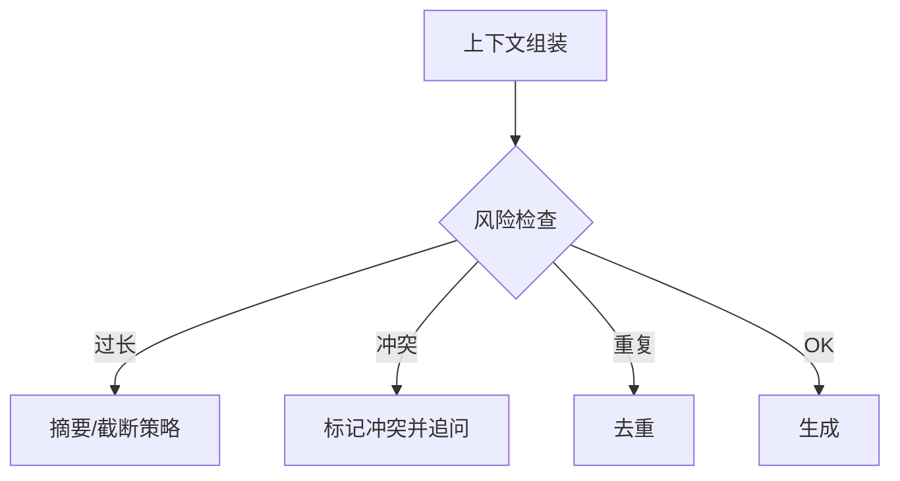

# 19 · 上下文失效模式（Context Failure Modes）

## 一句话直觉

**窗口里「有」不等于模型「用得好」**——塞得越多，越可能忽略中间、混淆来源、被噪声带偏。

---

## 直觉讲解

长上下文与 RAG 组装常见失效模式（FDE 要用案例说话，而不只说「幻觉」）：

| 模式 | 现象 | 诱因 |
|------|------|------|
| 大海捞针失败 | 关键句在长文中间被忽略 | 过长、结构差 |
| 中间丢失 | 首尾记得、中间忘 | 位置偏差 |
| 证据冲突未裁决 | 两段政策相反仍糅合 | 无冲突策略 |
| 来源混淆 | 张冠李戴引用 | 多段拼接无编号 |
| 工具结果淹没 | 早期观察被挤出窗 | 轨迹过长 |
| 提示冲突 | 系统要求拒答，后文又要求必须答 | 模板拼装错误 |
| 重复块污染 | 同一段落出现多次，模型过度自信 | 未去重 |

缓解不是单靠更大窗口：结构化编号证据、强制引用、冲突显式提示、窗口预算、重排提升信噪比、分治子问题。

---

## 工作示例

**案例 1**：把 40 段检索一股脑塞入。正确条款在第 27 段，模型引用了第 2 段过期政策。  
**修复**：重排 top-6；块首加 `[[id=27, as_of=2026-01]]`；系统提示「若日期冲突取最新并声明」。

**案例 2**：Agent 10 步后忘记用户最初约束「只读」。  
**修复**：约束写入不可截断的系统前缀；每步检查点重复「权限模式=只读」。

**案例 3**：同文 3 个重叠切块并列，模型以为「三处都证实」。  
**修复**：指纹去重；父子块只留一。

**小实验**：同一答案，证据放在开头/中间/末尾，测命中率——给客户看比讲论文有效。

---

## 面试常问取舍

**Q：升级到百万 token 窗口能解决吗？**  
A：缓解部分，不消灭；费用与延迟上升，且仍有忽略与冲突问题。

**Q：如何验收组装质量？**  
A：除答案正确率外，看引用准确率、冲突题表现、超长题表现。

**Q：和幻觉关系？**  
A：很多「幻觉」其实是上下文失效或检索错误，先归因再改。

| 取舍 | 多给证据 | 精给证据 |
|------|----------|----------|
| 覆盖 | 高 | 可能漏 |
| 噪声 | 高 | 低 |
| 推荐 | 否作默认 | 重排后的精短包 |

---

## FDE 现场怎么用

坏案例复盘模板强制填「当时上下文里有什么、模型用了什么」。很多争论三轮后会发现是组装问题。

工程指标：`context_tokens`、`dup_chunk_rate`、`citation_precision`、`conflict_cases_accuracy`。

---

## 与本库其他篇的链接

- 同目录：`13-FDE-Agent上下文窗口管理`、`01-RAG检索增强生成`、`05-重排与两阶段检索`、`11-Agent记忆`  
- 面试：`12.超出上下文窗口.md`、`16.rag系统上下文组装.md`、`14.幻觉缓解方案.md`  
- [RAG 实战精要](../../03-AI落地/RAG实战精要.md)

---

## 组装检查清单（发布前）

- [ ] 证据带稳定编号与来源  
- [ ] 近重复已去重  
- [ ] 冲突策略已写进系统提示  
- [ ] 安全前缀不可被截断  
- [ ] 超长时有明确降级顺序  
- [ ] 引用 id 与块表可 join  

## 归因口诀

先分清：检索错 / 组装坏 / 模型忽略证据 / 证据不足却强答。四类对策完全不同。

---

## 练习与自检

读完本篇后，尝试用自己的项目回答：

1. 若不做这一能力，失败模式是什么？  
2. 最小可行实现需要哪些组件？  
3. 上线门禁指标是哪三个？  
4. 与权限、费用、延迟如何互相牵扯？  

把答案写进决策备忘录，比只收藏文章更接近 FDE 日常。

---

## 对照速记

本篇核心可以压成三句话，便于面试或客户沟通临场调用：

1. **问题本质**：本主题要解决的失败是什么。  
2. **默认做法**：企业场景下通常先怎么做。  
3. **升级信号**：什么指标/坏案例出现才加重方案。  

结合上文表格与示例，把这三句话改写成你客户行业的语言；若写不出来，说明概念尚未内化，应回到「工作示例」一节重做一遍角色扮演。

## 落地检查清单

- 是否写清责任人与数据/工具边界  
- 是否有可回归的评测或断言  
- 是否有延迟、费用、权限的明确取舍  
- 是否有失败降级与审计  
- 是否与本库相邻篇目的术语一致  

完成清单后再进入下一概念，避免「篇篇都读过、现场一张嘴却接不上」。

---

## 参考与来源

- 原创综述：上下文组装的失效模式目录与对策（本篇）  
- 「大海捞针」类长上下文评测公开工作  
- 本库幻觉与组装相关面试题
