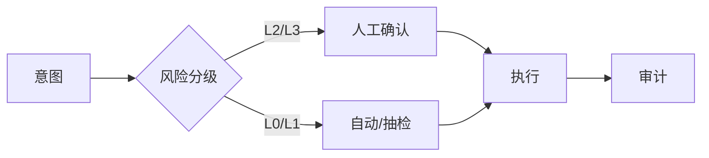

# 20 · 有界自主与人在回路（Bounded Autonomy / HITL）

## 一句话直觉

**自主不是放养，而是「在围栏里跑」**——谁能自动、谁必须人点头，事先写死。

---

## 直觉讲解

有界自主（bounded autonomy）主张：Agent 只在明确的能力、数据、动作与预算边界内决策。人在回路（Human-in-the-Loop, HITL）是边界的强制门禁：高风险动作必须人工批准、介入或事后审计。

| HITL 模式 | 行为 | 适用 |
|-----------|------|------|
| 影子 | 只建议不执行 | 冷启动 |
| 确认 | 展示计划，人批后执行 | 默认高危 |
| 介入 | 关键槽位人填 | 缺信息/高规 |
| 事后审计 | 先跑后抽检 | 仅低危高置信 |

边界清单至少包括：工具白名单、数据范围、最大步数/费用、时间盒、可回滚性、升级路径。没有升级路径的「自主」是假自主。

---

## 工作示例

**场景**：采购助手申请付款。

- 模型可自动生成付款申请草稿（L1）  
- 金额 < 5,000 且供应商白名单：单人批准  
- 金额 ≥ 5,000：双人批准  
- 任何改供应商银行账户：强制人工 + 冻结自动  

**SLA 设计**：HITL 等待超时（如 4h）→ 提醒 → 升级主管 → 任务过期关闭，绝不静默自动批。

**度量**：自动通过率、平均等待、拒绝率、越权拦截次数。自主率上升必须以越权=0 为前提。

---

## 面试常问取舍

**Q：HITL 是否否定 AI 价值？**  
A：否。它把 AI 放在「加速起草与检索」，人放在「责任动作」。这是可卖给风控的叙事。

**Q：怎样避免人变成橡皮图章？**  
A：界面展示风险点与证据；抽样质检审批质量；关键字段变更高亮。

**Q：边界写在哪里？**  
A：策略引擎/配置中心，而不是深埋提示词。

| 取舍 | 高自主 | 高 HITL |
|------|--------|---------|
| 速度 | 快 | 慢 |
| 风险 | 高 | 低 |
| 合规友好 | 差 | 好 |

---

## FDE 现场怎么用

发现访谈直接问：「哪三个动作出错你会上新闻？」那三个默认 HITL。范围与 POC 验收写明分级表。

演示走一条「到确认屏为止」的幸福路径，再走一条「拒绝批准」路径，显示系统会停。

---

## 与本库其他篇的链接

- 同目录：`07-AI-Agent与工具使用`、`10-Guardrails护栏`、`15-Agent-vs-工作流-vs-单次调用`、`17-Agent轨迹评测`  
- [Agent 与工具调用](../../03-AI落地/Agent与工具调用.md)  
- 面试：`19.反对使用智能体理由.md`

---

## 产品文案示例

- 影子：`建议如下（未执行）`  
- 确认：`将执行：退款 ￥120 至原支付方式。批准 / 拒绝`  
- 介入：`请选择收货仓库，系统无法从工单推断`  

文案清晰能降低橡皮图章：人要知道自己在承担什么。

## 度量驾驶舱

自主率、HITL 等待 P50/P95、拒绝率、越权拦截、事后审计发现问题数。自主率单周暴涨要警惕「审批被跳过」。

---

## 练习与自检

读完本篇后，尝试用自己的项目回答：

1. 若不做这一能力，失败模式是什么？  
2. 最小可行实现需要哪些组件？  
3. 上线门禁指标是哪三个？  
4. 与权限、费用、延迟如何互相牵扯？  

把答案写进决策备忘录，比只收藏文章更接近 FDE 日常。

---

## 对照速记

本篇核心可以压成三句话，便于面试或客户沟通临场调用：

1. **问题本质**：本主题要解决的失败是什么。  
2. **默认做法**：企业场景下通常先怎么做。  
3. **升级信号**：什么指标/坏案例出现才加重方案。  

结合上文表格与示例，把这三句话改写成你客户行业的语言；若写不出来，说明概念尚未内化，应回到「工作示例」一节重做一遍角色扮演。

## 落地检查清单

- 是否写清责任人与数据/工具边界  
- 是否有可回归的评测或断言  
- 是否有延迟、费用、权限的明确取舍  
- 是否有失败降级与审计  
- 是否与本库相邻篇目的术语一致  

完成清单后再进入下一概念，避免「篇篇都读过、现场一张嘴却接不上」。

---

## 参考与来源

- 原创综述：有界自主与 HITL 模式目录（本篇）  
- 本库工具分级与人机回环章节  
- 自动化治理的一般工业实践（类比）
