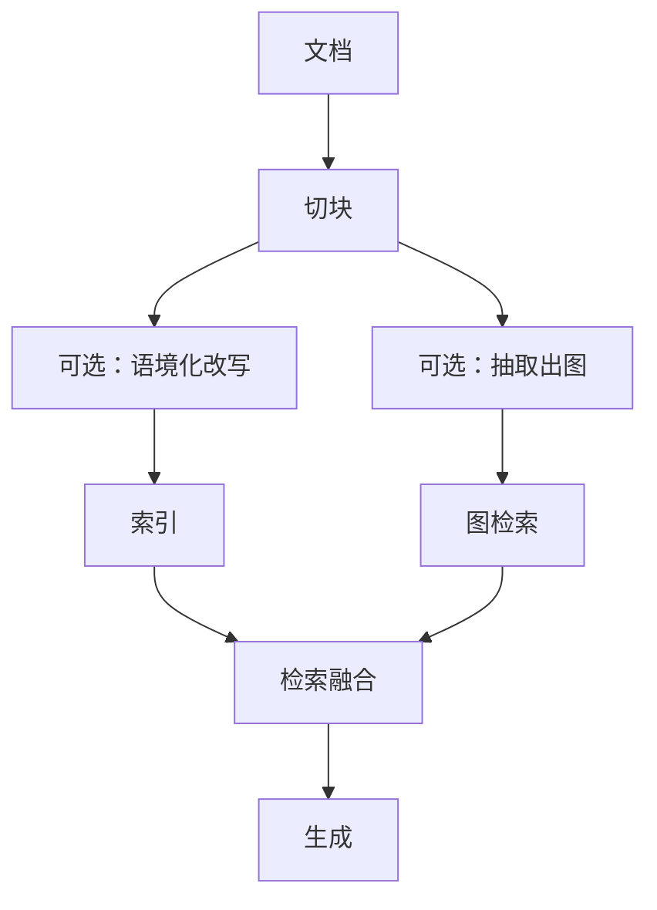

# 21 · GraphRAG 与 Contextual Retrieval

## 一句话直觉

**当「段落相似」不够时，把实体关系与块级上下文补进检索**——用结构对抗碎片化。

---

## 直觉讲解

标准向量 RAG 把世界切成块后，多跳问题（A 的供应商的合规状态？）与「块内缺主语」问题会暴露。两条进阶路线常被提及：

**GraphRAG 类**：从语料抽取实体与关系，形成图谱；检索时沿关系扩展子图，再生成。适合强实体、强关系的知识域。

**Contextual Retrieval 类**：在入索引前，用模型为每个块生成「置于文档中的上下文说明」，再嵌入；减轻块孤立导致的检索失败。

| 路线 | 核心增量 | 成本 | 适用信号 |
|------|----------|------|----------|
| 基础 RAG | 块向量/BM25 | 低 | 单跳事实问答 |
| Contextual | 块前缀语境 | 中（预处理） | 块缺主语、同名混淆 |
| GraphRAG | 实体关系推理 | 高（构建+维护） | 多跳、关系密集 |

不要为了简历关键词一上来上图谱。先用坏案例证明「缺的是关系」还是「缺的是块语境」。

---

## 工作示例

**Contextual 示例**：块原文「该费率自下季度起调整为 0.8%」。语境化后：「《商家支付协议 v4》第二节，针对线上渠道的结算费率……该费率……」。检索「线上结算费率」时命中率上升。

**Graph 示例**：问「供应给项目北极星的厂商是否在处罚名单」。路径：项目→合同→供应商实体→处罚名单节点。纯向量可能只找到项目介绍或名单本身，接不上。

**代价**：图谱抽取有误差，需要治理与版本；语境化要为每块多一次模型预处理与存储。

---

## 面试常问取舍

**Q：GraphRAG 是否取代向量？**  
A：通常是增强。叶子文本仍可能要向量/关键词。

**Q：抽取错了怎么办？**  
A：人审关键类型边；保留回源；生成时声明不确定。

**Q：ROI 怎么估？**  
A：统计评测集中多跳题占比；若 <10%，先把混合+语境化做满。

| 取舍 | 基础+混合 | +Contextual | +Graph |
|------|-----------|-------------|--------|
| 工程量 | 基线 | +1 | +3 |
| 多跳 | 弱 | 弱-中 | 强 |
| 运维 | 低 | 中 | 高 |

---

## FDE 现场怎么用

对客户用两个具体坏问题展示：一个缺主语，一个多跳。能被语境化修好的别承诺图谱大项目。

若上图谱，单列「实体治理」工作流与负责人，否则半年后图谱腐烂比关键词索引还可怕。

---

## 与本库其他篇的链接

- 同目录：`01-RAG检索增强生成`、`04-切块策略Chunking`、`22-查询改写扩展与HyDE`  
- [RAG 实战精要](../../03-AI落地/RAG实战精要.md)

---

## 图谱治理最小集

- 实体类型表与命名规范  
- 边类型白名单  
- 抽取版本与人工校对队列  
- 废止实体的下线流程  
- 图与原文回源链接  

没有治理的 GraphRAG 是第二年的技术债炸弹。

## Contextual 预处理批跑

离线批处理为每块生成语境前缀，写入 `contextualized_text` 再嵌入。源文变更要重算对应块，纳入新鲜度管道。

---

## 练习与自检

读完本篇后，尝试用自己的项目回答：

1. 若不做这一能力，失败模式是什么？  
2. 最小可行实现需要哪些组件？  
3. 上线门禁指标是哪三个？  
4. 与权限、费用、延迟如何互相牵扯？  

把答案写进决策备忘录，比只收藏文章更接近 FDE 日常。

---

## 对照速记

本篇核心可以压成三句话，便于面试或客户沟通临场调用：

1. **问题本质**：本主题要解决的失败是什么。  
2. **默认做法**：企业场景下通常先怎么做。  
3. **升级信号**：什么指标/坏案例出现才加重方案。  

结合上文表格与示例，把这三句话改写成你客户行业的语言；若写不出来，说明概念尚未内化，应回到「工作示例」一节重做一遍角色扮演。

## 落地检查清单

- 是否写清责任人与数据/工具边界  
- 是否有可回归的评测或断言  
- 是否有延迟、费用、权限的明确取舍  
- 是否有失败降级与审计  
- 是否与本库相邻篇目的术语一致  

完成清单后再进入下一概念，避免「篇篇都读过、现场一张嘴却接不上」。

---

## 参考与来源

- 原创综述：何时升级到 Contextual / GraphRAG（本篇）  
- Microsoft GraphRAG 等公开技术报告（概念参考）  
- Anthropic Contextual Retrieval 等公开工程文章（概念参考）
