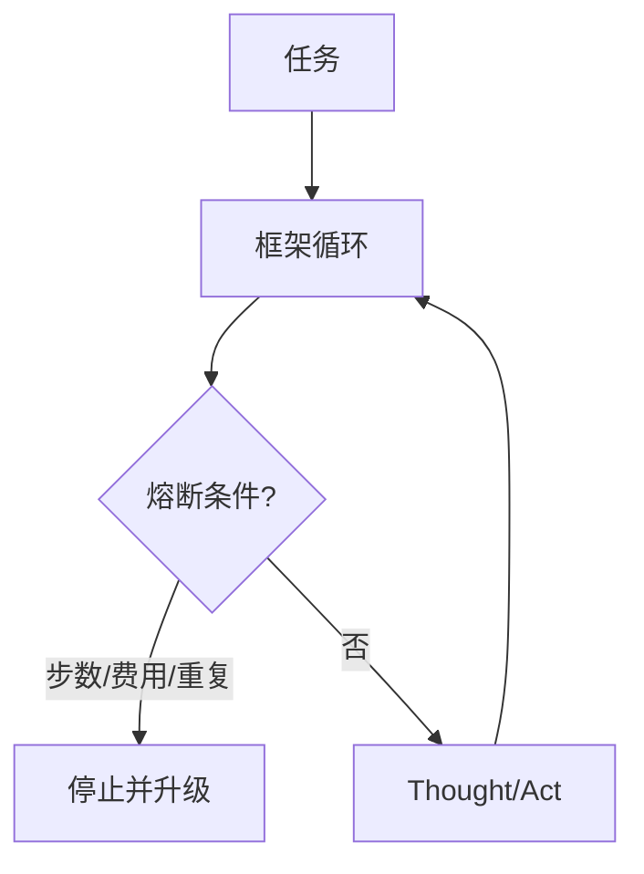

# 23 · Agent 框架与失败模式

## 一句话直觉

**框架能加速搭建，也能加速翻车**——先认清失败模式，再挑品牌。

---

## 直觉讲解

市场上有各类 Agent 框架（编排图、工具注册、记忆、追踪）。FDE 选型应看：可观测性、HITL 支持、权限钩子、超时熔断、与客户栈集成，而不是 demo 华丽度。

高频失败模式目录：

| 模式 | 症状 | 缓解 |
|------|------|------|
| 无限循环 | 反复同一工具 | 步数/重复检测熔断 |
| 幻觉工具 | 调用不存在 API | 严格 schema、校验 |
| 沉默失败 | 忽略 tool error | 强制观察错误分支 |
| 权限漂移 | 服务账号过大 | 用户身份下行 |
| 提示膨胀 | 系统提示冲突 | 模块化与测试 |
| 伪异步 | 阻塞外部调用 | 超时与排队 |
| 框架魔法 | 隐藏控制流难审计 | 选可导出轨迹的框架 |
| 过度拆分 | Agent 过多推诿 | 减少角色、硬编排 |

原则：**框架是实现细节，架构原则（有界、HITL、轨迹、权限）不可框架化掉。**

---

## 工作示例

**案例**：某框架默认「失败自动换工具重试」打爆下游限流，引发联锁 429。  
**修复**：重试策略收归网关；幂等键；对写操作禁止盲目重试。

**案例**：Demo 用内存记忆，生产多副本后「失忆」或「串话」。  
**修复**：外置会话存储，键含 `tenant+user+session`。

**选型表（示意维度）**：本地可调试？支持人工节点？OTLP 追踪？SAC 钩子？许可协议？

---

## 面试常问取舍

**Q：要不要自研框架？**  
A：默认不。缺的能力用薄封装补；自研编排内核极易变成无文档黑洞。

**Q：如何在面试谈框架？**  
A：先谈失败模式与控制点，再提用过的库，显示判断力。

**Q：开源框架安全吗？**  
A：依赖供应链与默认示例配置常过宽，要审默认值。

| 取舍 | 重框架 | 薄自研胶水+工作流 |
|------|--------|-------------------|
| 速度 | 起步快 | 起步中 |
| 控制 | 看框架 | 强 |
| 锁定 | 高 | 低 |

---

## FDE 现场怎么用

架构评审用失败模式清单走查。POC 允许用框架快速验证，进生产前做「控制点核对」：熔断、HITL、审计是否真能用，而不是 README 宣称能用。

---

## 与本库其他篇的链接

- 同目录：`09-多Agent编排`、`16-ReAct循环`、`17-Agent轨迹评测`、`20-有界自主与人在回路`  
- [Google-ADK 与多 Agent 编排](../../03-AI落地/Google-ADK与多Agent编排.md)  
- [Agent 与工具调用](../../03-AI落地/Agent与工具调用.md)  
- 面试：`17.工具调用失败.md`、`19.反对使用智能体理由.md`

---

## 框架采用门禁

- 能否导出完整轨迹？  
- 能否插入 HITL 节点？  
- 默认重试是否威胁写操作？  
- 密钥是否出现在示例里？  
- 许可协议是否兼容交付？  

任一项「否」且短期无法修补，就不要进主干。

## 薄封装建议

业务代码依赖自己的 `ToolGateway` 与 `PolicyEngine` 接口；框架只活在适配层。换框架时不掀桌。

---

## 练习与自检

读完本篇后，尝试用自己的项目回答：

1. 若不做这一能力，失败模式是什么？  
2. 最小可行实现需要哪些组件？  
3. 上线门禁指标是哪三个？  
4. 与权限、费用、延迟如何互相牵扯？  

把答案写进决策备忘录，比只收藏文章更接近 FDE 日常。

---

## 对照速记

本篇核心可以压成三句话，便于面试或客户沟通临场调用：

1. **问题本质**：本主题要解决的失败是什么。  
2. **默认做法**：企业场景下通常先怎么做。  
3. **升级信号**：什么指标/坏案例出现才加重方案。  

结合上文表格与示例，把这三句话改写成你客户行业的语言；若写不出来，说明概念尚未内化，应回到「工作示例」一节重做一遍角色扮演。

## 落地检查清单

- 是否写清责任人与数据/工具边界  
- 是否有可回归的评测或断言  
- 是否有延迟、费用、权限的明确取舍  
- 是否有失败降级与审计  
- 是否与本库相邻篇目的术语一致  

完成清单后再进入下一概念，避免「篇篇都读过、现场一张嘴却接不上」。

---

## 参考与来源

- 原创综述：Agent 框架选型视角与失败模式目录（本篇）  
- 各主流框架官方文档（实现参考）  
- 本库编排与评测文
