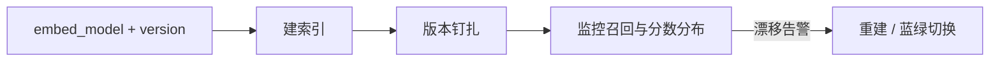

# 24 · Embedding 版本与漂移

## 一句话直觉

**向量空间会换坐标系**——模型一换版，旧索引与新查询不再同一套「意思」，不重建就悄悄变笨。

---

## 直觉讲解

Embedding 模型决定文本如何映射到向量空间。更换模型、同一品牌升级维度/训练数据、甚至归一化方式变化，都会造成**表示漂移（representation drift）**：旧向量与新查询向量不可比，或可比但质量下降。

漂移来源：

| 来源 | 例子 | 后果 |
|------|------|------|
| 模型切换 | A→B 厂商/开源模型 | 必须全量重嵌 |
| 静默升级 | 托管 API 后端变更 | 召回莫名下降 |
| 预处理变更 | 分词、小写、去 HTML | 部分漂移 |
| 领域偏移 | 语料主题大变 | 旧空间不适合新词 |
| 中英混合策略变 | 翻译后再嵌 vs 直接嵌 | 排序分布变 |

工程纪律：索引元数据写入 `embedding_model`, `embedding_version`, `dim`, `metric`；查询路径校验一致；禁止「新模型查旧索引」默默混跑（除非做了对齐层，企业少见）。

---

## 工作示例

**事故复盘（典型）**：托管 embedding 未钉版本，供应商升级后，内部评测 hit@5 从 0.86 掉到 0.71，业务以为「LLM 变笨」。根因在检索。

**处置**：

1. 立即钉回旧版本或切只读旧索引  
2. 用新模型全量重嵌到新 collection  
3. 评测集回归通过后蓝绿切流量  
4. 观察分数分布直方图是否整体平移  

**成本感**：100 万块 × 新模型价，重建可能数百美元到数千美元 + 计算时间；要纳入变更窗口，而不是深夜热改。

**兼容技巧（有限）**：维度相同且官方声称兼容时仍要抽样评测；不要听「drop-in replacement」就跳过回归。

---

## 面试常问取舍

**Q：能否新旧向量混在一个库？**  
A：默认否。空间不同，近邻无意义。分 collection 或全量重建。

**Q：如何监控漂移？**  
A：固定探针查询集的日频 hit/分数分布；嵌入模型版本变更事件告警；业务空结果率。

**Q：微调 embedding 值得吗？**  
A：领域词极强且基线不够时考虑；要版本化与重建流水线先就绪。

| 取舍 | 追新模型 | 钉版本 |
|------|----------|--------|
| 效果上限 | 可能更高 | 稳定 |
| 运维 | 常重建 | 省心 |
| 风险 | 静默回归 | 错过改进 |

---

## FDE 现场怎么用

把 embedding 版本列入变更管理与 Go-Live 检查表。与客户云账号一起关掉「自动升级」。POC 报告写明模型 id 与日期。

交付重建 runbook：谁触发、多久、如何回滚、评测门槛。

---

## 与本库其他篇的链接

- 同目录：`02-向量数据库`、`06-ANN近似最近邻`、`25-索引新鲜度与陈旧窗口`、`01-RAG检索增强生成`  
- [RAG 实战精要](../../03-AI落地/RAG实战精要.md)  
- 面试：`6.什么是embedding语义搜索.md`  
- [生产化清单](../../03-AI落地/生产化清单.md)

---

## 变更日历

| 动作 | 要求 |
|------|------|
| 换 embedding | 双索引 + 评测 + 蓝绿 |
| 改预处理 | 视同换模型，抽样重建 |
| 供应商维护通知 | 进变更评审，探针加频 |

## 探针集

固定 200 查询，每日跑 hit@5 与平均分。跌破阈值自动建工单。比用户先发现漂移。

---

## 练习与自检

读完本篇后，尝试用自己的项目回答：

1. 若不做这一能力，失败模式是什么？  
2. 最小可行实现需要哪些组件？  
3. 上线门禁指标是哪三个？  
4. 与权限、费用、延迟如何互相牵扯？  

把答案写进决策备忘录，比只收藏文章更接近 FDE 日常。

---

## 参考与来源

- 原创综述：Embedding 版本钉扎与漂移监测（本篇）  
- 各托管 Embedding API 的版本与兼容说明  
- 本库生产化清单中的变更控制思想
