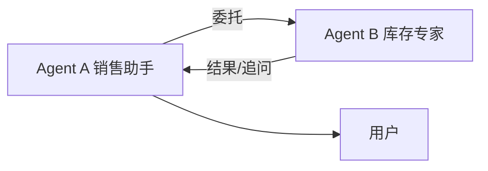

# 26 · A2A 智能体互操作（Agent-to-Agent）

## 一句话直觉

**让不同厂商/团队的 Agent 像服务一样彼此发现与委托任务**——互操作的是协议与信任，不是把两个聊天机器人硬拼在一起。

---

## 直觉讲解

A2A（Agent-to-Agent）泛指智能体之间的标准化协作：发现对方能力、发送任务、同步状态、回传结果。它与「单个应用内多 Agent 编排」不同——后者常在同一进程/同一编排器内；A2A 强调**跨边界**（跨团队、跨厂商、跨安全域）。

需要标准化的点：

| 点 | 问题 |
|----|------|
| 能力描述 | 对方能做什么、输入输出 schema |
| 任务生命周期 | 提交、进行中、需人工、完成、失败 |
| 身份与信任 | 谁在委托、如何鉴权、如何审计 |
| 数据最小化 | 只传完成任务所需上下文 |
| 取消与超时 | 跨组织不能假设永远在线 |

A2A **不消解**权限与 HITL：跨 Agent 委托写操作时，责任边界要合同化——是 A 的用户授权，还是 B 侧二次审批。

---

## 工作示例

**场景**：采购 Agent 向合规 Agent 发起「供应商 X 能否下单」咨询。

1. 发现合规 Agent 的能力卡片（同步检查、需哪些字段）  
2. 发送最小数据包：供应商 id、品类、国家  
3. 合规返回：`allow/deny + reason_code + policy_refs`  
4. 采购侧再决定是否进入下单 HITL  

**反模式**：把完整客户对话转录甩给外部 Agent；或链式委托失去审计（A→B→C 后无人能回答为何下单）。

**与 MCP 关系**：MCP 偏「模型应用连接工具/资源」；A2A 偏「Agent 对 Agent 委托」。可并存：每个 Agent 内部用 MCP 连工具，对外用 A2A 会话。

---

## 面试常问取舍

**Q：已经有多 Agent 框架了还要 A2A 吗？**  
A：框架内编排够用就不上。出现跨产品、跨供应商边界再评估互操作协议。

**Q：安全怎么做？**  
A：mTLS/OAuth、受众限制、payload 脱敏、委托范围令牌、全链路 trace id。

**Q：失败谁负责？**  
A：事先定义：超时、部分成功、人工接管的归属与用户可见文案。

| 取舍 | 单体多 Agent | 跨界 A2A |
|------|--------------|----------|
| 集成快 | 是 | 否 |
| 组织扩展 | 弱 | 强 |
| 攻击面 | 较小 | 较大 |

---

## FDE 现场怎么用

客户若提「生态互操作/多智能体市场」，先做威胁模型与责任矩阵，再谈协议选型。POC 用两个内部 Agent 模拟 A2A，把审计打通，比接公开 demo 更有价值。

关注公开协议演进，但落地以企业网关为中心，避免 Agent 点对点裸连。

---

## 与本库其他篇的链接

- 同目录：`09-多Agent编排`、`14-MCP模型上下文协议`、`28-AG-UI协议`、`29-AP2智能体支付协议`  
- [Google-ADK 与多 Agent 编排](../../03-AI落地/Google-ADK与多Agent编排.md)  
- [Agent 与工具调用](../../03-AI落地/Agent与工具调用.md)

---

## 信任域

跨组织 A2A 默认不互信。通过：

- 明确受众的令牌  
- 能力范围声明（只能答合规，不能下单）  
- 数据分类标签（禁止传 PII 字段）  
- 双向审计导出  

## 产品形态

「Agent 市场」若无评审，会变成影子 IT。沿用内部 API 上市流程：分级、SLA、负责人、下线策略。

---

## 练习与自检

读完本篇后，尝试用自己的项目回答：

1. 若不做这一能力，失败模式是什么？  
2. 最小可行实现需要哪些组件？  
3. 上线门禁指标是哪三个？  
4. 与权限、费用、延迟如何互相牵扯？  

把答案写进决策备忘录，比只收藏文章更接近 FDE 日常。

---

## 对照速记

本篇核心可以压成三句话，便于面试或客户沟通临场调用：

1. **问题本质**：本主题要解决的失败是什么。  
2. **默认做法**：企业场景下通常先怎么做。  
3. **升级信号**：什么指标/坏案例出现才加重方案。  

结合上文表格与示例，把这三句话改写成你客户行业的语言；若写不出来，说明概念尚未内化，应回到「工作示例」一节重做一遍角色扮演。

## 落地检查清单

- 是否写清责任人与数据/工具边界  
- 是否有可回归的评测或断言  
- 是否有延迟、费用、权限的明确取舍  
- 是否有失败降级与审计  
- 是否与本库相邻篇目的术语一致  

完成清单后再进入下一概念，避免「篇篇都读过、现场一张嘴却接不上」。

---

## 参考与来源

- 原创综述：A2A 的企业问题框架与和 MCP 的分工（本篇）  
- 业界 Agent 互操作相关公开规范/公告（跟进官方文本）  
- 本库多 Agent 编排文
