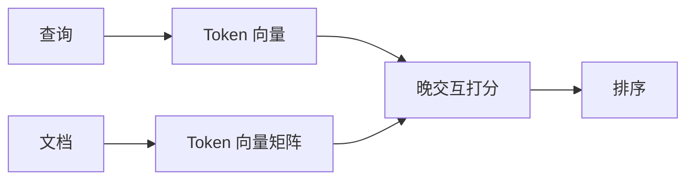

# 27 · ColBERT 与晚交互检索（Late Interaction）

## 一句话直觉

**不只把整段压成一个向量，而是保留词级向量，查询时再交互打分**——在效果与速度之间找中间地带。

---

## 直觉讲解

双编码器（bi-encoder）把查询与文档各自压成单向量，算一次相似度，快但细粒度交互弱。交叉编码器（cross-encoder）把查询和文档拼在一起深度交互，准但难以直接扫库。ColBERT 类「晚交互（late interaction）」：文档侧预存 token 级向量；查询时用查询 token 向量与文档 token 向量做最大相似聚合（如 MaxSim），兼顾一定交互与可预计算索引。

| 方法 | 交互强度 | 索引形态 | 延迟 |
|------|----------|----------|------|
| 双编码器 | 低 | 单向量/文档 | 低 |
| ColBERT 类 | 中（晚交互） | 多向量/文档 | 中 |
| 交叉编码器 | 高 | 通常作重排 | 高（宜小 N） |

适用信号：专有名词、部分匹配、双编码器老漏、又希望比纯交叉编码器扫库更可扩展。代价是索引体积显著变大（每文档多向量），运维更重。

---

## 工作示例

**场景**：零部件手册，查询「M6 不锈钢 法兰面 螺栓 防松」。双编码器常被「不锈钢螺栓」大类带偏；晚交互更可能对齐「法兰面」「防松」等关键 token。

**工程要点**：

- 存储：压缩（如量化）几乎必做  
- 检索：先用廉价召回（BM25/双编码）缩候选，再 ColBERT 打分，或用专用索引  
- 评测：看专有名词子集提升是否配得起存储  

**数字感（示意）**：索引体积可能达单向量方案的数倍到一个数量级；换来几个点的 nDCG 是否值得，要用客户语料回答。

---

## 面试常问取舍

**Q：有了 reranker 还要 ColBERT 吗？**  
A：reranker 作用于小候选集；ColBERT 可改善第一阶段或中间阶段排序。先把混合+重排做满，再评估。

**Q：实现难吗？**  
A：比 pgvector 默认可高。除非效果瓶颈明确，POC 不必首周上。

**Q：和 SPLADE 等稀疏神经检索？**  
A：同属「超越朴素双编码」家族，选型看生态与运维，不是概念站队。

| 取舍 | 双编码+重排 | +ColBERT |
|------|-------------|----------|
| 运维 | 熟 | 重 |
| 细粒度 | 中 | 较强 |
| 存储 | 小 | 大 |

---

## FDE 现场怎么用

仅在基线评测证明「专名/多关键词」仍弱时立项。向客户诚实沟通存储与复杂度。可先用托管/现成实现做离线对比，不要自研内核。

---

## 与本库其他篇的链接

- 同目录：`05-重排与两阶段检索`、`03-混合检索Hybrid-Search`、`06-ANN近似最近邻`、`12-TF-IDF与BM25`  
- [RAG 实战精要](../../03-AI落地/RAG实战精要.md)

---

## 何时试点

满足多数再开：

- 混合+重排后专名题仍明显弱  
- 有预算支撑更大索引  
- 团队能运维多向量索引  
- 有离线对比环境  

## 与两阶段兼容

常见：BM25/双编码召回 200 → ColBERT 打分取 50 → 交叉编码重排取 5。层级越多越要逐级熔断。

---

## 练习与自检

读完本篇后，尝试用自己的项目回答：

1. 若不做这一能力，失败模式是什么？  
2. 最小可行实现需要哪些组件？  
3. 上线门禁指标是哪三个？  
4. 与权限、费用、延迟如何互相牵扯？  

把答案写进决策备忘录，比只收藏文章更接近 FDE 日常。

---

## 对照速记

本篇核心可以压成三句话，便于面试或客户沟通临场调用：

1. **问题本质**：本主题要解决的失败是什么。  
2. **默认做法**：企业场景下通常先怎么做。  
3. **升级信号**：什么指标/坏案例出现才加重方案。  

结合上文表格与示例，把这三句话改写成你客户行业的语言；若写不出来，说明概念尚未内化，应回到「工作示例」一节重做一遍角色扮演。

## 落地检查清单

- 是否写清责任人与数据/工具边界  
- 是否有可回归的评测或断言  
- 是否有延迟、费用、权限的明确取舍  
- 是否有失败降级与审计  
- 是否与本库相邻篇目的术语一致  

完成清单后再进入下一概念，避免「篇篇都读过、现场一张嘴却接不上」。

---

## 参考与来源

- 原创综述：晚交互检索在企业 RAG 升级路径中的位置（本篇）  
- Khattab & Zaharia — ColBERT 论文  
- 后续压缩/演进变体的公开实现文档
