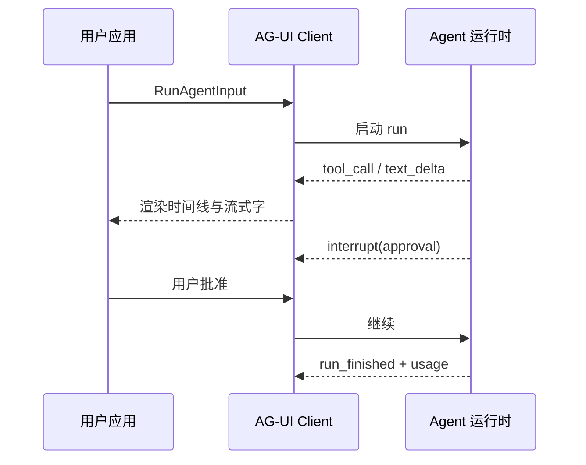

# 28 · AG-UI 协议（Agent–User Interaction）

## 一句话直觉

**Agent ↔ 用户界面需要专用事件协议**——流式文本只是事件之一；工具进度、HITL 审批、子 Agent、中断与用量都要可类型化、可调试地推到前端。

---

## 直觉讲解

请求/响应式 REST 聊天 API 假设「一次问、一次答」。真实 Agent 却是**长时、部分完成、可打断**的：可能先调三个工具、中途要你批准退款、再流式解释政策。没有标准事件层，每个项目都会私造一套 WebSocket JSON，前端无法复用，线上也难复盘。

**AG-UI（Agent–User Interaction Protocol）** 是开放的、偏事件驱动的规范（CopilotKit 团队推动，并与多家 Agent 框架对接）：把「任意 Agent 后端」接到「任意用户面应用」。传输可 SSE / WebSocket / webhook 等，核心是**类型化事件流**，而不是绑定某一家 UI。

与相邻协议的分工（面试必背）：

| 层 | 协议 | 解决什么 |
|----|------|----------|
| Agent ↔ 工具/数据 | **MCP** | 向下接工具与资源 |
| Agent ↔ Agent | **A2A** | 侧向协作、跨组织委托 |
| Agent ↔ 用户应用 | **AG-UI** | 向上把状态与交互推到 UI |
| 生成式 UI 部件 | **A2UI**（勿与 AG-UI 混淆） | Agent 下发可渲染组件描述 |

AG-UI 1.0（公开材料）强调：JSON Schema 锚定的稳定事件规范、多 SDK 生成、子 Agent、metadata、多模态工具结果、**interrupt（中断）**、token usage 等，并保持与 0.x 双向兼容。

典型事件族（概念层，名称随规范演进）：

| 类别 | 例子 | 用户感知 |
|------|------|----------|
| 生命周期 | run started / finished | 会话是否在跑 |
| 文本流 | text delta | 降低感知延迟 |
| 工具 | tool call / result | 「正在查订单」 |
| HITL | interrupt / approval | 审批卡、改参数 |
| 状态 | state snapshot / delta | 表单草稿可恢复 |
| 可观测 | usage / error | 费用与排障 |

---

## 工作示例

**场景：企业退款 Agent（React + 任意后端）**

1. 前端用 AG-UI 兼容 client 提交 `RunAgentInput`（消息、工具定义、会话 id）  
2. 收到 `tool_call:get_order` → 骨架屏 + 工具时间线  
3. 流式政策解释（`text_delta`）  
4. `interrupt` 弹出金额/风险摘要审批卡（不是让用户在聊天里打「yes」）  
5. 批准后继续；`usage` 写入审计；失败可 `cancelled` 并保留可重放快照  

**对比失败模式**：只推最终 Markdown——30 秒沉默、审批靠自然语言、前端无法区分「在想」还是「挂了」。

**安全**：事件里脱敏工具参数；审批卡只展示人该看的字段；HITL 决策写审计，不写进可被注入的自由文本历史当唯一真相。

---

## 面试常问取舍

**Q：和「开个 SSE 推 token」有何不同？**  
A：SSE 是传输；AG-UI 是**语义事件模型**（工具、中断、状态、用量）。可以自研轻量 schema，但面试要说清事件族，而不是「我们也流式了」。

**Q：必须上 CopilotKit 吗？**  
A：不必。协议开放；CopilotKit 是一等客户端。客户若已有设计系统，可只采纳事件契约 + 自研组件。

**Q：与 MCP/A2A 同时出现怎么讲？**  
A：画三层表：MCP 向下、A2A 侧向、AG-UI 向上。FDE 交付常三者同时出现在一张架构图里。

| 取舍 | 私有 WebSocket | AG-UI 类事件协议 |
|------|----------------|------------------|
| 上线速度（单项目） | 快 | 中 |
| 跨项目前端复用 | 差 | 好 |
| HITL / 可观测 | 易腐化 | 可标准化 |
| 厂商锁定 | 自锁 | 规范可迁移 |

---

## FDE 现场怎么用

- 产品 + 前端 Kickoff 先锁**事件清单与 HITL 点**，再选框架。  
- POC 最低配：流式文本 + 工具时间线 + 一次审批 interrupt。  
- 把 `usage` 与 `run_id` 打进现有可观测栈（与「AI 可观测性」篇对齐）。  
- 移动端与无障碍：审批不可只靠悬停；长任务要可回前台用 snapshot 恢复。  
- 勿把 AG-UI 与 Google 的 **A2UI**（生成式 UI 描述）口头搞混——面试官会追问。

---

## 与本库其他篇的链接

- 同目录：[14-MCP模型上下文协议](./14-MCP模型上下文协议.md)、[26-A2A智能体互操作](./26-A2A智能体互操作.md)、[20-有界自主与人在回路](./20-有界自主与人在回路.md)、[16-ReAct循环](./16-ReAct循环.md)  
- [Agent 与工具调用](../../03-AI落地/Agent与工具调用.md)  
- 生产：[AI系统可观测性](../04-生产系统设计/06-AI系统可观测性.md)

---

## 参考与来源

| 来源 | 链接 | 本篇用法 |
|------|------|----------|
| AG-UI 概述（CopilotKit Docs） | https://docs.copilotkit.ai/ag-ui/introduction | 协议定位与三层对照 |
| AG-UI 1.0 公告 | https://www.copilotkit.ai/blog/introducing-ag-ui-1-0 | 稳定规范、interrupt、usage |
| ag-ui-protocol/ag-ui | https://github.com/ag-ui-protocol/ag-ui | 开源实现入口 |
| 本文 | — | 原创综述：FDE 现场事件化 UI 的取舍 |
