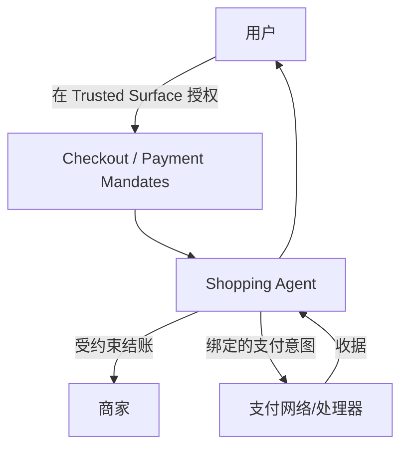

# 29 · AP2 智能体支付协议（Agent Payments Protocol）

## 一句话直觉

**Agent 真要碰钱时，不能靠「工具里调一下支付 API」**——需要可验证的用户授权（Mandate）、与结账内容绑定的支付意图，以及人在场/不在场两套模式。

---

## 直觉讲解

当购物 Agent 从「推荐商品」走到「代为下单/支付」，失败模式从幻觉升级为**资金损失与合规事故**。卡组织与风控看到的是「没有人类在场的交易」；应用层 if 挡不住提示注入改价、重复扣款、越权商户。

**AP2（Agent Payments Protocol）** 是 Google 等与支付生态方推动的开放协议（2025-09 前后公开），支付方式无关（卡、银行、稳定币扩展等），可与 **A2A**、**MCP**、以及商务层协议（如 UCP）配合。核心不是又一个 checkout UI，而是：

| 构件 | 作用 |
|------|------|
| **Checkout Mandate** | 密码学证明：购物 Agent 被授权提交该笔结账内容 |
| **Payment Mandate** | 证明：被授权为该结账付款；与 Checkout JWT 哈希绑定 |
| **Trusted Surface** | 用户真正同意的界面（展示约束、金额、商户） |
| **约束条件** | 金额上限、白名单商户/支付工具、有效期、是否可复发等 |
| **人在场 / 自主** | Human-present vs Autonomous（后者需更紧的 open mandate + 公钥绑定） |

Mandates 使用可验证凭证风格材料（公开规范讨论 SD-JWT 等），让商户、凭证提供方、网络方能**独立验证**「这不是模型随口说的同意」。

与「函数调用 `charge_card`」的差别：多了**协议级、可验证、可约束、可审计**的授权，而不是仅依赖应用服务器信任模型输出。

---

## 工作示例

**场景：差旅 Agent 代订机票（人在场）**

1. 用户在 Trusted Surface 批准：上限 ¥2000、航司白名单、仅经济舱、24h 有效  
2. Agent 选定航班 → 固化 Checkout（内容哈希）→ 请求 Checkout Mandate  
3. 生成与之绑定的 Payment Mandate  
4. 若注入攻击试图改商务舱或抬价 → 与已签名结账哈希不一致 → 校验失败  
5. 成功后写不可抵赖收据；Agent **不持有**用户完整卡号，只持委托范围内的支付能力  

**自主模式（Human not present）**：用户预先签发 **open** Mandate（含 Agent 公钥 `cnf`、紧 `exp`、预算/商户约束）。适合「票价掉到 X 自动买」——FDE 必须把约束写死，并默认更短有效期。

**攻击面清单（POC 验收用）：**

- 提示注入「忽略上限」  
- 篡改购物车金额/税  
- 重复提交同一意图（缺幂等）  
- 过期 Mandate 仍被接受  
- 演示测试卡密钥残留进生产  

---

## 面试常问取舍

**Q：内部「预算占用」也要 AP2 吗？**  
A：内部至少要 HITL + 审计 + 幂等；真进出外部资金网络、卡组织可见「无人交易」时，再评估 AP2 类协议。面试讲**要件表**比背缩写重要。

**Q：和 MCP 支付工具冲突吗？**  
A：不冲突。MCP 暴露「能调用的能力」；AP2 约束「这笔钱凭什么能动」。常一起出现在架构图。

**Q：POC 用测试卡直连？**  
A：可以，但成功标准必须包含：超限失败、篡改失败、重复支付失败、撤销成功；正式路径换委托模型，防演示代码残留。

| 取舍 | 应用层确认按钮 | AP2 类协议 |
|------|----------------|------------|
| 速度 | 快 | 慢（法务/支付方） |
| 防篡改与不可抵赖 | 弱 | 强 |
| 生态互操作 | 自建 | 面向网络与商家标准 |
| 自主下单 | 高风险 | 有 open mandate 约束模型 |

---

## FDE 现场怎么用

1. 路线图一旦出现「自动下单 / 代付 / 自动续费」，立项日拉支付安全、法务、财务。  
2. 架构评审用要件表（授权、意图绑定、最小权限、可撤销、审计、HITL），不贴「我们支持 AP2」空标签。  
3. Agent **永不**日志打印完整支付工具细节；Mandate 与收据进审计存储。  
4. 金额用最小货币单位；税费/汇率是否计入上限写进意图快照。  
5. 清结算仍走原财务系统——协议管授权与意图，不让 Agent「发明」会计分录。

---

## 与本库其他篇的链接

- 同目录：[20-有界自主与人在回路](./20-有界自主与人在回路.md)、[10-Guardrails护栏](./10-Guardrails护栏.md)、[26-A2A智能体互操作](./26-A2A智能体互操作.md)、[14-MCP模型上下文协议](./14-MCP模型上下文协议.md)  
- 安全：[IAM与最小权限](../08-AI安全隐私与治理/12-IAM与最小权限.md)、[审计轨迹与可追溯](../08-AI安全隐私与治理/04-审计轨迹与可追溯.md)  
- [Agent 与工具调用](../../03-AI落地/Agent与工具调用.md)

---

## 参考与来源

| 来源 | 链接 | 本篇用法 |
|------|------|----------|
| Google Cloud：Announcing AP2 | https://cloud.google.com/blog/products/ai-machine-learning/announcing-agents-to-payments-ap2-protocol | 协议定位与生态 |
| AP2 Specification | https://ap2-protocol.org/ap2/specification/ | Mandate 模型与人在场/自主模式 |
| Payment Mandate | https://ap2-protocol.org/ap2/payment_mandate/ | 约束与绑定 |
| github.com/google-agentic-commerce/AP2 | https://github.com/google-agentic-commerce/ap2 | 参考实现 |
| 本文 | — | 原创综述：FDE 碰资金时的要件与验收 |
