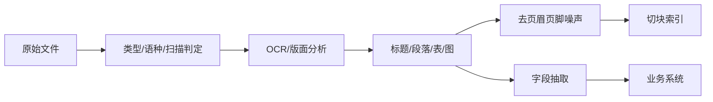

# 31 · 文档解析与抽取（Document Parsing & Extraction）

## 一句话直觉

**进不了干净文本层，后面的向量与 Agent 全是垃圾进垃圾出**——解析是 RAG 的第一公里。

---

## 直觉讲解

企业语料充满扫描 PDF、复杂版面、嵌套表格、页眉页脚、图片中的字、邮件附件、PPT。解析（parsing）负责变成结构化文本/块；抽取（extraction）负责拉出字段级信息（金额、日期、当事人）。两者常流水线串联，但 KPI 不同。

| 难点 | 表现 | 对策 |
|------|------|------|
| 扫描件 | 乱码、栏乱序 | 版面模型+人工抽检 |
| 表格 | 单元格错位 | 表结构保留/转 CSV 文本 |
| 多栏 | 阅读顺序错 | 阅读顺序模型 |
| 页眉页脚 | 污染每一块 | 模板去除 |
| 图片字 | 漏信息 | OCR 或多模态 |
| 加密/损坏 | 管道失败 | 检疫区与死信队列 |

解析质量应用**字段级/结构级指标**衡量，而不是「能吐出字就行」。

---

## 工作示例

**RAG 案例**：合同 PDF 双栏，错误阅读顺序把甲方义务接到乙方段。检索命中后模型给出相反责任方。  
**修复**：版面阅读顺序校正 + 条款对象化切块 + 抽检。

**抽取案例**：发票字段抽取进费控。指标：字段 F1、关键字段（金额、税号）零容忍错误、人工复核队列。

**管道 SLA**：解析失败率、平均页耗时、人工回退比例。与索引新鲜度联动：解析堵塞 = 检索陈旧。

---

## 面试常问取舍

**Q：多模态模型直接读 PDF 能否替代解析索引？**  
A：适合小规模交互式阅读；大规模检索仍需要可索引文本层与成本可控管道。

**Q：解析用开源还是商业？**  
A：用客户样例集盲测表格/扫描件；总成本含人工纠正。

**Q：抽取用 LLM 还是规则？**  
A：版式稳定用规则/模板；长尾用 LLM+校验；关键字段双通道。

| 取舍 | 快而糙 | 慢而准 |
|------|--------|--------|
| POC | 常见 | — |
| 生产合同/财务 | 危险 | 必要 |

---

## FDE 现场怎么用

进场第一周就要样例文件包（含「最脏」的 20 份）。解析 POC 与生成 POC 分开验收，避免生成尚可掩盖解析很差。

范围里写清支持的文件类型与明确不支持的类型，防范围蔓延。

---

## 与本库其他篇的链接

- 同目录：`04-切块策略Chunking`、`01-RAG检索增强生成`、`25-索引新鲜度与陈旧窗口`、`30-Text-to-SQL`  
- [RAG 实战精要](../../03-AI落地/RAG实战精要.md)  
- [生产化清单](../../03-AI落地/生产化清单.md)

---

## 样例集构成

- 5 份标准数字 PDF  
- 5 份扫描件  
- 5 份复杂表  
- 5 份 PPT/邮件  
- 5 份「客户以为很简单其实很脏」的文件  

每份标注期望标题树与 3 个关键字段。招标式对比解析供应商。

## 与切块合同

解析输出 schema 稳定后，切块才能稳定。二者接口版本化，避免解析升级默默改阅读顺序导致全库脏。

---

## 练习与自检

读完本篇后，尝试用自己的项目回答：

1. 若不做这一能力，失败模式是什么？  
2. 最小可行实现需要哪些组件？  
3. 上线门禁指标是哪三个？  
4. 与权限、费用、延迟如何互相牵扯？  

把答案写进决策备忘录，比只收藏文章更接近 FDE 日常。

---

## 对照速记

本篇核心可以压成三句话，便于面试或客户沟通临场调用：

1. **问题本质**：本主题要解决的失败是什么。  
2. **默认做法**：企业场景下通常先怎么做。  
3. **升级信号**：什么指标/坏案例出现才加重方案。  

结合上文表格与示例，把这三句话改写成你客户行业的语言；若写不出来，说明概念尚未内化，应回到「工作示例」一节重做一遍角色扮演。

## 落地检查清单

- 是否写清责任人与数据/工具边界  
- 是否有可回归的评测或断言  
- 是否有延迟、费用、权限的明确取舍  
- 是否有失败降级与审计  
- 是否与本库相邻篇目的术语一致  

完成清单后再进入下一概念，避免「篇篇都读过、现场一张嘴却接不上」。

---

## 参考与来源

- 原创综述：企业文档解析与抽取的职责、指标与管道（本篇）  
- OCR / 版面分析开源与商业引擎文档（选型实测）  
- 本库 RAG 实战精要中的语料治理观点
