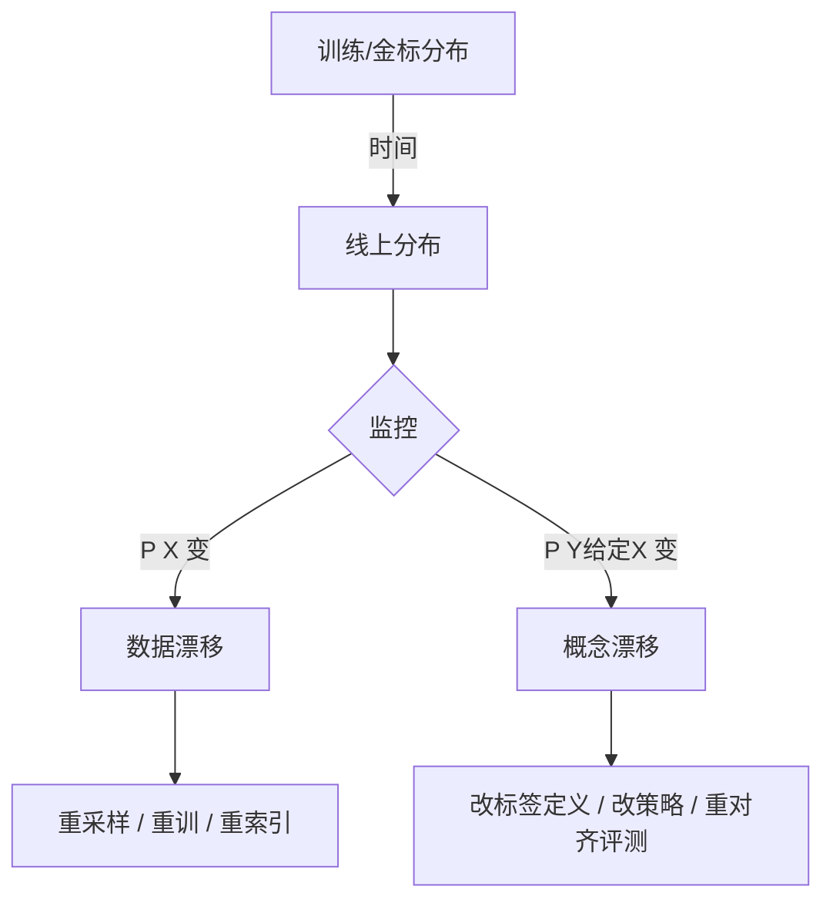

# 数据漂移与概念漂移

一句话直觉：模型没变，世界变了——要么输入分布挪了（数据漂移），要么「输入→标签」的规则变了（概念漂移）；不监测就会静悄悄变差。

## 直觉讲解

生产模型的隐含假设是：**上线时见过的数据分布，大致等于未来流量**。漂移打破这个假设。

| 类型 | 变了什么 | 典型信号 | 例子 |
|------|----------|----------|------|
| 协变量漂移（数据漂移） | \(P(X)\) | 特征/查询分布偏移，标签规则可仍成立 | 促销季查询词变了；新机型日志格式变了 |
| 标签漂移 | \(P(Y)\) | 正负类比例变了 | 欺诈比例季节性波动 |
| 概念漂移 | \(P(Y\|X)\) | 同样输入，正确标签变了 | 「高风险」政策改了；产品 SKU 语义重定义 |
| 先验/渠道漂移 | 流量来源结构 | 渠道占比、语言、设备变了 | 海外客服突然占 40% |

LLM / RAG 场景里，漂移常伪装成：

- **语料与文档陈旧**：索引还是 Q1，业务已改价；
- **提示与工具契约漂移**：下游 API 字段改名；
- **用户意图迁移**：从「查政策」变成「要改单」；
- **评测集失真**：金标还在考旧答案。

关键区分：**数据漂移**往往还能靠「同规则 + 新数据」修复；**概念漂移**必须先更新「什么叫对」，再谈重训或改提示。

## 工作示例（数字/场景）

**场景 A：分类模型（工单优先级）**

上线时「紧急」约占 8%。三个月后紧急占比到 22%，且「紧急」定义从「4 小时内」改成「当日」。

| 现象 | 解读 | 动作 |
|------|------|------|
| 特征 PSI 升高 | 数据漂移 | 重平衡训练集、校准阈值 |
| 同样描述，人工标注从「普通」变「紧急」 | 概念漂移 | 先改标注指南与金标，再训 |
| 准确率掉 5pt，但召回升 | 可能标签先验变了 | 看按类 F1，别只看 accuracy |

**场景 B：RAG 客服**

周报显示「答案相关性」持平，但「忠实度」下滑：模型开始引用已废止的退货政策。根因是**文档漂移**（源系统改了，索引未跟上），属于广义的数据/知识漂移，不是权重坏了。

现场动作：

1. 文档 `updated_at` 与索引新鲜度看板；
2. 金标里放「政策变更」切片，每周回归；
3. 命中旧 doc_id 的回答打「陈旧」标签进错误本。

**场景 C：LLM 提示系统**

同一提示在供应商模型小版本升级后，JSON 破坏率从 1% 升到 7%。这是**模型侧行为漂移**（供应商换代），处理见本轨 [06-模型版本与迁移](./06-模型版本与迁移.md)，但监控手段与数据漂移共用：分布 + 质量代理指标。

## 面试常问取舍

1. **统计检验（KS/PSI）vs 业务指标（采纳率/升级率）**  
   - 统计灵敏、可早发现；业务更「真」。取舍：统计做哨兵，业务做裁决。

2. **自动重训 vs 人工确认概念是否变了**  
   - 纯数据漂移可更激进重训；概念漂移盲目重训会固化错误标签。

3. **窗口对比（本周 vs 上线基线）vs 滑动对比（本周 vs 上周）**  
   - 对基线能抓慢漂；对上周能抓突变。两者都要。

4. **特征空间监控 vs 嵌入空间监控（LLM）**  
   - 传统 ML 盯特征；LLM 可盯查询 embedding 聚类迁移 + 输出 schema 失败率。

## FDE 现场怎么用

- **立项**：写清「漂移假设」——哪些字段会变、谁拥有标签定义、索引 SLA。  
- **看板最小集**：输入分布（语言/意图/长度）、质量代理（升级率、拒答率、schema 失败）、知识新鲜度。  
- **告警**：先定「可行动」阈值（如金标切片掉点 >2pt 且持续 3 天），避免 PSI 噪音轰炸。  
- **响应剧本**：漂移告警 → 抽 50 条人工复审 → 判定数据/概念 → 走重训、重标、重索引或改提示。  
- **合同语言**：把「数据分布显著变化时需重新验收」写进运维附录，避免无限期免费救火。

## 与本库其他篇的链接

- 同轨：[04-模型监控](./04-模型监控.md)、[07-Eval回归套件与CI门禁](./07-Eval回归套件与CI门禁.md)  
- 评测：[金标数据集与Eval集](../03-评测与ML基础/06-金标数据集与Eval集.md)、[离线vs在线评测](../03-评测与ML基础/12-离线vs在线评测.md)  
- 检索：[索引新鲜度与陈旧窗口](../02-检索与Agent/25-索引新鲜度与陈旧窗口.md)、[Embedding版本与漂移](../02-检索与Agent/24-Embedding版本与漂移.md)  
- 落地：[生产化清单](../../03-AI落地/生产化清单.md)（观测与质量门禁）

## 课堂小结

漂移不是「模型老化」玄学，而是分布假设被现实打破。FDE 要会三分：测得到、分得清（数据 vs 概念）、改得对（重训 / 重标 / 重索引）。下一篇谈模型如何在注册表里晋级，避免「笔记本里的 pickle」直接进生产。

## 深入：如何下手做检测

### 传统表格特征
- **PSI / KS / 均值方差**：对数值与分箱类别特征做周对比；设「观察带」与「行动带」。
- **训练-服务倾斜检查**：同一特征在离线样本与线上日志的缺失率、默认值是否一致。
- **切片**：按渠道、地区、产品线分别看，全局平均会掩盖局部崩盘。

### LLM / RAG
- 查询长度、语言、意图聚类中心距离；
- 检索空结果率、Top 文档年龄；
- 输出侧：schema 失败、拒答、引用缺失、工具超时被吞。

### 概念漂移的「便宜探针」
每周抽 30–50 条做盲标（或双人复核），算与线上自动标签/模型输出的一致率。一致率塌了且输入 PSI 不大 → 优先怀疑概念或标注定义变更。

### 现场检查清单
- [ ] 基线分布快照已存（上线日或金标冻结日）
- [ ] 数据 vs 概念 的判定剧本写进 Runbook
- [ ] 索引/文档新鲜度与模型监控同一值班看板
- [ ] 告警可行动（附抽样链接），非纯统计噪音
- [ ] 合同或运维附录含「分布显著变化需重验收」

### 常见误区
「准确率掉了就重训」——若标签定义变了，重训只是固化错误。「没有标签就无法监控」——分布与代理指标仍可做哨兵。

## 参考与来源

- 原创综述：按 FDE 交付中的分类、RAG、提示系统三类现场组织。  
- 经典 ML 监控文献中 PSI / 协变量漂移概念（行业通识）。  
- Google / 各云「ML monitoring」实践中的训练-服务倾斜（training-serving skew）讨论。  
- 与本库评测双环、生产化清单交叉验证，不依赖付费课文。
