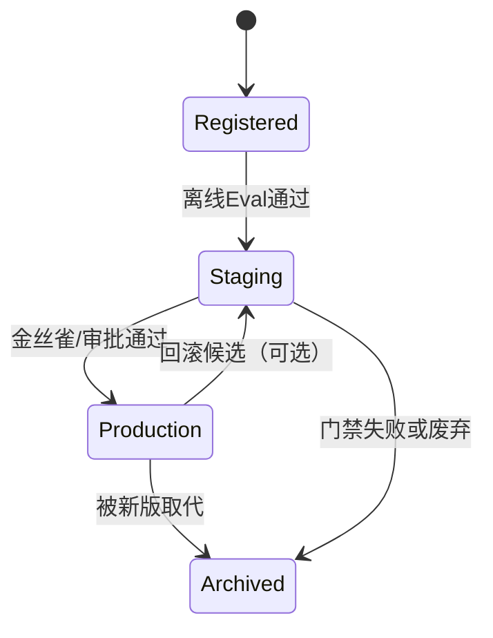

# 模型注册与晋级

一句话直觉：注册表是模型的「身份证与户籍」；晋级是「开发 → 预发 → 生产」的受控放行，禁止从笔记本直接空降线上。

## 直觉讲解

**模型注册（Model Registry）** 把「可部署工件」变成一等公民：版本号、度量、血缘、审批状态、指向的 artifact（权重、adapter、提示包、索引句柄）。

**晋级（Promotion）** 是状态机，不是 `cp model.bin /prod`。

| 状态（示意） | 含义 | 谁能动 |
|--------------|------|--------|
| `Registered` | 训练/导出完成，有元数据 | 训练流水线 |
| `Staging` | 过离线门禁，可影子/金丝雀 | CI + 评审 |
| `Production` | 线上默认或流量桶 | 变更审批 |
| `Archived` | 可回滚引用，不再新流量 | 运维 |

LLM 交付里「模型」常是组合体：

```text
ModelVersion =
  foundation_model_id + revision
  + LoRA/adapter_hash（可选）
  + prompt_template_version
  + tool_schema_version
  + retrieval_index_version（若绑定）
  + eval_report_uri
```

缺任一字段，出事时无法回答：「上周三坏的是哪一版？」。



## 工作示例（数字/场景）

**场景 A：传统分类 + 特征管线**

数据科学家交出 `fraud_v3`。注册条目包含：训练数据快照 ID、特征视图版本、AUC/召回、公平性切片、容器镜像 digest。晋级规则：Staging 需 AUC≥0.92 且高价值客群召回不降；Production 需金丝雀 5% 流量 48h 无成本/延迟红灯。

**场景 B：企业 RAG「系统版本」**

客户以为「换了 GPT」；你实际晋级的是：

| 组件 | 旧 | 新 | 是否同一次晋级 |
|------|----|----|----------------|
| 聊天模型 | vendor-A@2025-01 | vendor-A@2025-03 | 是 |
| 提示包 | prompts@1.4 | prompts@1.5 | 是 |
| 索引 | idx@2026-03-01 | 不变 | 否（解耦） |

原则：**能解耦的晋级解耦**；强耦合的（如「提示假设某工具字段」）打成同一 release bundle。

**场景 C：回滚 12 分钟**

生产 JSON 破坏率飙升。Runbook：把路由从 `Production: bundle-17` 切回 `bundle-16`（注册表里仍是 `Production` 候选或 `Archived` 可热切）。没有注册表时，团队在对象存储里找「大概是上周的文件」——这就是注册的 ROI。

## 面试常问取舍

1. **一个 registry 管所有 vs 提示/索引分库存**  
   - 统一入口利于审计；分库利于独立节奏。折中：统一「Release Bundle」元数据，底层存储可分。

2. **语义化版本 vs 单调 build 号**  
   - SemVer 对人友好；build/digest 对机器诚实。对外沟通 SemVer，对内以 digest 为准。

3. **自动晋级 vs 人工审批**  
   - 低风险、可逆、有金丝雀 → 可自动；高危（支付、医疗建议、权限）→ 人在回路。

4. **注册权重文件 vs 只注册供应商 model id**  
   - SaaS LLM 往往无权重；仍要注册 **model id + 日期/revision + 兼容测试报告**。

## FDE 现场怎么用

- **第一周**：强制「凡进预发必有 registry 条目」，禁止共享盘模型。  
- **字段最小集**：版本、创建者、Eval 链接、依赖版本、审批人、回滚目标。  
- **权限**：谁能标 `Production` 与谁能训练分开（职责分离）。  
- **客户演示**：展示「一键指向旧 bundle」比展示准确率更能建立信任。  
- **与云对齐**：GCP Vertex Model Registry / 自建制品库均可；关键是流程，不是品牌。参见 [GCP云架构与基础设施](../../05-能力补强/GCP云架构与基础设施.md)。

## 与本库其他篇的链接

- 同轨：[03-模型CI-CD](./03-模型CI-CD.md)、[06-模型版本与迁移](./06-模型版本与迁移.md)、[07-Eval回归套件与CI门禁](./07-Eval回归套件与CI门禁.md)  
- 生产：[从POC到生产](../04-生产系统设计/01-从POC到生产.md)、[AB-金丝雀-影子测试](../03-评测与ML基础/10-AB-金丝雀-影子测试.md)  
- 落地：[生产化清单](../../03-AI落地/生产化清单.md)

## 课堂小结

注册解决「是什么」；晋级解决「凭什么上线」。FDE 把组合系统（模型+提示+工具+索引）收成可回滚的 bundle，比争论 MLflow 还是自建表更重要。下一篇把晋级嵌进 CI/CD。


## 深入：Release Bundle 怎么拆

### 建议绑定在一起晋级的
- 提示模板 + 工具 JSON schema（强耦合）
- 基座 revision + 该基座上的 LoRA
- 约束解码语法与后处理版本

### 建议解耦的
- 向量索引重建（可独立滚动）
- 纯展示层文案
- 限流数字（配置中心）

### 审批与审计字段
至少记录：申请人、审批人、Eval 报告 URI、风险等级、回滚目标版本、变更窗口。客户安全审查时这些字段比「我们很谨慎」有用。

### 现场检查清单
- [ ] Staging/Production 状态机在工具里强制，而非口头
- [ ] 生产指向的 digest/ bundle id 可一键查询
- [ ] 回滚演练记录（时间、操作者、影响面）
- [ ] 提示/模型/索引版本打进每条请求日志
- [ ] 权限：训练账号不能独自标 Production

### 常见误区
把 notebook 导出的 pickle 当注册；只注册权重不注册提示；生产覆盖写导致无法回滚。

## 参考与来源

- 原创综述：面向 FDE 的 registry/promotion 状态机与 LLM bundle 实践。  
- MLOps 社区对 Model Registry、training-serving skew 的通行做法。  
- 云厂商 Model Registry 文档（概念层，实现以客户栈为准）。  
- 本库生产化清单中的回滚与变更条目。
