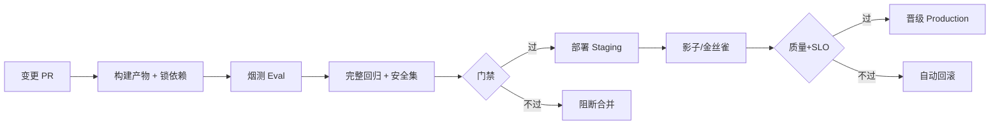

# 模型 CI/CD

一句话直觉：代码有 CI/CD；模型也要——每次改权重、提示、索引或工具契约，都走「构建 → 测试 → 分级发布 → 回滚」管道，而不是人肉 SCP。

## 直觉讲解

**模型 CI** 回答：这次变更是否「可构建、可复现、过门禁」。  
**模型 CD** 回答：如何安全推到预发/生产，以及如何撤回来。

与纯软件 CI 的差异：

| 维度 | 软件 CI | 模型 / AI 系统 CI |
|------|---------|-------------------|
| 产物 | 二进制/镜像 | 权重、adapter、提示包、索引、配置 |
| 测试 | 单测/集成 | 金标 Eval、安全集、延迟/成本探针 |
| 非确定性 | 少 | 采样、供应商模型行为可能漂 |
| 数据依赖 | 弱 | 强（训练快照、特征版本） |
| 发布 | 蓝绿/金丝雀 | 流量切分 + 影子 + 质量门禁 |

典型流水线：



「变更」在 FDE 项目里常见四类触发源：训练任务完成、提示仓库 PR、索引重建、供应商 model revision 通知。

## 工作示例（数字/场景）

**场景 A：提示词 PR 的最小 CI**

| 阶段 | 内容 | 时长目标 |
|------|------|----------|
| lint | 模板变量、禁止明文密钥 | <1 min |
| smoke | 30 条金标，schema + 拒答 | 3–8 min |
| full | 200 条 + 安全 50 条 | 15–40 min（可异步） |
| deploy | Staging 自动；Prod 需审批 | — |

失败策略：smoke 失败阻断合并；full 失败阻断晋级但不一定阻断合并（可标 `eval-needed`）。

**场景 B：自托管 LLM 镜像 CD**

构建：`base image + 模型权重层 + tokenizer + chat template`。  
测试：固定种子下的生成快照（允许微小差异阈值）+ TTFT/吞吐探针。  
发布：先 5% 金丝雀，看 P95 延迟与 5xx；同时跑线上抽样 LLM-as-Judge（低权重）。

**场景 C：训练管道与应用管道解耦**

错误做法：训练 job 直接写生产路径。  
正确做法：训练只产出 `Registered` artifact → 应用 CD 拉取并走门禁。两边用同一 `model_version` 关联。

## 面试常问取舍

1. **每次 PR 跑全量 Eval vs 分层测**  
   - 全量准但慢/贵。取舍：PR 烟测，nightly/晋级前全量。

2. **确定性快照测试 vs 指标阈值**  
   - 快照脆；纯指标可能漏结构性破坏。组合：schema/工具调用硬断言 + 分数阈值。

3. **GitOps 声明式 vs 点击控制台**  
   - 企业客户偏 GitOps（可审计）；POC 期控制台可接受，但要约定迁出时间。

4. **CD 推模型 vs CD 推「路由配置」**  
   - 大权重难推时，只推路由指向的 registry URI，权重由拉取端缓存——更常见。

## FDE 现场怎么用

- **Walking Skeleton**：第一周就接通「提示改动 → 烟测 → Staging」，哪怕模型仍是 SaaS。  
- **密钥与数据**：CI 用最小权限服务账号；金标脱敏；日志禁原材料落盘。  
- **成本护栏**：Eval 用小模型裁判或规则优先；全量 LLM Judge 放晋级前。  
- **客户对齐**：在 [生产化清单](../../03-AI落地/生产化清单.md) 勾「发版跑回归；失败可阻断」。  
- **环境**：Dev/Staging/Prod 隔离；GPU 队列与配额在 IaC 里写清（见 GCP 文）。

## 与本库其他篇的链接

- 同轨：[02-模型注册与晋级](./02-模型注册与晋级.md)、[07-Eval回归套件与CI门禁](./07-Eval回归套件与CI门禁.md)  
- 生产：[Walking-Skeleton瘦切片](../04-生产系统设计/11-Walking-Skeleton瘦切片.md)、[客户部署的容器与K8s](../04-生产系统设计/13-客户部署的容器与K8s.md)  
- 基础设施：[GCP云架构与基础设施](../../05-能力补强/GCP云架构与基础设施.md)

## 课堂小结

模型 CI/CD 的本质是：**把不确定的智能变更，关进确定的工程门禁**。FDE 不需要一天建完 ML 平台，但必须让「改提示/换模型」走管道。下一篇谈上线后的持续监控。


## 深入：管道骨架（示意）

```text
on: [pull_request, workflow_dispatch]
jobs:
  smoke-eval:
    - build prompt/model bundle
    - run smoke suite
    - upload report
  full-eval:  # on merge / nightly
    - run core + safety
    - compare to baseline thresholds
  deploy-staging:
    - needs: smoke-eval
    - apply gitops manifest (bundle uri)
```

### 密钥与数据
CI 用短期凭证；金标存受控桶；日志脱敏。禁止把生产用户原文拉进公有 CI。

### 现场检查清单
- [ ] PR 必跑 smoke；晋级必跑 holdout/safety
- [ ] 失败有可读报告（哪条 id、哪项度量）
- [ ] Staging 自动、Production 审批策略写清
- [ ] 回滚与部署同一条管道能力
- [ ] GPU/API 费用有日封顶，防评测打爆账单

### 常见误区
「模型特殊所以不走 CI」；只测 happy path；CD 手点控制台且无镜像 digest；Eval 绿了但没部署同一产物（测的是 A、上的是 B）。

## 参考与来源

- 原创综述：AI 系统四类变更源与分层 Eval 门禁。  
- 持续交付通识（构建-测试-发布-回滚）应用于 ML。  
- 各云 Vertex/SageMaker Pipelines 概念（实现以客户为准）。  
- 本库生产化清单与评测双环。
