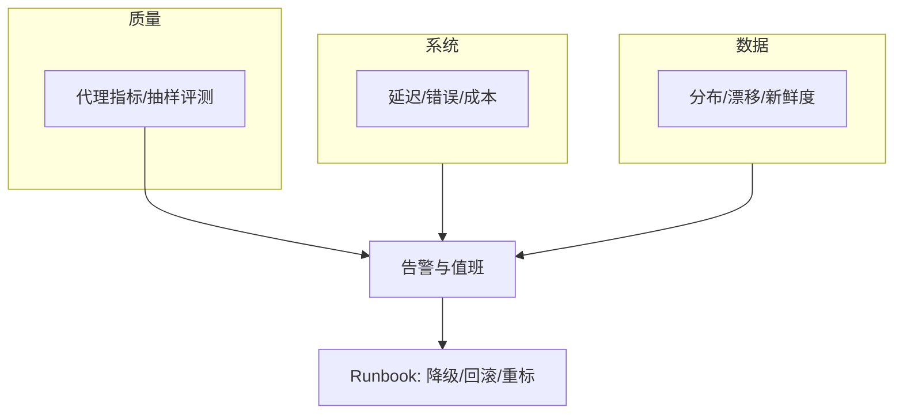

# 模型监控

一句话直觉：上线不是结束——要用「系统健康 + 数据分布 + 任务质量」三层仪表盘，把静默变差变成可值班事件。

## 直觉讲解

传统服务监控看延迟/错误率；模型还要回答：**还在做对的事吗？**

| 层 | 监控什么 | 例 |
|----|----------|-----|
| L1 系统 | 可用性、延迟、饱和、成本 | 5xx、P95 TTFT、GPU 利用率、$/请求 |
| L2 数据 | 输入/输出分布、漂移、倾斜 | 语言占比、token 长尾、空检索率 |
| L3 质量 | 任务成功代理、安全、漂移裁决 | 升级率、拒答率、schema 失败、抽检分 |

没有标签的线上流量，L3 多用**代理指标 + 抽样人工/LLM Judge**，而不是妄想每条都有金标。

**训练-服务倾斜（training-serving skew）** 是监控经典项：线上特征缺失填充与训练不一致、提示模板版本不一致、工具超时被静默吃掉等——表现像「模型变傻」，根因是管道。

## 工作示例（数字/场景）

**场景 A：分类 API**

| 指标 | 基线 | 告警 | 动作 |
|------|------|------|------|
| P95 延迟 | 120ms | >250ms 15min | 扩容/查依赖 |
| 预测为「欺诈」占比 | 3–6% | <1% 或 >12% | 查阈值与数据 |
| 特征空值率 | <0.5% | >2% | 查上游 ETL |
| 周抽样精确率 | ≥0.90 | <0.85 | 触发重训评估 |

**场景 B：RAG 助手**

最小看板：

- 检索：`hit_rate@k`、空结果率、索引年龄；  
- 生成：TTFT、补全 token、JSON/工具失败率；  
- 产品：点踩率、转人工率、任务完成率（若可埋点）；  
- 安全：注入命中、越权拒答；  
- 成本：每会话 $、缓存命中率。

**场景 C：无标签质量监控**

每天抽 100 条：规则检查引用是否在检索集；LLM Judge 打忠实度；人工复核 20 条校准 Judge。成本可控，比「完全不看质量」强一个数量级。

## 面试常问取舍

1. **代理指标 vs 金标离线**  
   - 代理快、噪；金标慢、准。线上用代理告警，周期性金标校准。

2. **高灵敏度告警 vs 值班疲劳**  
   - 先页「可行动」；探索性漂移进日报。

3. **日志全文 vs 隐私**  
   - 默认存哈希/摘要/特征；原文采样需合规与保留期。

4. **监控模型分 vs 监控产品结果**  
   - 最终要对齐业务（完成工单、成交）；模型分是中间层。

## FDE 现场怎么用

- **上线前**：在 [生产化清单](../../03-AI落地/生产化清单.md) 勾观测项；至少 5 条 Runbook。  
- **标签规范**：每条请求带 `model_version`、`prompt_version`、`index_version`、`request_id`。  
- **与 SLO 挂钩**：质量代理可进错误预算（见 [SLO-SLI与错误预算](../04-生产系统设计/20-SLO-SLI与错误预算.md)）。  
- **第一周交付物**：一张仪表盘 + 告警路由到真人，而不是「以后再加监控」。  
- **客户沟通**：周会看趋势，不看单点准确率表演。

## 与本库其他篇的链接

- 同轨：[01-数据漂移与概念漂移](./01-数据漂移与概念漂移.md)、[07-Eval回归套件与CI门禁](./07-Eval回归套件与CI门禁.md)  
- 生产：[AI系统可观测性](../04-生产系统设计/06-AI系统可观测性.md)、[AI成本与单位经济](../04-生产系统设计/02-AI成本与单位经济.md)  
- 评测：[LLM-as-Judge](../03-评测与ML基础/08-LLM-as-Judge.md)、[评测RAG系统](../03-评测与ML基础/09-评测RAG系统.md)

## 课堂小结

模型监控 = 系统 SRE + 数据哨兵 + 质量抽样。FDE 的价值是把三层接到值班与回滚，而不是堆无主指标。下一篇谈特征商店如何降低训练-服务倾斜。

## 深入：从零搭一周看板

| 日 | 交付 |
|----|------|
| D1 | 请求日志强制带三版本字段 + request_id |
| D2 | L1：错误率、P95、$/请求 |
| D3 | L2：语言/长度/空检索分布 |
| D4 | L3：日抽 50–100 条规则+抽检 |
| D5 | 5 条 Runbook 与告警到人 |

### 告警分级
- **P1**：可用性崩、安全拒答失效、成本失控暴涨
- **P2**：质量代理连续跌破、漂移行动带
- **P3**：探索性分布偏移进周报

### 现场检查清单
- [ ] 有「版本维度」下钻，不只看全局曲线
- [ ] 抽样评测与在线代理指标能互相校准
- [ ] PII/原文保留期符合合同
- [ ] 与错误预算会议挂钩（非只技术群刷屏）
- [ ] 训练-服务倾斜有专项检查项

### 常见误区
只有 GPU 利用率没有质量；告警风暴导致全忽略；用离线榜分数替代线上监控。

## 参考与来源

- 原创综述：L1/L2/L3 监控分层与 RAG 最小看板。  
- SRE 四大黄金信号思路在 ML 上的延伸。  
- 行业对 training-serving skew、PSI 等监控实践的通识。  
- 本库可观测性与生产化清单。
