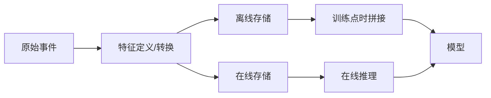

# 特征商店 Feature Stores

一句话直觉：特征商店让「训练时用的数」和「线上推理用的数」出自同一套定义与服务，专治训练-服务倾斜与重复造轮子。

## 直觉讲解

**特征（Feature）** 是模型输入的可复用信号：用户近 7 日活跃度、设备风险分、文档 embedding 旁路统计等。  
**特征商店（Feature Store）** 提供：

1. **注册与文档**：名字、类型、责任人、语义；  
2. **离线库**：历史大表，供训练点-in-time 正确拼接；  
3. **在线库**：低延迟键值，供推理；  
4. **物化与监控**：作业调度、新鲜度、分布。

核心难题是 **point-in-time join**：训练样本时刻 T 只能用 ≤T 的特征，否则「未来泄露」让离线指标虚高、上线崩盘。

在 LLM/RAG 项目中，「经典特征商店」不一定家家都上，但**同一思想**仍在：

- 用户画像/权限属性集中服务；  
- 检索侧的文档元数据与 ACL 视图；  
- 缓存的「预计算上下文片段」。

不要为了简历关键词强上 Feast；要为了「多模型共用、防泄露、降倾斜」。

## 工作示例（数字/场景）

**场景 A：反欺诈双模型共用**

| 特征 | 离线用途 | 在线 SLA | 共享方 |
|------|----------|----------|--------|
| `acct_txn_7d_sum` | 日批训练 | P99 <20ms | 欺诈 + 限额 |
| `device_risk_score` | 流式更新 | P99 <10ms | 登录 + 支付 |
| `geo_mismatch_24h` | 窗口聚合 | P99 <15ms | 三模型 |

未建商店时，两个团队各写一套 SQL，定义差一天窗口，线上一个用实时一个用 T+1——AUC 对不上。

**场景 B：点时泄露事故**

训练用「当月逾期标签」拼「当月月底汇总特征」，离线召回漂亮；线上只有日内特征。修复：所有聚合带 `as_of` 时间旅行查询；CI 抽检「特征时间 ≤ 样本时间」。

**场景 C：LLM 辅助决策**

不把整库塞进 Prompt，而是特征服务返回：`customer_tier`、`open_cases`、`last_policy_version`。提示只消费**已治理字段**，并在日志打 `feature_vector_version`。

## 面试常问取舍

1. **上 Feature Store vs 先规范几张「黄金特征表」**  
   - 团队小、模型少：规范表 + 契约测试往往够用；多团队/多模型再平台化。

2. **流式特征 vs 批式特征**  
   - 流式新鲜、贵、复杂；批式简单、易漂。按业务时效 SLO 选，不按炫技。

3. **特征存在店里 vs 推理时即时算**  
   - 重计算、高复用 → 物化；轻量、强一致需读源 → 在线算（注意超时降级）。

4. **Embedding 算不算特征**  
   - 算，且版本极敏感；须与模型/索引版本绑定（见检索轨道漂移文）。

## FDE 现场怎么用

- **诊断**：若离线很好、线上很差，优先查特征时间旅行与缺失默认值。  
- **最小可行**：一张特征目录（电子表也行）+ 离线/在线同一转换代码路径。  
- **所有权**：每个特征有 owner；废弃走 deprecate，禁止静默改语义。  
- **与数据平台**：对接 BigQuery/仓表时分区与成本见 [GCP云架构与基础设施](../../05-能力补强/GCP云架构与基础设施.md)、[数据工程基石课程](../../05-能力补强/数据工程基石课程.md)。  
- **权限**：在线特征可能含 PII——与检索 ACL 同一严肃等级。

## 与本库其他篇的链接

- 同轨：[01-数据漂移与概念漂移](./01-数据漂移与概念漂移.md)、[04-模型监控](./04-模型监控.md)  
- 检索：[权限感知RAG](../02-检索与Agent/18-权限感知RAG.md)、[Embedding版本与漂移](../02-检索与Agent/24-Embedding版本与漂移.md)  
- 落地：[生产化清单](../../03-AI落地/生产化清单.md)

## 课堂小结

特征商店的本质是**特征的产品化**：可发现、可点时、可在线、可监控。FDE 用其思想消倾斜；平台选型服务于协作规模。下一篇聚焦供应商大模型换代时的版本与迁移。

## 深入：没有平台时的最小替代

1. **特征目录表**（名称、SQL/代码路径、owner、SLA、PII 级）；  
2. **同一转换库** 被训练 job 与在线服务 import；  
3. **契约测试**：线上模拟请求 vs 离线行，关键特征差值=0；  
4. **新鲜度监控**：`feature_as_of` 延迟告警。

等协作模型 >3 且重复特征多，再评估 Feast/云厂商商店。

### 现场检查清单
- [ ] 点时 join 有单测或抽检
- [ ] 在线默认值与训练一致并文档化
- [ ] 特征语义变更走版本号，不静默改
- [ ] PII 特征有访问审计
- [ ] Embedding 类特征绑定模型/索引版本

### 常见误区
为了「有 Feature Store」而上重平台；在线一套 SQL、离线另一套 notebook；把实时特征 SLA 定成「尽量快」而不可测。

## 与 RAG/Agent 的边界

特征商店不替代文档索引：非结构化知识仍走检索；结构化、低延迟、强一致的用户/账户属性走特征服务。Agent 工具调用前也可拉取「决策特征包」，减少每次让模型从对话里猜状态。

### 一周落地（无平台）
| 日 | 动作 |
|----|------|
| D1 | 列出模型真正用到的 10–20 个字段 |
| D2 | 收拢到单一转换模块 |
| D3 | 点时 join 抽检脚本 |
| D4 | 在线路径打 feature_version |
| D5 | 缺失率进监控 |

## 参考与来源

- 原创综述：point-in-time、训练-服务一致与 LLM 侧「治理字段」用法。  
- Feature Store 行业通识（Feast/Tecton 等产品形态作概念参照）。  
- 数据泄露与时间旅行 join 的经典坑（ML 工程共识）。  
- 本库数据工程与生产化清单。
