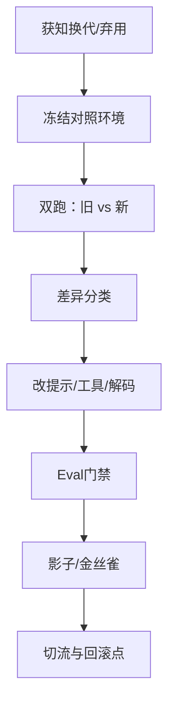

# 模型版本与迁移（供应商模型换代）

一句话直觉：供应商一换代，你的提示、工具、评测与成本合同都可能失效——迁移是「带门禁的换引擎」，不是改一行 model id。

## 直觉讲解

企业 AI 大量依赖 **闭源 API 模型** 或 **定期更新的开源权重**。版本变化包括：

| 变化 | 例子 | 风险 |
|------|------|------|
| 同系列小改 | `model-x` → `model-x-2026-03` | 格式/安全/风格微漂 |
| 同厂换代 | GPT/Claude/Gemini 大版本 | 行为与价格结构重写 |
| 跨厂迁移 | A 厂 → B 厂 | tokenizer、上下文、工具协议全变 |
| 自托管换基座 | Llama→Qwen 等 | 模板、量化、Serving 全换 |
| 弃用强制 | 旧 model id sunset | 截止日期驱动 |

迁移成功标准不是「还能聊」，而是：**金标不掉点、契约（JSON/工具）不破、延迟/成本在预算内、安全集不回退**。

把「模型」与「应用契约」分层：业务代码依赖的是 **稳定的内部接口**（`chat(plan)`、`extract(schema)`），背后再绑供应商版本——换代时少改业务面。

## 工作示例（数字/场景）

**场景 A：强制弃用，还剩 6 周**

| 周 | 动作 |
|----|------|
| W1 | 锁定旧版流量基线；新建新版 Staging endpoint |
| W2 | 全量金标 + 安全集双跑；列出 top 失败模式 |
| W3 | 修提示/约束解码；成本测算（tokenizer 倍率） |
| W4 | 10% 金丝雀；盯 schema 失败与升级率 |
| W5 | 50% → 100%；旧版保留只读回滚 2 周 |
| W6 | 合同与文档切换；归档 registry |

**场景 B：跨厂迁移的隐藏成本**

- 中文 token 倍率 1.0 → 1.35，同样业务月费 +35%；  
- 工具调用 JSON 键顺序/空格策略变了，脆弱解析器挂了；  
- 上下文从 128k 营销值到有效可用 80k（系统提示+工具占满）。

对策：迁移预算里单列「适配工程周」与「token 重定价」。

**场景 C：开源自托管小版本**

权重文件 hash 变了但「同名」。必须：registry 记 digest；Serving 滚动升级；KV cache 冷启动预热；与 [06 轨道 Serving 文](../06-ML基础设施与Serving/04-推理Serving-vLLM-TGI.md) 联动。

## 面试常问取舍

1. **尽早追新 vs 钉死版本**  
   - 钉死求稳，但有 sunset；追新享能力，但回归贵。策略：钉 revision + 定期受控升级窗。

2. **双厂商热备 vs 单一深度优化**  
   - 热备抗弃用与涨价；深度优化降成本。关键路径可双跑，长尾单厂。

3. **抽象层（LiteLLM 类）vs 直连**  
   - 抽象加速切厂，可能丢失独特能力。对核心链路保留原生特性开关。

4. **行为对齐（用数据微调/蒸馏）vs 只改提示**  
   - 提示便宜；若差距结构性（数学/格式），考虑蒸馏或换任务分解。

## FDE 现场怎么用

- **合同**：写明 model id、地区、弃用通知期、价格变更条款。  
- **技术**：内部 `ProviderAdapter` + 契约测试；禁止业务代码散落 model 字符串。  
- **评测**：换代必跑 [07-Eval回归套件](./07-Eval回归套件与CI门禁.md)；记录 diff 报告给客户。  
- **沟通**：用「迁移计划」一页纸，不承诺「无感切换」。  
- **清单**：对照 [生产化清单](../../03-AI落地/生产化清单.md) 的回滚与依赖健康检查。

## 与本库其他篇的链接

- 同轨：[02-模型注册与晋级](./02-模型注册与晋级.md)、[03-模型CI-CD](./03-模型CI-CD.md)、[07-Eval回归套件与CI门禁](./07-Eval回归套件与CI门禁.md)  
- LLM：[企业部署模型选型](../01-LLM与GenAI基础/29-企业部署模型选型.md)、[结构化输出与Schema校验](../01-LLM与GenAI基础/30-结构化输出与Schema校验.md)  
- 生产：[降级与供应商故障转移](../04-生产系统设计/16-降级与供应商故障转移.md)

## 课堂小结

供应商换代是可预期的运营事件。FDE 用双跑、门禁、金丝雀与适配层把它变成常规变更，而不是季度火灾。下一篇把 Eval 回归做成 CI 硬门禁。

## 深入：差异分类账

双跑后把失败分桶，避免一把抓改提示：

| 桶 | 例子 | 优先动作 |
|----|------|----------|
| 契约 | JSON/工具破 | 约束解码、修复解析、改 schema 提示 |
| 知识 | 事实/政策 | 检索与金标，不盲怪模型 |
| 风格 | 冗长/语气 | 提示与解码参数 |
| 安全 | 拒答回退 | 硬规则+安全集，阻断晋级 |
| 成本 | token 膨胀 | 压缩上下文、换路由、重定价 |

### 现场检查清单
- [ ] 内部 model id 抽象，业务不散落供应商字符串
- [ ] 弃用日历与负责人
- [ ] 双跑报告模板可复用
- [ ] 回滚窗口与旧版保留策略
- [ ] 价格/tokenizer 变化进入商务评审

### 常见误区
「只改 env 里的 model 名」；无 holdout 就全量切；跨厂迁移不重测工具调用；忽略中文 token 倍率。

## 迁移沟通一页纸（模板）

- 原因：弃用 / 能力 / 价格 / 驻留  
- 范围：哪些流量、哪些工具  
- 证据：Eval 摘要（质量/安全/成本/延迟）  
- 节奏：金丝雀比例与日期  
- 回滚：一键条件与值班人  
- 残留风险：已知掉点切片  

客户要的是可控变化，不是「模型更强」口号。

## 参考与来源

- 原创综述：弃用窗口、跨厂隐藏成本与内部适配层。  
- 各模型商 deprecation/versioning 公开说明（以当时文档为准）。  
- 本库选型、降级转移与生产化清单。  
- 不依赖付费课文的现场迁移节奏模板。
