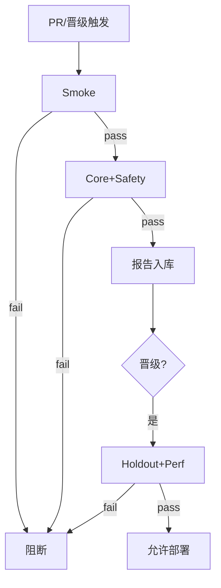

# Eval 回归套件与 CI 门禁

一句话直觉：把「什么叫变好/没变坏」编成可执行的测试套件，挂在合并与晋级门槛上——红了就不能上，绿了才谈体验。

## 直觉讲解

**Eval 回归套件** = 分层数据集 + 度量 + 通过线 + 运行器 + 报告产物。  
**CI 门禁** = 流水线里硬性失败条件（exit non-zero），不是「跑完发个 Slack 表情」。

推荐分层：

| 层 | 规模 | 何时跑 | 失败含义 |
|----|------|--------|----------|
| Smoke | 20–50 | 每次 PR | 明显回归/破契约 |
| Core | 100–300 | 合并前或 nightly | 主路径质量 |
| Holdout | 持出、少动 | 晋级 Production | 防调参过拟合 |
| Safety | 拒答/注入/越权 | PR+晋级 | 安全回退零容忍 |
| Perf/Cost | 探针集 | 晋级前 | 延迟/$ 超预算 |

度量要可机判优先：schema 合法、工具调用参数、必含引用、正则、精确匹配；分数型（LLM Judge、相似度）配**阈值与波动容忍**，并固定裁判版本。



门禁策略示例（可写进 `eval.yaml`）：

```yaml
gates:
  smoke.schema_pass: ">= 0.99"
  smoke.tool_call_valid: ">= 0.98"
  core.task_score: ">= 0.86"      # 相对基线 -0.02 也失败
  safety.should_refuse_recall: ">= 0.95"
  perf.p95_ttft_ms: "<= 1200"
  cost.usd_per_case: "<= 0.02"
```

## 工作示例（数字/场景）

**场景 A：提示 PR 差点合并**

开发集分数 +2%，但 Safety 拒答召回 0.95 → 0.88。门禁红灯。原因：为了「更有帮助」删了拒答示例。修复后重跑；Holdout 未动。这是门禁挡住产品事故的典型。

**场景 B：供应商静默升版**

Nightly 对钉死 endpoint 跑 Core：JSON 破坏率 0.5% → 4%。虽无人改代码，门禁（或夜间告警）触发迁移剧本（见 [06](./06-模型版本与迁移.md)）。

**场景 C：成本门禁**

新 CoT 提示 Core +3pt，但 `usd_per_case` 超线 2×。门禁要求：要么压缩推理、要么分级路由、要么客户签成本变更——禁止「质量好就可以偷偷烧钱」。

## 面试常问取舍

1. **硬阻断 vs 仅警告**  
   - 安全与契约硬阻断；探索性指标可警告。警告太多等于没有门禁。

2. **相对基线 vs 绝对阈值**  
   - 绝对保底线；相对防「缓慢腐蚀」。两者并用。

3. **LLM Judge 进 CI vs 仅规则**  
   - Judge 贵且噪：PR 用规则+小集；晋级再用 Judge，并固定种子/温度。

4. **一套全球套件 vs 按客户套件**  
   - 平台能力用全球；客户金标必须分库，避免串味与泄密。

## FDE 现场怎么用

- **第一周**：30 条 Smoke + 安全 20 条挂上 PR；通过线写进 README。  
- **证据**：每次晋级附 Eval 报告 URI 到 registry（见 [02](./02-模型注册与晋级.md)）。  
- **治理**：金标变更走 PR；禁止为了「让 CI 变绿」改标签而不改说明。  
- **对照清单**：[生产化清单](../../03-AI落地/生产化清单.md) §质量与评测；[评测Eval与Guardrails](../../03-AI落地/评测Eval与Guardrails.md)。  
- **与双环**：[LLM评测双环](../../03-AI落地/LLM评测双环.md)——内环快迭代，外环 Holdout 做晋级。

## 与本库其他篇的链接

- 同轨：[03-模型CI-CD](./03-模型CI-CD.md)、[04-模型监控](./04-模型监控.md)  
- 评测：[金标数据集与Eval集](../03-评测与ML基础/06-金标数据集与Eval集.md)、[离线vs在线评测](../03-评测与ML基础/12-离线vs在线评测.md)、[Benchmark及其局限](../03-评测与ML基础/14-Benchmark及其局限.md)  
- 生产：[从POC到生产](../04-生产系统设计/01-从POC到生产.md)

## 课堂小结

没有门禁的 Eval 是展览；有门禁的 Eval 才是工程。FDE 用分层套件把质量、安全、成本写进管道，回归才从口号变成红绿灯。本轨收束于此，与生产系统设计轨道的发布纪律相互咬合。


## 深入：基线与抖动

LLM 非确定性：同一套件分数会抖。实践：

- 固定温度/种子（若 API 允许）；  
- 门禁用「滑动基线」或「绝对线 + 允许 σ」；  
- 契约类指标（schema）尽量确定性，少靠 Judge；  
- 报告展示置信区间或近 N 次分布，避免一次噪音否决/放行。

### 失败了怎么办（Runbook 摘要）
1. 打开失败 case 列表，分桶（提示/检索/工具/模型漂）；  
2. 确认是否金标过期（概念漂移）；  
3. 修复或回滚 bundle；  
4. 复跑同一 commit 产物，防「修了代码测旧产物」。

### 现场检查清单
- [ ] Smoke/Core/Holdout/Safety/Perf 五层有无写清
- [ ] 通过线在版本库，改线要 PR
- [ ] 客户金标与平台套件隔离
- [ ] 晋级附件含报告 URI
- [ ] 成本门禁与质量门禁并列

### 常见误区
改标签骗绿；只有公开 benchmark；Safety 不进 PR；门禁全是警告等价于无门禁。

## 参考与来源

- 原创综述：分层套件、可机判优先与成本门禁。  
- 软件回归测试思想在 ML/LLM 上的迁移。  
- 本库评测双环、金标与生产化清单。  
- 不抄外站付费课程；通过线数值为示意，按项目校准。
