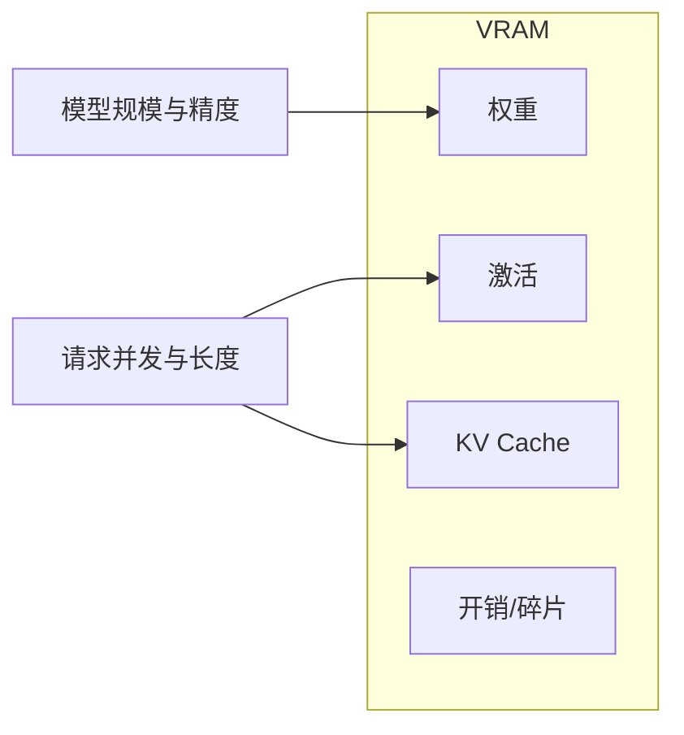

# GPU 显存与 VRAM

一句话直觉：算力广告看 FLOPS，能不能跑起来先看 VRAM——权重、激活、KV Cache 和碎片一起抢这块「高速桌面」。

## 直觉讲解

**VRAM（显存）** 是 GPU 板上的高带宽内存。LLM 推理时主要吃四块：

| 占用 | 含义 | 粗算直觉 |
|------|------|----------|
| 权重 | 参数本身 | 参数量 × 字节/参数（FP16≈2B） |
| 激活 | 前向中间张量 | 与 batch、序列长、隐层相关 |
| KV Cache | 已生成 token 的 K/V | 层数 × 头 × 维 × 序列 × 精度 × batch |
| 框架开销 | 碎片、工作区、CUDA context | 常预留 1–3GB+ |

示意：7B 参数 FP16 ≈ 14GB 仅权重；再加长上下文 KV，一张 24GB 卡可能「模型能装、一并发就 OOM」。

相关杠杆：量化减权重（见 [02](./02-量化Quantization.md)）；PagedAttention 减 KV 浪费（见 [06](./06-PagedAttention.md)）；连续批处理提高利用率但抬高并发显存（见 [05](./05-连续批处理Continuous-Batching.md)）。

## 工作示例（数字/场景）

**场景 A：选型「能不能塞进 1×A10 24GB」**

| 配置 | 权重约 | 余量给 KV/并发 | 结论 |
|------|--------|----------------|------|
| 7B FP16 | ~14GB | ~8–9GB | 短上下文小并发可行 |
| 7B INT8 | ~7GB | 更宽裕 | 同样卡更高并发 |
| 13B FP16 | ~26GB | 负 | 需更大卡或量化/多卡 |
| 70B FP16 | ~140GB | — | 多卡张量并行或强量化 |

数字为数量级示意，以实测 `nvidia-smi` / 框架日志为准。

**场景 B：OOM 排障顺序**

1. 看是否权重都装下（单卡/多卡 map）；  
2. 降 `max_model_len`、并发、`gpu_memory_utilization`；  
3. 换 KV 精度（FP16→FP8/INT8，若支持）；  
4. 查碎片：长短期混部导致分配失败。

**场景 C：训练 vs 推理**

训练还要梯度与优化器状态（Adam 可到参数的数倍），同样 7B 训练远比推理吃显存。FDE 试点多数是推理；别用训练口径估 Serving 卡。

## 面试常问取舍

1. **更大卡 vs 更多小卡并行**  
   - 大卡简单；多卡要通信与工程。延迟敏感优先减少跨卡。

2. **预留显存 vs 榨干利用率**  
   - 榨干吞吐高，尖峰 OOM。生产设利用率上限（如 0.85–0.92）。

3. **加长上下文 vs 加并发**  
   - 二者争 KV。产品要先定 SLA：长文档还是高 QPS。

4. **统一空白卡型 vs 异构**  
   - 统一好运维；异构省钱但调度复杂（见 [10 吵闹邻居](./10-吵闹邻居与KV公平份额.md)）。

## FDE 现场怎么用

- **立项**：用「目标上下文 × 目标并发 × 模型」做显存预算表，再谈采购。  
- **验收**：在**客户目标硬件**上压测，不在笔记本 GPU 上承诺。  
- **观测**：导出显存高水位、OOM 次数、KV 占用；进成本看板。  
- **云侧**：GPU 配额与区域见 [GCP云架构与基础设施](../../05-能力补强/GCP云架构与基础设施.md)。  
- **清单**：[生产化清单](../../03-AI落地/生产化清单.md) 的峰值与 SLA 项。

## 与本库其他篇的链接

- 同轨：[02-量化](./02-量化Quantization.md)、[05-连续批处理](./05-连续批处理Continuous-Batching.md)、[06-PagedAttention](./06-PagedAttention.md)、[09-GPU架构](./09-GPU架构与执行模型.md)  
- LLM：[KV-Cache](../01-LLM与GenAI基础/16-KV-Cache.md)、[上下文窗口](../01-LLM与GenAI基础/02-上下文窗口.md)  
- 生产：[延迟优化](../04-生产系统设计/07-延迟优化.md)、[AI成本与单位经济](../04-生产系统设计/02-AI成本与单位经济.md)

## 课堂小结

VRAM 是 Serving 的硬约束。FDE 先算得清权重与 KV，再谈吞吐优化。下一篇用量化把权重字节打下来。

## 深入：KV 粗算（教学用）

近似：`KV ≈ 2 * layers * kv_heads * head_dim * seq_len * batch * bytes_per_elem`（含 K 与 V）。  
GQA/MQA 会减小 `kv_heads`。长上下文产品必须把 KV 放进容量表，而不是只除「模型 GB」。

### 碎片与利用率
连续分配失败时 `nvidia-smi` 仍可能显示「还有空闲」——那是碎片。分页 KV（PagedAttention）缓解该类浪费。

### 现场检查清单
- [ ] 目标上下文 × 并发 的显存预算表
- [ ] 客户目标卡型上的 OOM 压测
- [ ] `gpu_memory_utilization` 留安全垫
- [ ] 训练/推理口径未混用
- [ ] 显存高水位进看板

### 常见误区
只按参数量估卡；在消费级卡上承诺数据中心吞吐；忽略多卡通信额外开销。

## 易混点

- **显存占用 ≠ 利用率**：占满可能在空等；利用率低也可能快 OOM（KV 预留）。  
- **参数量 GB** 只覆盖权重；产品承诺必须加 KV。  
- **多卡总显存** 不能简单相加给单请求用（还要看并行方式）。

## 一周落地节奏（容量）

| 日 | 动作 |
|----|------|
| D1 | 锁定模型精度与目标窗口 |
| D2 | 粗算权重+KV，选卡型 |
| D3 | 客户环境冒烟加载 |
| D4 | 并发阶梯压测至 OOM 边界 |
| D5 | 写入预算表与告警阈值 |

## 参考与来源

- 原创综述：推理四块显存占用与选型表。  
- NVIDIA 显存/CUDA 通识；各推理框架内存日志字段。  
- 本库 KV Cache 与成本文。  
- 表中 GB 数为教学示意，上线以实测为准。
