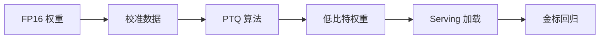

# 量化 Quantization

一句话直觉：用更少的比特存数（权重/激活/KV），换显存与带宽，理想情况下质量只掉一点——但「一点」必须用你的金标量，而不是博客截图。

## 直觉讲解

神经网络参数本是 FP32/FP16/BF16。**量化**把它们映射到 INT8、INT4、FP8 等较小表示，推理时反量化或整数运算。

| 类型 | 何时量化 | 特点 |
|------|----------|------|
| PTQ（训练后） | 已有权重上压 | 快、便宜；极端位宽可能掉点 |
| QAT（量化感知训练） | 训练中模拟量化 | 更稳；成本高 |
| 权重量化 | 主要压参数 | 省显存；算子要支持 |
| 权重+激活 | W8A8 等 | 更好吞吐潜力；校准更难 |
| KV 量化 | 压缓存 | 长上下文友好 |

常见口径：`W4A16` = 权重量 4bit、激活仍 16bit。GPTQ、AWQ、GGUF/llama.cpp 系、SmoothQuant 等是不同工程路线——FDE 记**效果合同**（延迟、显存、金标），不背诵论文名词炫耀。

风险：长尾任务、数学、极短 JSON 约束、多语言——对量化敏感度不同；**平均分差不多不等于你的切片都安全**。

## 工作示例（数字/场景）

**场景 A：24GB 卡上的 13B**

| 方案 | 显存粗感 | 质量动作 |
|------|----------|----------|
| FP16 | 装不下 | — |
| INT8 | 可装 + 小并发 | 跑 Core Eval |
| INT4 | 更高并发 | 安全集+结构化输出必测 |

**场景 B：量化把 JSON 搞坏**

金标总分 -1%，但 schema 失败从 0.5%→3%。产品不可接受。处理：对该链路保持更高精度；或约束解码 + 重试；或只量化非关键专家层（若框架支持）。

**场景 C：成本叙事**

同卡并发 2→5，单位成本下降，但要用 [Eval 门禁](../05-MLOps与生命周期/07-Eval回归套件与CI门禁.md) 证明质量；否则是「便宜的错误答案」。

## 面试常问取舍

1. **4bit vs 8bit**  
   - 4bit 更省；8bit 通常更稳。默认从 8bit 起，瓶颈再试 4bit。

2. **量化 vs 换小模型**  
   - 小模型架构更配任务时，优于「大模型砍成残血」。用同一套 Eval 比。

3. **权重量化 vs 蒸馏到小模型**  
   - 量化保架构；蒸馏可更小更快但需数据与训练（见 [03](./03-知识蒸馏Distillation.md)）。

4. **统一量化所有环境 vs 按链路精度**  
   - 关键链路高精度，批处理/摘要可更激进——路由比一刀切聪明。

## FDE 现场怎么用

- **流程**：量化产物进 registry，当新模型版本晋级，不「手改文件覆盖」。  
- **校准集**：用客户域无敏样本，避免只用公网 wiki。  
- **硬件**：查目标 GPU 对 FP8/INT8 张量核支持；软件栈版本锁死。  
- **验收**：显存、P95、金标切片、安全集四门全过。  
- **沟通**：向客户展示「省多少卡 / 掉哪类题」，禁止只报平均分。

## 与本库其他篇的链接

- 同轨：[01-GPU显存](./01-GPU显存与VRAM.md)、[03-蒸馏](./03-知识蒸馏Distillation.md)、[04-Serving](./04-推理Serving-vLLM-TGI.md)  
- MLOps：[模型注册与晋级](../05-MLOps与生命周期/02-模型注册与晋级.md)、[Eval门禁](../05-MLOps与生命周期/07-Eval回归套件与CI门禁.md)  
- LLM：[企业部署模型选型](../01-LLM与GenAI基础/29-企业部署模型选型.md)

## 课堂小结

量化是显存与带宽的杠杆，不是免费午餐。FDE 用金标切片与契约测试为「掉点」定价。下一篇谈蒸馏：用教师模型教出更小学生。

## 深入：校准与域偏移

PTQ 依赖校准数据代表线上分布。校准全是英文维基、线上全是中文工单+表格时，掉点会「集中爆炸」。校准集应含：短指令、长文档、JSON、工具调用、拒答样例。

### 现场检查清单
- [ ] 量化算法与比特位写入 registry
- [ ] Core + Safety + schema 全回归
- [ ] 关键链路可否保持更高精度
- [ ] 目标 GPU 算子支持已确认
- [ ] 与未量化基线的延迟/显存对比表

### 常见误区
只看平均分；4bit 一把梭；量化文件覆盖原权重无版本；忽略长尾语言与代码。

### 和缓存的交互
权重变了，前缀缓存/引擎编译缓存可能要失效重建——换量化当作一次晋级事件。

## 易混点

- **INT8 训练** 与 **INT8 推理 PTQ** 不是一回事。  
- **GGUF 消费端格式** 与 **服务端 GPTQ/AWQ** 工作流不同，别混拷贝。  
- **「差不多」** 必须以切片 Eval 定义，不是体感。

## 面试 60 秒

量化用更少比特存权重/激活/KV 换显存与带宽；我先 8bit PTQ，用客户金标+安全集验收，敏感链路可保留高精度，产物当新版本晋级。

## 与连续批处理的联动

量化省下的显存应有意识地转化为：更高并发、更长窗口、或更小卡型——三者选一写进目标，避免「省了显存却仍按旧并发跑」，红利蒸发在闲置里。

量化是手段，目标必须是可陈述的容量或成本结果。

## 参考与来源

- 原创综述：PTQ/QAT、W4A16 口径与现场验收门。  
- GPTQ/AWQ/SmoothQuant 等公开方法（概念层）。  
- 推理框架量化加载文档（以当前版本为准）。  
- 本库选型与 Eval 门禁。
