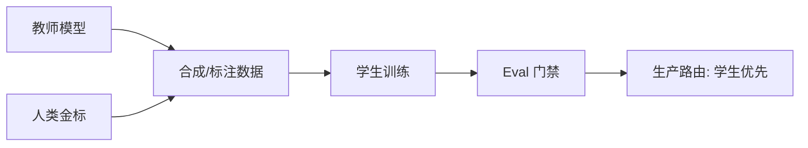

# 知识蒸馏 Distillation

一句话直觉：让大（或强）教师把「软知识」教给小（或便宜）学生——目标是在你的任务分布上逼近教师，而不是在通用榜上照抄教师参数量。

## 直觉讲解

**知识蒸馏（KD）** 经典形式：学生拟合教师的输出分布（软标签 / logits），而不只学硬标签 0/1。对 LLM，常见变体：

| 形态 | 教师提供什么 | 学生学什么 |
|------|--------------|------------|
| 响应蒸馏 | 完整高质量回答 | SFT 模仿 |
| 推理蒸馏 | 带思维链的轨迹 | 学分解步骤（注意泄露与冗长） |
| 偏好蒸馏 | 偏好对/排序 | 对齐风格与安全 |
| 特征/隐藏态 | 中间表示 | 较少用于黑盒 API 教师 |
| 工具轨迹蒸馏 | 成功工具调用轨迹 | 学何时调用与参数格式 |

黑盒 API 当教师时，你通常只能做**数据蒸馏**（生成合成监督数据），不能访问 logits——仍然有效，但是「模仿学习」，要防学生抄到教师幻觉。

与量化差别：量化几乎不改架构；蒸馏常得到**更小模型或更短推理**，可改任务头与提示策略。

## 工作示例（数字/场景）

**场景 A：客服意图 + 槽位**

教师：大模型零样本。学生：1B–3B 或传统分类器。  
流程：教师在历史工单上打标 → 人工抽检 5% → 学生训练 → 线上 90% 走学生，低置信升教师。

| 指标 | 教师 | 学生 | 路由后 |
|------|------|------|--------|
| 意图 F1 | 0.91 | 0.88 | 0.90 |
| 单价 | 1.0× | 0.05× | ~0.2× |
| P95 | 800ms | 40ms | 120ms |

**场景 B：RAG 回答蒸馏**

用教师对「检索到的上下文 + 问题」生成答案，学生只在**有检索上下文**时学——避免把参数记忆当知识，减少幻觉迁移。Eval 盯忠实度，不只看流畅。

**场景 C：失败的蒸馏**

只蒸馏「开放聊天」导致工具调用格式崩。修复：训练集必须含工具正/负例；门禁含 schema。

## 面试常问取舍

1. **蒸馏 vs 直接量化大模型**  
   - 需要极限延迟/边缘 → 蒸馏或小模型；只需塞进显存 → 先量化。

2. **软标签 logits vs 硬回答 SFT**  
   - 有白盒教师用软标签更丰；API 教师用高质量回答 + 多样采样。

3. **一步蒸馏到位 vs 教师继续当级联**  
   - 级联更稳（见模型路由）；蒸馏降成本。常并存：学生+升级。

4. **合成数据放大 vs 质量**  
   - 无过滤放大会放大偏见与幻觉。要多样性与审核，不只要条数。

## FDE 现场怎么用

- **范围**：先钉 1–2 个高 QPS 意图蒸馏，避免「蒸馏整个 GPT」。  
- **数据权属**：合成数据与教师 ToS、客户数据驻留要过法务。  
- **版本**：教师换代要重蒸馏或至少回归（链到 MLOps 迁移文）。  
- **路由**：置信度/规则升级，保留教师作安全网。  
- **基础设施**：训练算力与推理分账，见 GCP 文 GPU 配额。

## 与本库其他篇的链接

- 同轨：[02-量化](./02-量化Quantization.md)、[04-Serving](./04-推理Serving-vLLM-TGI.md)  
- LLM：[微调vs-RAG-vs-Prompt](../01-LLM与GenAI基础/12-微调vs-RAG-vs-Prompt.md)、[模型路由与级联](../01-LLM与GenAI基础/27-模型路由与级联.md)、[合成数据生成](../03-评测与ML基础/13-合成数据生成.md)  
- MLOps：[模型CI-CD](../05-MLOps与生命周期/03-模型CI-CD.md)

## 课堂小结

蒸馏是把贵智能换成便宜智能的数据工程+训练项目。FDE 用窄任务、金标与级联兜底控制风险。下一篇进入推理 Serving 引擎选型。

## 深入：数据配方

好的蒸馏数据通常混合：

1. 生产脱敏成功轨迹；  
2. 教师生成的多样性回答（多温度采样后筛选）；  
3. 难例与拒答；  
4. 工具调用正负例。  

比例失衡（全是长 CoT）会让学生又慢又贵，背离蒸馏目的。

### 现场检查清单
- [ ] 任务范围够窄、金标够清
- [ ] 教师 ToS/数据驻留已审
- [ ] 学生+升级路由有开关
- [ ] 教师换代触发回归/重蒸馏策略
- [ ] 单位经济对比表（教师/学生/级联）

### 常见误区
蒸馏「整个通用聊天」；无过滤合成数据；上线后删掉教师无兜底；只学答案不学「何时拒答」。

## 易混点

- 蒸馏不是「压缩文件」，是 **再学习**。  
- 学生好于教师某切片 可能因任务更窄，不代表通用更强。  
- 轨迹蒸馏要防把教师幻觉与过长 CoT 学进去。

## 面试 60 秒

我对高 QPS 窄任务用教师生成/标注数据训学生，线上学生优先、低置信升级教师；用金标与单位经济证明，而不是只报模型更小。

## 参考与来源

- 原创综述：LLM 场景下的响应/轨迹蒸馏与路由并存。  
- Hinton et al. 知识蒸馏经典思想（概念层）。  
- 行业「用大模型生成数据训小模型」实践通识。  
- 本库路由、微调对比与合成数据篇。
