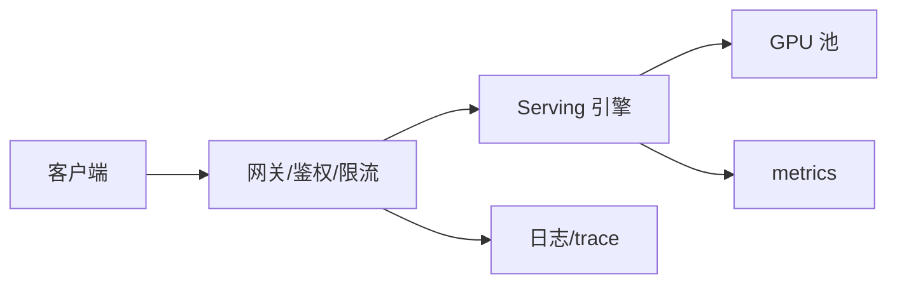

# 推理 Serving：vLLM / TGI

一句话直觉：Serving 引擎把「加载权重 + 调度请求 + 高效解码」做成稳定服务；vLLM、TGI 等是常见开源选项——选型看生态、特性与团队运维面，不是品牌信仰。

## 直觉讲解

自托管 LLM 时，裸 `transformers generate` 难撑生产。专用引擎通常提供：

- 模型加载与多适配器；  
- **连续批处理**与分页 KV（见同轨 05/06）；  
- OpenAI 兼容 HTTP、流式 token；  
- 张量并行、量化加载；  
- 指标（队列、吞吐、显存）。

| 引擎（示意） | 常见印象 | FDE 关注点 |
|--------------|----------|------------|
| vLLM | 高吞吐、PagedAttention 生态活跃 | 版本与模型兼容矩阵、多 LoRA |
| TGI（Text Generation Inference） | HF 生态整合 | 与 Hub 工作流、容器运维 |
| TensorRT-LLM 等 | 极致性能潜力 | 编译/引擎构建成本、硬件绑定 |
| 云托管端点 | 少运维 | 数据驻留、弃用、单价 |

FDE 常落的分层：**网关负责产品策略**（租户、预算、路由），**引擎负责模型执行**。不要让业务直接裸连 GPU Pod。

## 工作示例（数字/场景）

**场景 A：POC → 预发**

1. 单卡 Docker 起引擎，OpenAI 兼容测通；  
2. 固定 `max_model_len`、并发、超时；  
3. 接金标烟测；  
4. K8s Deployment + GPU nodeSelector + PDB；  
5. 就绪探针看「模型已加载」而非只看端口。

**场景 B：多 LoRA 租户**

基座一份权重，热插适配器。注意：适配器切换的显存与调度公平；登记每个 adapter 的 Eval。引擎若不稳定，退回「每租户独立副本」（贵但隔离强）。

**场景 C：与 SaaS 混部**

内部文档走自托管；通用闲聊走 SaaS。网关按意图路由；统一观测字段 `backend=vllm|vendor`。

## 面试常问取舍

1. **自托管 vs 纯 API**  
   - 驻留/成本/定制 → 自托管；速度上市/少 GPU → API。见企业选型篇。

2. **vLLM vs TGI vs 其他**  
   - 比：所需模型是否 day-0 支持、量化、多 LoRA、团队已有经验、Issue 活跃度。打一份评分表，别空争。

3. **引擎内限流 vs 网关限流**  
   - 两者都要：引擎防 OOM；网关防租户吵闹（见 [10](./10-吵闹邻居与KV公平份额.md)）。

4. **常驻大模型 vs 按需加载**  
   - 常驻低延迟；按需省闲置。冷启动可能数十秒，需产品预期。

## FDE 现场怎么用

- **锁版本**：镜像 digest、引擎版、CUDA、权重 hash 进 registry。  
- **压测**：真实提示长度分布，不只短 prompt。  
- **安全**：内网/私有链路、无公网暴露 admin；见 [GCP](../../05-能力补强/GCP云架构与基础设施.md)、网络白话。  
- **清单**：回滚=切镜像或切路由；演练一次。  
- **文档**：给客户一页「支持模型列表与已知限制」。

## 与本库其他篇的链接

- 同轨：[05-连续批处理](./05-连续批处理Continuous-Batching.md)、[06-PagedAttention](./06-PagedAttention.md)、[07-推测解码](./07-推测解码Speculative-Decoding.md)  
- 生产：[客户部署的容器与K8s](../04-生产系统设计/13-客户部署的容器与K8s.md)、[限流](../04-生产系统设计/05-限流Rate-Limiting.md)  
- LLM：[企业部署模型选型](../01-LLM与GenAI基础/29-企业部署模型选型.md)  
- 落地：[生产化清单](../../03-AI落地/生产化清单.md)

## 课堂小结

Serving 引擎是生产推理的操作系统。FDE 用网关+引擎分层、版本锁定与压测验收，而不是在 notebook 里演示生成。下一篇解剖连续批处理为何抬吞吐。

## 深入：生产清单（引擎视角）

- 就绪探针：权重加载完成再接流量  
- 优雅退出：在途流式请求的超时策略  
- 水平扩展：无状态副本 + 外部队列/网关粘滞（若需前缀缓存命中，慎盲扩）  
- 资源：`nvidia.com/gpu`、节点污点、PDB  
- 安全：禁公网 admin、网络策略、密钥不进镜像层  

### 选型评分表示意

| 维度 | 权重 | 引擎A | 引擎B |
|------|------|-------|-------|
| 模型 day-0 支持 | 高 | | |
| 量化/多 LoRA | 中 | | |
| 运维熟悉度 | 高 | | |
| 可观测指标 | 中 | | |
| 社区/支持 | 中 | | |

### 现场检查清单
- [ ] 镜像 digest 钉死
- [ ] OpenAI 兼容层与业务契约测试
- [ ] 压测含真实长度分布
- [ ] 回滚演练
- [ ] 网关限流与引擎硬顶同时存在

### 常见误区
业务直连 Pod IP；用短 prompt 压测报喜；忽略tokenizer/chat template 与训练不一致。

## 易混点

- OpenAI 兼容 ≠ 行为兼容（工具、对数概率、限流头可能不同）。  
- 引擎基准分高 ≠ 你的提示长度分布下更好。  
- 多 LoRA 节省权重，不自动等于多租户安全隔离。

## 一周落地节奏

| 日 | 动作 |
|----|------|
| D1 | 单卡引擎 + 兼容 API 打通 |
| D2 | 烟测 Eval |
| D3 | K8s/GPU 清单与探针 |
| D4 | 混部长度压测 |
| D5 | 网关限流+回滚演练 |

## 参考与来源

- 原创综述：网关/引擎分层与选型评分表思路。  
- vLLM、TGI 等项目公开文档与架构博客（概念层，版本以当时为准）。  
- 本库 K8s 交付、限流与选型文。  
- 不绑定单一厂商宣传口径。
