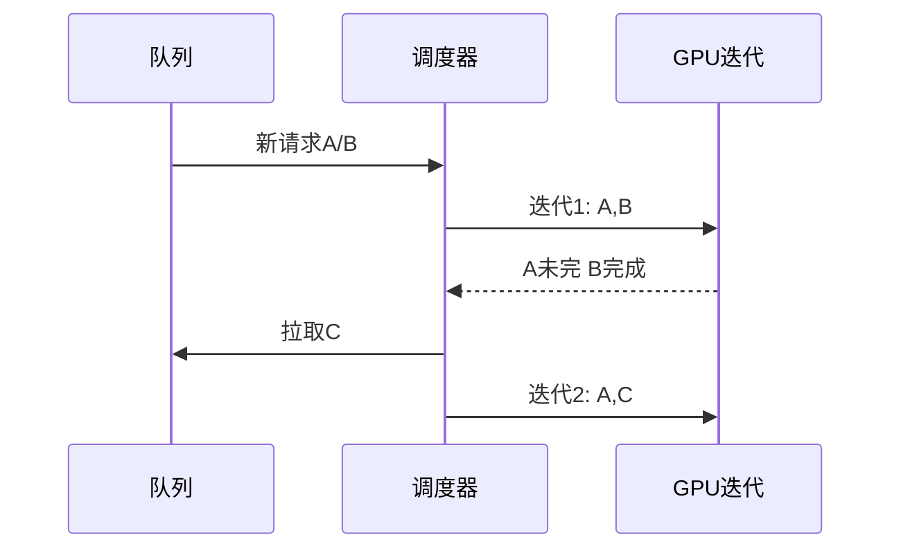

# 连续批处理 Continuous Batching

一句话直觉：别等一整批请求同时开始、同时结束——解码步进里谁好了谁下船、谁新来谁插队，GPU 才不会在「短请求等长请求」时晒太阳。

## 直觉讲解

静态批处理（static batching）：凑齐 B 条再跑，最长序列决定大家等待，短请求尾部浪费算力。

**连续批处理（continuous / in-flight batching）**：在 token 步进（iteration）级别维护「当前活跃序列集合」。某条完成 EOS → 立刻腾出槽位给队列中下一条。与自回归特性契合：每步大家一起算下一 token，但生命周期不同。

收益主要在**吞吐（tokens/s、QPS）**与 GPU 利用率；对单条延迟：排队可能变短，但高负载时也可能因共享迭代而抖动——要用 SLA 衡量。

与 **PagedAttention** 常捆绑：动态进出场需要灵活的 KV 内存管理，连续批处理才榨得动。

## 工作示例（数字/场景）

**场景 A：长短请求混部**

| 策略 | 现象 | 吞吐 |
|------|------|------|
| 静态 batch=8 | 短请求等 2k 长文生成完 | 低 |
| 连续批处理 max=8 | 短请求先完成腾位 | 明显升高 |
| 无上限并发 | 显存打满 OOM/抖动 | 不可用 |

**场景 B：参数旋钮**

- `max_num_seqs`：并发序列上限；  
- `max_num_batched_tokens`：每步 token 预算；  
- 超时与公平队列：防巨型请求占满（见 [10](./10-吵闹邻居与KV公平份额.md)）。

压测集必须混合：短分类、中等聊天、长摘要，否则数字撒谎。

**场景 C：流式体验**

连续批处理下 TTFT 仍受队列与 prefill 影响。产品侧：先回「已收到」、流式吐 token；工程侧：prefill/decode 分离调度（若引擎支持）降干扰。

## 面试常问取舍

1. **更大并发 vs 更稳 P99**  
   - 并发升吞吐，P99 可能恶化。按错误预算设上限。

2. **连续批处理 vs 每请求一模型副本**  
   - 副本隔离好、利用率差；共享引擎利用率高、需公平性。

3. **按请求批 vs 按 token 预算批**  
   - token 预算更能控显存与迭代时间，现代引擎多支持。

4. **与推测解码叠用**  
   - 可叠，但调度更复杂；先稳连续批处理再开投机（见 [07](./07-推测解码Speculative-Decoding.md)）。

## FDE 现场怎么用

- **承诺**：对外 SLO 用 P95/P99，不拿空载 tokens/s 演示。  
- **配置**：按显存与目标上下文设硬顶；写进 Helm values。  
- **观测**：队列等待、活跃序列数、iteration 耗时、每请求生成长度。  
- **事故**：延迟尖峰先看是否被超长请求占满——加长度限制与租户配额。  
- **清单**：峰值流量假设与限流行为对用户可见（生产化清单）。

## 与本库其他篇的链接

- 同轨：[04-Serving](./04-推理Serving-vLLM-TGI.md)、[06-PagedAttention](./06-PagedAttention.md)、[10-吵闹邻居](./10-吵闹邻居与KV公平份额.md)  
- LLM：[自回归解码](../01-LLM与GenAI基础/26-自回归解码.md)、[KV-Cache](../01-LLM与GenAI基础/16-KV-Cache.md)  
- 生产：[延迟优化](../04-生产系统设计/07-延迟优化.md)、[限流](../04-生产系统设计/05-限流Rate-Limiting.md)

## 课堂小结

连续批处理让 GPU 在动态请求下保持忙碌。FDE 要同时管吞吐旋钮与公平性，避免「平均值好看、大客户拖死小请求」。下一篇看 KV 分页如何减少显存浪费。

## 深入：prefill 与 decode

- **Prefill**：吃完整提示，算力密集，生成首 token；  
- **Decode**：逐步生成，常带宽绑定。  

长预填请求会阻塞同批他者的迭代——有的引擎做 chunked prefill 或分离调度。现场若 P95 TTFT 差，先查是否被超长预填拖累。

### 现场检查清单
- [ ] max 并发/每步 token 预算有据
- [ ] 混部长短压测集
- [ ] 超长请求隔离或降级
- [ ] 队列等待指标进告警
- [ ] SLO 看 P95/P99 非仅平均值

### 常见误区
无界提高并发；只优化吞吐忽略尾延迟；批处理任务与在线对话混池无优先级。

## 易混点

- 连续批处理 **不是** 更大的静态 batch 这么简单，关键是迭代级调度。  
- 吞吐升时 P99 可能变差——二者要一起报。  
- 与「动态批处理」口口语有时混用，面试时讲清 iteration-level 即可。

## 面试 60 秒

静态批被最长序列拖累；连续批处理在每步让完成的序列腾位给新请求，提升 GPU 利用率。我会用混部长短压测设并发上限，并配公平队列防长请求饿死短请求。

## 与产品体验

流式输出下，用户感知的是 TTFT + 后续匀速。连续批处理提升的是系统吞吐；若队列变长，TTFT 仍可能变差。产品与容量要一起设：最大排队或快速失败。

## 参考与来源

- 原创综述：静态 vs 连续批处理与混部压测。  
- Orca / vLLM 等系统对 iteration-level scheduling 的公开描述（概念层）。  
- 本库自回归、KV 与限流文。  
- 参数名因引擎而异，以所选版本文档为准。
