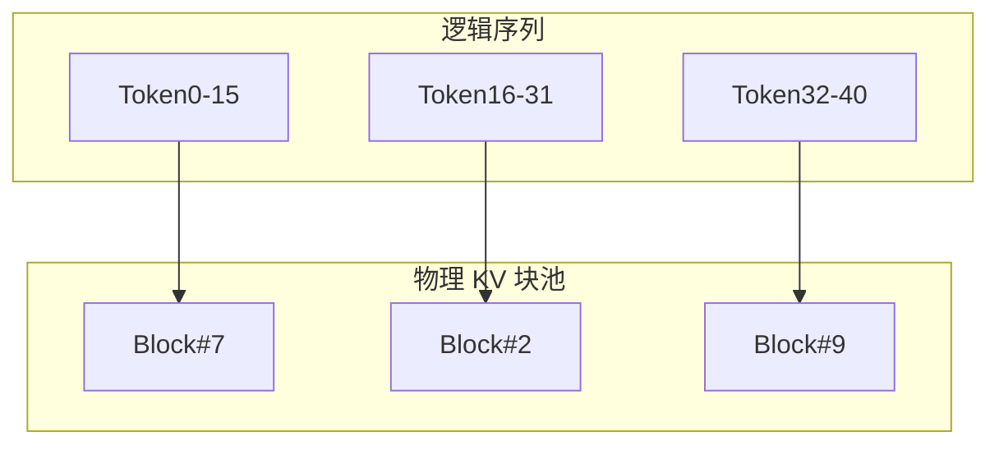

# PagedAttention

一句话直觉：把 KV Cache 像操作系统管理虚拟内存一样「分页」——按需分配物理块，告别为每条请求预留整段最大长度显存的巨大浪费。

## 直觉讲解

自回归解码为每个 token 缓存 Key/Value。传统实现常按 `max_seq_len` **预分配**连续 KV 槽：请求实际只生成 50 token，却按 4k 预留 → 显存碎片与浪费，并发上不去。

**PagedAttention**（vLLM 等推广的思想）将 KV 切成固定大小的 **page/block**，用块表映射逻辑位置 → 物理块。效果类似 OS 的分页：

| 问题 | 连续预分配 | 分页 KV |
|------|------------|---------|
| 短请求 | 大量预留浪费 | 按块增长 |
| 并发 | 很快触顶 | 更高存活序列数 |
| 共享前缀 | 难 | 可块级共享（视实现） |
| 复杂度 | 低 | 块表与调度更复杂 |

注意：PagedAttention 解决的是 **KV 布局与复用**，不是免费增加上下文窗口；窗口仍受模型与配置限制。它与连续批处理是「搭档」：动态进出场需要弹性内存。

## 工作示例（数字/场景）

**场景 A：并发从 4 到 16**

同卡、同模型、`max_model_len=4096`。预分配时 4 条长预留打满；分页后大量短聊天只占少量块，并发升到十几（示意）。验收看：OOM 率、活跃序列、P95。

**场景 B：前缀共享**

系统提示 + 工具 schema 相同的大量请求，块级共享前缀 KV（若开启前缀缓存）可降 TTFT 与显存。注意：**跨租户禁止共享**含用户数据的前缀；缓存键要纳入租户与权限。

**场景 C：碎片与大块**

极端长短交织仍可能产生块池碎片。运维：监控「KV 池使用率 vs 请求数」；必要时限制 `max_model_len` 或隔离长文档队列。

## 面试常问取舍

1. **分页 vs 更大显存卡**  
   - 分页提高利用率；不能替代「模型太大」的硬件升级。

2. **块大小太大 vs 太小**  
   - 太大浪费内块；太小块表与开销增。一般用引擎默认，除非有实测理由。

3. **前缀缓存开 vs 关**  
   - 开：降成本；关：实现简单、少串扰风险。多租户默认谨慎。

4. **与 KV 量化叠用**  
   - 可进一步省显存；质量门禁同上轨量化文。

## FDE 现场怎么用

- **解释给客户**：用「别按最大长度给每人订整桌」类比，说明为何同卡更高并发。  
- **安全**：多租户前缀缓存策略写进设计评审。  
- **调参**：先定产品最大上下文，再挖分页红利，避免无限制超长。  
- **观测**：KV 占用字节、块命中率（若有）、因显存拒绝的请求数。  
- **链路**：与 [01 显存](./01-GPU显存与VRAM.md)、[05 连续批处理](./05-连续批处理Continuous-Batching.md) 一起写进容量规划。

## 与本库其他篇的链接

- 同轨：[04-Serving](./04-推理Serving-vLLM-TGI.md)、[05-连续批处理](./05-连续批处理Continuous-Batching.md)、[01-GPU显存](./01-GPU显存与VRAM.md)  
- LLM：[KV-Cache](../01-LLM与GenAI基础/16-KV-Cache.md)、[Prompt缓存与语义缓存](../01-LLM与GenAI基础/28-Prompt缓存与语义缓存.md)  
- 生产：[AI成本与单位经济](../04-生产系统设计/02-AI成本与单位经济.md)

## 课堂小结

PagedAttention 把 KV 从「预留整段」变成「按块租用」，是现代高吞吐 Serving 的内存基石。下一篇谈推测解码如何用小模型带动大模型加速。

## 深入：和「上下文窗口」叙事的关系

销售说「支持 128k」≠ 你能在目标卡上以可接受并发跑 128k。分页提高的是**利用率**，不自动提供免费的长上下文算力与显存。容量规划仍用：有效并发 × 有效长度 × KV 单价。

### 前缀缓存安全规则
- 缓存键：`tenant + user_scope + prompt_hash + model_version`  
- 禁止跨租户共享用户文档前缀  
- 权限变更要能失效相关键  

### 现场检查清单
- [ ] max_model_len 与产品一致
- [ ] KV 池使用率监控
- [ ] 多租户前缀策略已评审
- [ ] OOM/拒绝原因可区分（KV 不足 vs 其他）
- [ ] 与连续批处理参数联合调优记录

### 常见误区
以为分页后无需限长；开启全局前缀缓存无租户键；用空载显存判断生产并发。

## 易混点

- 分页是 **KV 内存管理**，不是注意力算法换新公式的产品名游戏。  
- 与 OS 分页类比帮直觉，但落在 GPU 块池与块表。  
- 前缀共享是加分项，涉及安全时默认谨慎。

## 面试 60 秒

传统按 max_len 预留 KV 极浪费；PagedAttention 把 KV 分成块按需映射，配合连续批处理提高并发。规划时仍按有效长度×并发算显存，并审查多租户前缀缓存键。

## 容量公式（口头版）

「能同时服务多少人 ≈ KV 池能租出多少块 / 每人平均占用块数」。分页让分母更接近真实长度，而不是被 max_len 放大。

## 参考与来源

- 原创综述：分页类比、多租户前缀风险与容量规划。  
- Kwon et al., vLLM / PagedAttention 论文与公开博客（概念层）。  
- OS 虚拟内存分页通识。  
- 本库 KV Cache 与成本文。
