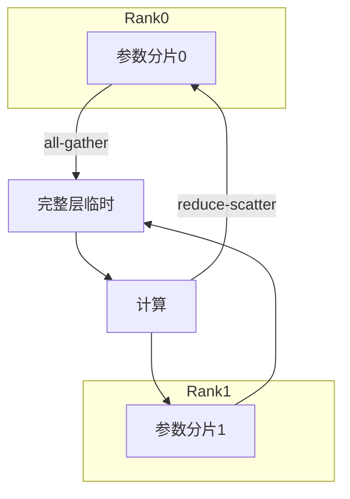

# 分布式训练与并行 FSDP

一句话直觉：模型或数据大到单卡装不下/跑不完时，把计算拆到多卡——数据并行复制模型啃不同 batch；张量/流水并行切模型；FSDP 则把分片做成更省显存的数据并行进化形。

## 直觉讲解

常见并行维度：

| 策略 | 切什么 | 典型用途 |
|------|--------|----------|
| DP 数据并行 | 数据 batch | 模型能装进单卡 |
| DDP | 每卡一份模型 + 梯度同步 | 标准多卡 |
| FSDP / ZeRO | 分片参数/梯度/优化器状态 | 大模型单卡装不下完整优化状态 |
| TP 张量并行 | 层内矩阵 | 超大层、低延迟偏好机内高速互联 |
| PP 流水并行 | 层间阶段 | 极深/极大模型 |
| 混合 | 组合以上 | 生产级大训 |

**FSDP（Fully Sharded Data Parallel）** 思想（与 ZeRO 一族相近）：每卡只持有参数分片，前向/后向前按需 all-gather，用完再释放/重新分片，显著降每卡显存，代价是更多通信。

FDE 多数交付是 **推理**；仍需懂训练并行，因为：客户要微调/域适应、要估 GPU 小时、要审供应商训练方案是否合理。

## 工作示例（数字/场景）

**场景 A：7B LoRA 微调**

往往单卡或轻量 DP 足够；不必上复杂 TP。优先：数据质量、Eval、合法基座。

**场景 B：全参 13B/70B**

| 方案 | 显存压力 | 工程复杂度 |
|------|----------|------------|
| 单卡全参 | 可能 OOM | 低 |
| DDP | 每卡仍持满模 | 中 |
| FSDP | 显著下降 | 中高（配置、ckpt） |
| FSDP+离线/CPU offload | 更省、更慢 | 高 |

**场景 C：沟通预算**

客户问「为何要 8×A100」。回答结构：参数+优化器+激活+批次 → 选 FSDP 后每卡需求 → 再乘数据吞吐时间。避免只甩「模型很大」。

## 面试常问取舍

1. **FSDP vs 纯 TP**  
   - FSDP 利扩展与显存；TP 对单步延迟与超大矩阵友好，但要好 NVLink/拓扑。

2. **全参微调 vs LoRA**  
   - 企业常 LoRA：省显存与灾难性遗忘风险；全参要更强并行与数据。

3. **更大切片省显存 vs 通信爆炸**  
   - 分片越细通信越勤。要 profiling，不盲开最激进 ZeRO stage。

4. **自建多机 vs 托管训练**  
   - 托管快；自建可控与驻留。看数据分级与团队能力。

## FDE 现场怎么用

- **先问目标**：适配器够不够？别默认全参分布式。  
- **检查清单**：全局 batch、学习率缩放、混精、梯度累积、ckpt 可恢复、种子。  
- **环境**：多机要同构 GPU、网络（IB/RoCE）、同一镜像；见 [GCP](../../05-能力补强/GCP云架构与基础设施.md)。  
- **产物**：训练完进 [模型注册](../05-MLOps与生命周期/02-模型注册与晋级.md)，不直写生产。  
- **成本**：GPU 小时写入单位经济，防止「微调玩死预算」。

## 与本库其他篇的链接

- 同轨：[01-GPU显存](./01-GPU显存与VRAM.md)、[09-GPU架构](./09-GPU架构与执行模型.md)  
- LLM：[LoRA与参数高效微调](../01-LLM与GenAI基础/17-LoRA与参数高效微调.md)、[灾难性遗忘](../03-评测与ML基础/15-灾难性遗忘.md)  
- MLOps：[模型CI-CD](../05-MLOps与生命周期/03-模型CI-CD.md)  
- 生产：[AI成本与单位经济](../04-生产系统设计/02-AI成本与单位经济.md)

## 课堂小结

分布式训练是显存与通信的交换艺术；FSDP 让「更大模型/更大状态」在多卡上可训。FDE 用它做合理方案与预算，而不是默认上最炫并行。下一篇补 GPU 执行模型直觉。

## 深入：FDE 问供应商的五个问题

1. 全参还是 LoRA？为何？  
2. 全局 batch 与步数如何定？有无过拟合监控？  
3. 用了何种并行？通信是否成为瓶颈？  
4. ckpt 频率与失败恢复演练过吗？  
5. 产物如何进 Eval 门禁与注册表？  

答不上来的「我们多机分布式训了」只是成本中心。

### 现场检查清单
- [ ] 任务是否真的需要多机
- [ ] 混精/梯度累积配置记录
- [ ] 数据合法与驻留
- [ ] 训练预算封顶
- [ ] 产出 bundle 走晋级，不直推生产

### 常见误区
未试 LoRA 就上全参 FSDP；多机不同构；无 Eval 只看 loss 曲线。

## 易混点

- FSDP ≈ 分片的数据并行，不是「更快」的保证，常是「更能装」。  
- 通信差时 FSDP 可能比小模型单卡 LoRA 更不划算。  
- DeepSpeed ZeRO 与 FSDP 同族思想，工程 API 不同。

## 面试 60 秒

单卡装不下优化状态时用 FSDP/ZeRO 分片参数与状态，以通信换显存。企业交付我优先论证 LoRA 是否足够，再谈全参多机，并要求 ckpt、Eval 与预算封顶。

## 参考与来源

- 原创综述：DP/TP/PP/FSDP 对照与 LoRA 优先的现场决策。  
- PyTorch FSDP / ZeRO 公开文档与论文（概念层）。  
- 本库 LoRA、成本与注册文。  
- 具体 API 随框架版本变化，以当前文档为准。
