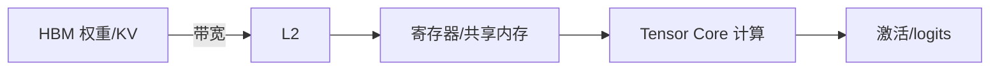

# GPU 架构与执行模型

一句话直觉：GPU 靠海量小核心把「同样的算子」砸在大数据块上——吃饱要靠合并访存、高占用与合适的精度/张量核；吃不饱时再贵的卡也像昂贵风扇。

## 直觉讲解

与 CPU「少量复杂核心 + 深缓存 + 低延迟分支」不同，GPU 面向 **吞吐量**：

| 概念 | 直觉 |
|------|------|
| SM / 计算单元 | 许多并行处理器集群 |
| Warp/Wave（如 32 线程） | 锁步执行的线程组；分歧伤性能 |
| 占用率 Occupancy | 同时驻留的 warp 够不够藏延迟 |
| HBM 显存 | 高带宽、高延迟相对寄存器 |
| Tensor Core | 专为矩阵乘加的加速单元（混精） |
| Kernel | 一次下发到 GPU 的核函数 |

LLM 核心是反复的 **矩阵乘** 与注意力。性能常卡在：

1. **算力上限**（FLOPS）；  
2. **带宽上限**（从 HBM 搬权重/KV）；  
3. **启动/同步开销**（太碎的 kernel）。

推理解码阶段常 **memory-bound**：每步搬大权重只产少量 token。所以量化、融合算子、连续批处理、KV 分页都是在打带宽与利用率，而不只是「多买 FLOPS」。

## 工作示例（数字/场景）

**场景 A：为何加卡线性不涨 QPS**

解码受权重带宽绑定时，复制到两卡若用朴素方式，可能通信或复制开销吃掉红利。要选对并行策略（副本扩吞吐 vs 张量并行切模型）。

**场景 B：短请求利用率低**

单条短 prompt：kernel 启动与预热占比高，GPU 利用率曲线「毛刺低」。连续批处理把多请求叠在同一迭代，提高有效占用。

**场景 C：精度与张量核**

FP16/BF16/FP8 走张量核；纯 INT 路径看内核支持。盲目 FP32 推理既慢又吃显存。验收用同一套 Eval，防数值坑。

## 面试常问取舍

1. **更强单卡 vs 更多卡**  
   - 单卡省工程；规模与 HA 要多卡。看瓶颈是显存、算力还是 QPS。

2. **追求理论 FLOPS vs 实测 tokens/s**  
   - 宣传 FLOPS 常不可达。合同与容量以实测为准。

3. **融合 kernel / 编译优化 vs 可调试性**  
   - 编译快，出问题难查。生产锁版本、金丝雀。

4. **MIG 切分 vs 整卡**  
   - MIG 隔离多租户；可能降最大模型尺寸。见吵闹邻居文。

## FDE 现场怎么用

- **排障口诀**：先看利用率、显存、是否 memory-bound，再猜模型「坏了」。  
- **选型对话**：把「带宽绑定的解码」讲给采购听，避免只比 TFLOPS。  
- **观测**：`SM 利用率`、HBM 带宽、功耗、时钟降频（热/电限制）。  
- **环境**：驱动、CUDA、引擎版本矩阵锁死。  
- **链接云**：GPU 机型与区域配额见 [GCP云架构与基础设施](../../05-能力补强/GCP云架构与基础设施.md)。

## 与本库其他篇的链接

- 同轨：[01-GPU显存](./01-GPU显存与VRAM.md)、[02-量化](./02-量化Quantization.md)、[05-连续批处理](./05-连续批处理Continuous-Batching.md)、[08-FSDP](./08-分布式训练与并行FSDP.md)  
- 生产：[延迟优化](../04-生产系统设计/07-延迟优化.md)、[AI成本与单位经济](../04-生产系统设计/02-AI成本与单位经济.md)  
- 落地：[生产化清单](../../03-AI落地/生产化清单.md)

## 课堂小结

理解 GPU 执行模型，是为了看穿「为什么优化 A 比加钱买卡更有效」。FDE 用瓶颈语言做选型与排障。下一篇收束多租户：吵闹邻居与 KV 公平份额。

## 深入：看图说话（利用率）

- **低利用率 + 高延迟**：可能队列、CPU 预处理、或请求太碎；  
- **高利用率 + 低吞吐**：可能已算力/带宽顶满，需量化/批处理/更大卡；  
- **高显存 + 低利用率**：可能 KV 囤积、并发低、或碎片。  

### 现场检查清单
- [ ] 能说清当前瓶颈是算力还是带宽
- [ ] 驱动/CUDA/引擎矩阵锁定
- [ ] 热降频/电限是否在监控
- [ ] 容量规划用实测 tokens/s
- [ ] 采购对比含显存带宽不只 TFLOPS

### 常见误区
唯 FLOPS 论；忽视解码 memory-bound；用训练 benchmark 推断推理 QPS。

## 易混点

- CUDA Core 与 Tensor Core 擅长不同精度路径。  
- 高占用不是唯一目标，错误的分块也可能「占满但很慢」。  
- CPU 预处理与数据加载会让 GPU 假闲。

## 面试 60 秒

GPU 为吞吐设计，LLM 解码常带宽绑定，所以量化、批处理、融合算子往往比空追 TFLOPS 有效。排障看利用率、带宽、显存与队列，再决定加卡还是改Serving。

## 和 Serving 旋钮的对照

| 瓶颈直觉 | 优先旋钮 |
|----------|----------|
| 带宽/权重搬运 | 量化、更大 batch 复用权重 |
| KV 显存 | 分页、限长、KV 量化 |
| 队列 | 扩副本、限流、降级 |
| 小请求开销 | 连续批处理 |

把架构语言翻译成可调参数，会议里才推得动决策。

## 参考与来源

- 原创综述：吞吐型架构、解码 memory-bound 与现场排障口诀。  
- NVIDIA GPU 架构公开白皮书/培训通识。  
- 推理性能分析的行业实践（profiler、利用率曲线）。  
- 本库显存、量化与延迟文。
