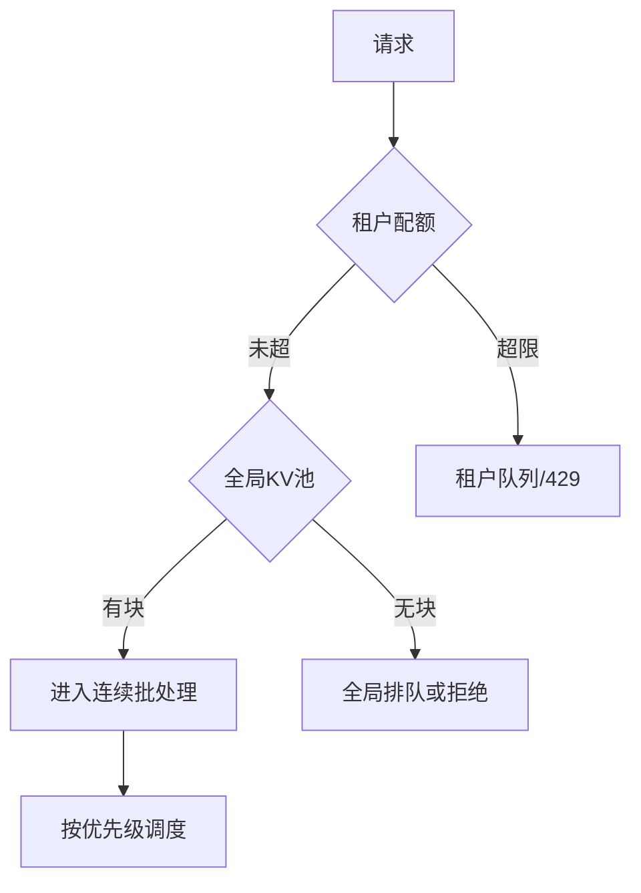

# 吵闹邻居与 KV 公平份额

一句话直觉：共享 GPU 上，一个「超长、超慢、超贪心」的租户能拖死所有人——要用队列、配额与 KV 显存份额，把吵闹邻居关进笼子。

## 直觉讲解

**吵闹邻居（noisy neighbor）**：多租户共享资源时，一方的突发占用导致另一方延迟/失败，即使总平均值「看起来还行」。

在 LLM Serving 里，争用点包括：

| 资源 | 吵闹方式 | 后果 |
|------|----------|------|
| KV / 显存 | 超长上下文、高并发占满块池 | 他人 OOM 或排队爆炸 |
| 迭代算力 | 极大 batch / 长生成 | 他人 TTFT/TPOT 恶化 |
| 队列 | 无优先级洪泛 | 交互被批任务饿死 |
| 前缀缓存 | 巨前缀占缓存 | 命中率对他人下降 |

**KV 公平份额**：为租户/路由类设置可占用的最大 KV 预算（或 `max_num_seqs`、最大并发 token），超限排队或拒绝，而不是让先到者吃光。



公平不是「每人一样慢」，而是 **隔离爆炸半径**：批处理报表打爆时，客服对话仍有 SLO。

## 工作示例（数字/场景）

**场景 A：内部平台两团队**

| 租户 | 模式 | 无管控 | 有管控 |
|------|------|--------|--------|
| 对话 | 短、流式 | P95 3s | P95 1.2s |
| 夜间摘要 | 长、高并发 | 拖垮对话 | 限 30% KV，夜间窗口 |

**场景 B：配额设计示意**

```text
tenant_A:
  max_concurrent_seqs: 16
  max_input_tokens: 8k
  max_output_tokens: 1k
  kv_budget_fraction: 0.4
  priority: high
tenant_B:
  max_concurrent_seqs: 8
  max_input_tokens: 32k
  kv_budget_fraction: 0.3
  priority: bulk
reserve_system: 0.3   # 突发与高优
```

超限返回明确错误码与「重试建议」，避免客户端空转重试打成风暴。

**场景 C：与网关协同**

引擎内硬顶防 OOM；网关做 API key 级 QPS、日预算、$ 上限。两层都要，见生产限流文。

## 面试常问取舍

1. **硬隔离（分卡/MIG/副本）vs 软隔离（配额）**  
   - 硬隔离稳、贵；软隔离省、有泄漏风险。关键客户可硬，长尾软。

2. **拒绝 vs 无限排队**  
   - 拒绝保 SLO；排队要有超时与可见位置。忌无界队列。

3. **全局公平 vs 付费优先级**  
   - 商业上允许优先级；技术上仍要保底份额防饿死。

4. **按请求数公平 vs 按 token 公平**  
   - LLM 应按 **token/KV** 计成本，按请求数会被长文钻空子。

## FDE 现场怎么用

- **设计评审**：多租户必答「谁能吃光 KV？」「大客户批任务放哪？」。  
- **默认值**：全局限长、全局限并发；再为租户细调。  
- **演练**：用压测账号发超长请求，看是否拖垮金丝雀租户。  
- **观测**：每租户排队、拒绝、KV 占用、P95；告警按租户路由。  
- **合同**：超额与优先级写清；对照 [生产化清单](../../03-AI落地/生产化清单.md) 限流与配额项。  
- **基础设施**：节点池与配额见 [GCP云架构与基础设施](../../05-能力补强/GCP云架构与基础设施.md)。

## 与本库其他篇的链接

- 同轨：[05-连续批处理](./05-连续批处理Continuous-Batching.md)、[06-PagedAttention](./06-PagedAttention.md)、[04-Serving](./04-推理Serving-vLLM-TGI.md)、[01-GPU显存](./01-GPU显存与VRAM.md)  
- 生产：[限流Rate-Limiting](../04-生产系统设计/05-限流Rate-Limiting.md)、[熔断与背压](../04-生产系统设计/09-熔断与背压.md)、[SLO-SLI与错误预算](../04-生产系统设计/20-SLO-SLI与错误预算.md)  
- MLOps：[模型监控](../05-MLOps与生命周期/04-模型监控.md)

## 课堂小结

多租户 Serving 的胜负手是公平性与爆炸半径，不只是峰值 tokens/s。FDE 用 KV/并发配额、优先级与硬隔离选项，让吵闹邻居吵不垮系统。本轨至此收束，可与 MLOps 轨道的监控与门禁闭环。


## 深入：优先级与防饿死

高优先级不能 100% 抢光：为 bulk 留最小份额或夜间窗口，否则批任务永远跑不完、会从旁路打爆系统。经典 QoS：`guaranteed / burstable / best-effort` 三类租户映射到不同 KV 分数与并发。

### 拒绝响应契约
```json
{"error":"tenant_kv_quota_exceeded","retry_after_ms":2000,"hint":"reduce max_tokens or later"}
```
客户端按契约退避；禁止无抖动重试。

### 现场检查清单
- [ ] 全局限长/限并发默认开启
- [ ] 每租户 KV/并发配额
- [ ] 对话与批处理隔离策略
- [ ] 吵闹演练做过
- [ ] 网关与引擎双层限流
- [ ] 每租户指标与告警

### 常见误区
只按 QPS 限流不按 token；无界队列；多租户共享前缀缓存无键；靠「大家自觉」。

## 参考与来源

- 原创综述：LLM 场景吵闹点、KV 份额与网关/引擎双层限流。  
- 多租户与 QoS 的通用系统思想。  
- 推理引擎调度/限额相关公开文档（概念层）。  
- 本库限流、背压、SLO 与显存文。
