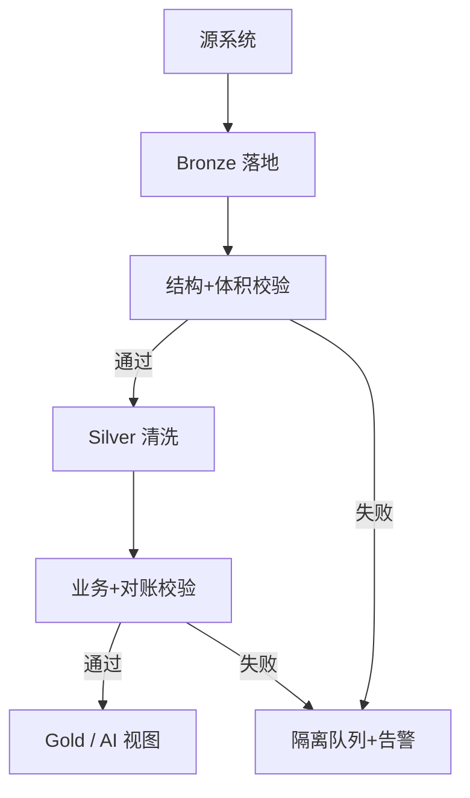

# 数据质量与校验

一句话直觉：坏数据进 AI 只会变成「自信的错答案」——质量规则要像断路器，在 CEO 看见之前先拦住。

## 直觉讲解

**数据质量（Data Quality）** 不是「表很干净」的感觉，而是可测量的属性集合。FDE 现场常用六维：

| 维度 | 含义 | 典型信号 |
|------|------|----------|
| 完整性 Completeness | 该有的字段/行是否在 | 空值率骤升、行数暴跌 |
| 唯一性 Uniqueness | 主键/业务键是否唯一 | 重复率、冲突键 |
| 准确性 Accuracy | 是否符合现实与权威源 | 与 SoR 对账失败 |
| 一致性 Consistency | 跨表/跨系统是否同口径 | 金额两边对不上 |
| 及时性 Timeliness | 是否在 SLA 内到达 | 新鲜度延迟 |
| 有效性 Validity | 是否落在合法域 | 枚举、区间、正则 |

**校验（Validation）** 把规则产品化：在管道关键节点跑断言，失败则告警、隔离坏批次或阻断下游。规则应分层：

1. **Schema 级**：类型、非空、主键  
2. **统计级**：分布漂移、行数相对昨日 ±X%  
3. **业务级**：订单金额 ≥ 0、关单必有关闭时间  
4. **跨表级**：事实表外键必须存在于维度  



原则：**CEO 看见坏数之前，你应先收到告警。** AI 助手接在未校验的 Bronze 上，等于把幻觉接口化。

## 工作示例（数字/场景）

**场景 A：客服 RAG 知识库新鲜度**

| 规则 | 阈值 | 动作 |
|------|------|------|
| 政策 PDF `updated_at` 与索引 `indexed_at` 差 > 24h | 每小时 | 告警检索 Owner |
| 切片数较昨日下降 > 30% | 每日 | 阻断重建发布 |
| 权限标签空值率 > 0 | 每次入库 | 拒绝入库 |

**场景 B：订单 Silver 日批**

假设昨日 120 万单，今日仅 40 万且无促销说明：

1. 体积规则触发「可疑」  
2. 作业标记 `data_quality=suspect`，Gold 看板打黄条「数据可能不完整」  
3. 不静默用残缺数训练周报 Agent  

**场景 C：金额对账**

ERP 与数仓日 GMV 差 > 0.5% → 打开对账报告：按门店拆差异。FDE 不负责修 ERP，但要能指出「权威源是谁、差在哪一段管道」。

**度量示例**：

```text
null_rate(customer_email) P95 < 2%
duplicate_pk_rate = 0
freshness_hours(orders_silver) < 4
```

把阈值写成监控，而不是周会口头问问。

## 面试常问取舍

1. **阻断 vs 仅告警**  
   - 资金、合规、对客承诺指标：倾向阻断或降级展示。  
   - 探索性分析：可告警继续，但标注质量状态。

2. **规则多少才够？**  
   - 第一周 5–10 条高杠杆规则胜过 200 条无人维护的断言。  
   - 规则要有 owner；无主规则等于没有。

3. **在源系统修 vs 在管道修**  
   - 根因在源则推动源修；管道可做临时修复但必须记「技术债 + 过期日」。  
   - 永久在 ETL 里「猜填」会毒化 AI。

4. **与模型评测的关系**  
   - 数据质量差会表现为「模型变笨」。先分清是数据回归还是提示/模型回归。

| 取舍 | 偏快 | 偏稳 |
|------|------|------|
| 校验深度 | 主键+行数 | +对账+漂移 |
| 失败策略 | 日志 | 隔离+阻断 Gold |
| 工具 | SQL 断言脚本 | 平台 DQ + 事件总线 |

## FDE 现场怎么用

进场检查清单：

1. 画出源 → Bronze → Silver → Gold → AI 消费点  
2. 点名每张关键表的 **权威源（System of Record）** 与 owner  
3. 抽样画像：空值、重复、时间戳单调性、枚举非法值  
4. 定最小断路器：新鲜度、体积、主键唯一  
5. 约定「黄条/红条」对业务的含义（能否给高管看）

对 AI 项目额外要求：进入提示词或索引的数据集必须挂质量门禁版本号；评测集本身也要防污染（标注冲突、过期政策）。

口条：「准确率掉了先看数据断路器，再看模型。」

## 与本库其他篇的链接

- 同轨：[03-幂等数据管道](./03-幂等数据管道.md)、[04-ETL-vs-ELT](./04-ETL-vs-ELT.md)、[07-湖仓Delta与勋章架构](./07-湖仓Delta与勋章架构.md)、[10-编排DAG重试回填](./10-编排DAG重试回填.md)  
- 基石：[数据工程基石课程](../../05-能力补强/数据工程基石课程.md)  
- 评测：[03-评测与ML基础/06-金标数据集与Eval集](../03-评测与ML基础/06-金标数据集与Eval集.md)、[09-评测RAG系统](../03-评测与ML基础/09-评测RAG系统.md)  
- 生产：[04-生产系统设计/06-AI系统可观测性](../04-生产系统设计/06-AI系统可观测性.md)

## 深入：质量门与 AI 消费契约

### 规则即契约
把质量规则写成与下游消费方共享的契约：字段含义、允许空值、合法枚举、新鲜度 SLA。AI 团队若另起一套「心里有数」的假设，评测集会与生产漂移。

### 统计漂移不只是 ML 话题
行数、空值率、类别分布的突变，往往比模型权重更新更早预告「上游换了导出逻辑」。把这些曲线挂在与模型指标同一周会上。

### 坏批次隔离模式
| 模式 | 做法 |
|------|------|
| 检疫区 | 写入 `quarantine` schema，不进 Silver |
| 影子 Gold | 算出结果但不切换对外视图 |
| 降级展示 | 看板标黄，Agent 拒答「数据过期」 |

### 与幂等、编排的咬合
质量失败应让编排失败或走分支，而不是「告警后继续成功」。否则重试与回填会把坏逻辑固化。

### 课堂小结
质量是断路器，不是事后报表美化。先 5 条高杠杆规则与明确 owner，再谈平台化 DQ 中台。

## 参考与来源

- 原创综述：将经典数据质量维度落到 FDE/AI 交付断路器（本篇）。  
- 本库：[数据工程基石课程](../../05-能力补强/数据工程基石课程.md)。  
- 行业常见实践：Great Expectations / dbt tests / 仓内约束等（概念通用，工具按客户栈选型）。  
- 提醒：质量规则与指标口径一样需要变更管理，避免「规则悄悄改、报表悄悄飘」。
