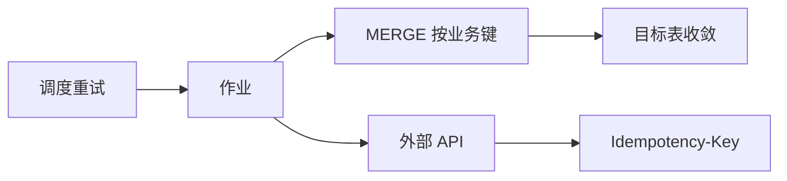

# 幂等数据管道

一句话直觉：管道会重跑、会回填、会至少一次投递——幂等让「跑两次」不等于「账算两次」。

## 直觉讲解

**幂等数据管道（Idempotent Pipeline）**：同一输入批次（或同一偏移区间）被处理一次或多次，目标表的业务状态收敛到相同结果。现实中消息与调度几乎都是 **at-least-once**，没有幂等就会在重试时制造重复订单行、重复扣减、重复向量索引。

常见实现杠杆：

| 层级 | 手段 | 说明 |
|------|------|------|
| 批次键 | `batch_id` / 分区日期 / Kafka offset 区间 | 每次运行可寻址 |
| 写入语义 | Upsert / MERGE / 覆盖分区 | 避免盲 append |
| 去重键 | 业务主键 + 版本 | 唯一约束托底 |
| 副作用 | 外部 API 带 Idempotency-Key | 管道外调用同样危险 |
| 状态存储 | 高水位 / 检查点 | 失败从安全点续跑 |



与「exactly-once」话术保持距离：端到端 exactly-once 昂贵且常被营销夸大；工程上多是 **at-least-once + 幂等写入 + 可重放**。

反模式：`INSERT INTO` 无边界；用「当前时间」当分区键导致回填写进「今天」；删除后重跑却用不可复现的随机 UUID 当主键。

## 工作示例（数字/场景）

**场景 A：日分区覆盖**

```sql
-- 伪代码：先清当日分区再写，或 INSERT OVERWRITE
DELETE FROM fact_orders WHERE dt = '{{ ds }}';
INSERT INTO fact_orders
SELECT ... FROM staging WHERE dt = '{{ ds }}';
```

同一 `ds` 重跑 10 次，行数仍等于源当日真相（假设源稳定）。

**场景 B：CDC MERGE**

以 `order_id` 为键，`updated_at` 为版本：仅当源更新时间更新时覆盖。乱序事件用版本比较，避免旧更新打赢新状态。

**场景 C：向量索引重建**

文档 `doc_id=POL-32` 变更：管道按 `doc_id` 删除旧切片再写入新切片，而不是无限 append。重跑不会让检索命中 5 份过期政策。

**数字直觉**：作业平均每天失败重试 2 次；若无幂等且每次多写 1% 重复，一个月后金表可能膨胀数十个百分点，AI 引用开始「同一条款多个版本」。

| 写入模式 | 幂等友好度 | 适用 |
|----------|------------|------|
| 分区覆盖 | 高 | 日批事实 |
| MERGE upsert | 高 | 维度 / CDC |
| 盲 append | 低 | 仅不可变事件且下游可去重 |
| 先删后插（无事务） | 中 | 需防半成功窗口 |

## 面试常问取舍

1. **分区覆盖 vs MERGE**  
   - 覆盖简单、回填清晰；大分区重写成本高。  
   - MERGE 适合缓慢变化；要设计好匹配条件与删除语义（软删）。

2. **幂等键选什么？**  
   - 优先稳定业务键；不要用「管道运行 id」当业务主键。  
   - 自然键不稳定时引入代理键，但要把映射表一并版本化。

3. **回填会破坏幂等吗？**  
   - 设计正确则回填只是「用历史输入再收敛」。  
   - 若逻辑依赖「今天的汇率」而不快照，回填不可复现——这是确定性（determinism）问题，与幂等纠缠。

4. **流式 exactly-once？**  
   - 承认检查点与幂等汇聚；面试说到「端到端语义需要源+中间件+汇」即可，不装神。

## FDE 现场怎么用

1. 列出所有有副作用的步骤：写表、调 API、发消息、建索引。  
2. 每步标注：键、重跑策略、失败半成品如何清理。  
3. 要求调度「失败自动重试」之前先证明幂等，否则重试=事故放大器。  
4. 回填演练：选一天历史分区重跑，对比行数与校验和。  
5. AI 相关：提示缓存、评测集导出、批处理打分作业同样要幂等，避免重复计费与重复标注。

与生产系统的 API 幂等互补：本篇偏数据面，API 面见生产轨「幂等」文。

## 与本库其他篇的链接

- 同轨：[02-数据质量与校验](./02-数据质量与校验.md)、[06-CDC变更数据捕获](./06-CDC变更数据捕获.md)、[10-编排DAG重试回填](./10-编排DAG重试回填.md)、[08-批处理vs流处理](./08-批处理vs流处理.md)  
- 生产：[04-生产系统设计/04-幂等Idempotency](../04-生产系统设计/04-幂等Idempotency.md)、[03-重试指数退避与抖动](../04-生产系统设计/03-重试指数退避与抖动.md)  
- 基石：[数据工程基石课程](../../05-能力补强/数据工程基石课程.md)

## 深入：确定性、水位与副作用

### 幂等 vs 确定性
幂等：多次执行收敛到同一状态。确定性：同样输入必然同样输出。回填时若读取「当前汇率」而不快照，则两者皆破。管道参数应显式：`ds`、汇率表版本、模型版本。

### 水位（High Watermark）
记录已成功处理的最大偏移/时间。失败重跑从水位继续或按分区重做。水位前进必须在「目标可见且校验通过」之后，避免跳号。

### 外部副作用清单（模板）
1. 写表 / 写索引  
2. 调支付或工单 API  
3. 发邮件 / 即时消息  
4. 触发下游 DAG  

每一项标注幂等键与补偿方式（撤销、对账、人工）。

### 验收用例
- 同一 `ds` 连续跑两次，校验和一致  
- 人为失败后重试，无重复对外副作用  
- 乱序 CDC 事件应用后状态仍正确  

### 课堂小结
自动重试是特权，特权建立在幂等证明上。没有证明，就把重试关掉。

## 参考与来源

- 原创综述：把 at-least-once 现实与仓内写入语义落到 FDE 管道设计（本篇）。  
- 本库生产轨幂等概念文（API/Agent 侧对照）。  
- 湖仓 MERGE / 分区覆盖等以实现平台文档为准。  
- 提醒：幂等不是「代码跑得通」，而是「重跑验收用例为绿」。
