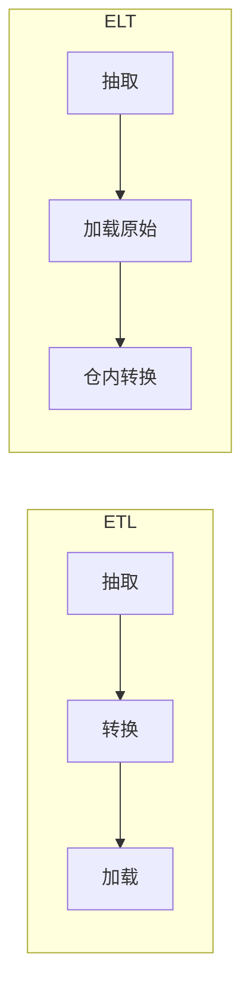

# ETL vs ELT

一句话直觉：ETL 先变形再入库；ELT 先落地再靠仓内算力变形——选型看「算力在哪、合规边界在哪、谁拥有转换逻辑」。

## 直觉讲解

| | ETL | ELT |
|--|-----|-----|
| 顺序 | Extract → Transform → Load | Extract → Load → Transform |
| 转换位置 | 中间件 / 专用引擎 | 目标仓内 SQL/Spark |
| 原始数据 | 往往不保留或保留有限 | Bronze/原始层常可追溯 |
| 典型年代感 | 仓算力贵时主流 | 云仓弹性后更常见 |

现代湖仓实践常是 **ELT 形、Medallion 魂**：原始落 Bronze，清洗到 Silver，指标到 Gold。但仍有场景必须 ETL：源侧不能出敏感明文、边缘设备预聚合、或目标是 API 而非仓。

关键不是缩写站队，而是回答：

1. **权威转换逻辑**写在哪、谁评审？  
2. **原始证据**能否回溯审计？  
3. **算力与成本**在中间集群还是在仓？  
4. **延迟**允许日批还是近实时？

FDE 口语：「我们是 ELT 还是 ETL？」更好的答法是画出数据平面与转换平面，指出合规与回放约束。

## 工作示例（数字/场景）

**场景 A：云数仓 + dbt 型 ELT**

- 抽取：Fivetran / 自建 CDC 写入 `raw_*`  
- 转换：仓内 SQL 模型生成 `stg_` / `mart_`  
- 好处：分析师可读 SQL、转换可 PR 评审、原始可重放  
- 成本：若 `raw` 无生命周期，存储与扫描费用爬升

**场景 B：强合规 ETL**

医保字段在源 VPC 内脱敏后才允许出网。此时 Transform 必须前移：出网载荷已是最小化视图。仓内再 ELT 只做非敏感主题域。

**场景 C：AI 备数混合**

| 步骤 | 模式 | 原因 |
|------|------|------|
| 合同 PDF → 文本/表格 | 管道侧 ETL（解析） | 非结构化不适合纯 SQL |
| 解析结果 → Silver 实体 | ELT/SQL | 关联、去重、SCD |
| Silver → 向量索引 | 作业型 T | embedding 调用是副作用 |

**数字感**：同一 2TB 原始日志，先在外部集群做重转换再加载，与丢进仓后按需转换，账单结构完全不同——前者付固定集群，后者付扫描；要按查询模式建模，而不是拍脑袋。

## 面试常问取舍

1. **为什么现在常说 ELT？**  
   - 云仓存算分离、SQL 引擎强、转换逻辑希望版本化与可测。  
   - 不是 ELT 万能：巨型行级 Python 逻辑可能仍要外部引擎。

2. **ELT 是否等于不要数据质量？**  
   - 相反：Load 后更要有测试与契约，否则脏数据「合法入住」。

3. **重复转换浪费吗？**  
   - ELT 鼓励保留原始以便改口径重放；用物化与增量模型控制成本。  
   - 「每次全量扫 raw」是实现问题，不是 ELT 原罪。

4. **和湖仓、Medallion 关系？**  
   - Medallion 是分层质量叙事；ETL/ELT 是转换发生地。可组合。

| 维度 | 偏 ETL | 偏 ELT |
|------|--------|--------|
| 出网合规 | 源侧最小化 | 仓内控权+脱敏视图 |
| 团队技能 | 数据工程 Java/Spark | 分析工程 SQL |
| 回放 | 依赖中间产物 | 依赖 raw + 代码 |

## FDE 现场怎么用

1. 第一周画清：哪些字段不能出源、哪些可以落 raw。  
2. 对 AI 项目默认争取「可追溯原始 + 受控 Silver 视图」，避免只拿不可回放的宽表。  
3. 转换逻辑进 Git；禁止仅存在于某同学桌面的 Informatica 点击流且无文档。  
4. 成本会议上区分「存储 raw」与「愚蠢的全表扫描」——用分区、聚簇、增量。  
5. 口头对齐客户：ELT 不是「不治理」，而是「治理点后移到仓内契约」。

## 与本库其他篇的链接

- 同轨：[02-数据质量与校验](./02-数据质量与校验.md)、[07-湖仓Delta与勋章架构](./07-湖仓Delta与勋章架构.md)、[06-CDC变更数据捕获](./06-CDC变更数据捕获.md)、[11-Spark内部与性能](./11-Spark内部与性能.md)  
- 基石：[数据工程基石课程](../../05-能力补强/数据工程基石课程.md)  
- 安全：[08-AI安全隐私与治理/02-PII处理与脱敏](../08-AI安全隐私与治理/02-PII处理与脱敏.md)、[11-数据驻留与主权](../08-AI安全隐私与治理/11-数据驻留与主权.md)

## 深入：转换所有权与成本模型

### 谁拥有 SQL？
ELT 把转换暴露给更多分析师，收益是速度，风险是口径分叉。治理手段：领域模型仓库、代码评审、发布环境（dev/staging/prod）、指标认证层。

### 原始层生命周期
无限保留 raw 会变成第二财务科目。按法规与重放需求定 TTL：例如原始文件 90–180 天，Bronze 表更长但转冷存储。

### 混合现实检查表
| 问题 | 偏向 |
|------|------|
| 出网前必须脱敏？ | ETL 前移 |
| 要频繁改口径重放？ | ELT + raw |
| 重 Python/ML 特征？ | 外部引擎 + 回写仓 |
| 只要 API 产品？ | 未必建仓 |

### AI 文档解析特例
PDF→结构化几乎总是管道作业（ETL 味道），随后实体合并用 SQL（ELT 味道）。不要教条单标签。

### 课堂小结
争论缩写不如在白板上标出「敏感边界」与「转换 Git 路径」。

## 参考与来源

- 原创综述：在合规、成本、回放三维下比较 ETL/ELT（本篇）。  
- 本库：[数据工程基石课程](../../05-能力补强/数据工程基石课程.md) Medallion 小节。  
- 云仓与 dbt 类分析工程实践（概念参考，不绑定单一厂商）。  
- 提醒：缩写辩论不如架构图；图上标出敏感数据边界即过关。
