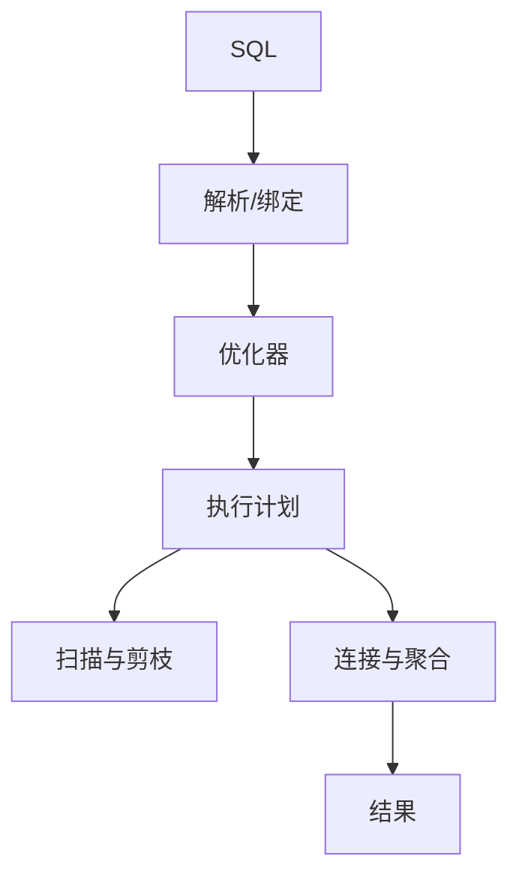

# 查询优化与执行计划

一句话直觉：慢查询不是「SQL 写得不够炫」，而是优化器选了一条昂贵路径——先读执行计划，再决定改写法、加索引还是改模型。

## 直觉讲解

**执行计划（Execution Plan）** 是引擎把 SQL 翻译成的算子树：扫描、过滤、连接、聚合、排序、交换（分布式）。**查询优化**则是让计划的代价（I/O、CPU、网络 shuffle、槽位时间）降到可接受。

FDE 需要的不是背完每一条优化器启发式，而是会问：

1. 读了多少字节 / 多少分区？能否裁剪？  
2. 连接顺序与类型是否合理（广播 vs shuffle）？  
3. 是否意外全表扫描或爆炸性中间结果？  
4. 统计信息是否过期导致误估？

仓型差异大：Postgres 看 `EXPLAIN ANALYZE`；Snowflake 看 Query Profile；BigQuery 看字节扫描与 slot；Spark SQL 看 DAG 与 stage。共通语言是 **扫描量、倾斜、spill、时间分布**。

反模式：没看计划就加一堆索引；用 `SELECT *` 扫宽表做存在性检查；在循环里发 N+1 查询；把「加机器」当唯一手段。

## 工作示例（数字/场景）

**场景 A：AI 助手「查最近订单」扫了 10TB**

根因：谓词写在子查询外，或对非分区键过滤；`WHERE customer_name LIKE '%张%'` 导致无法剪枝。

处置：

1. 用 `customer_id` 等值过滤  
2. 保证表按 `dt` 分区，查询带时间窗  
3. 需要模糊搜则走搜索系统，不拿仓当 ES  

**场景 B：双大表 JOIN OOM/超时**

计划显示 sort-merge join 且两表无预过滤。改为：

- 先各自聚合到日粒度再 join  
- 或确认小表可广播  
- 检查数据倾斜键（某超大门店）

**场景 C：窗口函数后过滤**

`ROW_NUMBER` 在全历史上算完再取 `rn=1`，应先按时间窗缩小集合，或物化「当前快照」表供在线查。

| 信号 | 可能原因 | 动作 |
|------|----------|------|
| 扫描字节巨大 | 无剪枝 / SELECT * | 分区谓词、列裁剪 |
| 单 stage 特久 | 倾斜 | salting、两阶段聚合 |
| spill 高 | 内存不够或基数爆 | 增内存或降中间基数 |
| 估算行数离谱 | 统计过期 | ANALYZE / 刷新 stats |

**粗算**：BigQuery 上一次 2TB 按需查询约数十美元量级（随定价变）；同一逻辑若能剪到 2GB，成本与延迟都降三个数量级——优化首先是少读。

## 面试常问取舍

1. **改 SQL vs 改表设计**  
   - 一次性报表优先改 SQL/物化。  
   - 高频路径要分区、聚簇、汇总表、索引（视引擎）。

2. **归一化 vs 宽表**  
   - 宽表利于扫少 join，但更新与一致性成本高。  
   - 在线点查与大分析可能要两套模型。

3. **提示优化器（hint）？**  
   - 最后手段；优先修统计与模型。hint 会在版本升级后变成暗债。

4. **Text-to-SQL 场景**  
   - 模型生成的 SQL 常缺分区谓词；网关层要强制时间窗与扫描上限。

## FDE 现场怎么用

1. 建立「慢查询复盘」模板：SQL、计划截图、扫描字节、改前改后。  
2. 给 AI/BI 用户设置护栏：最大扫描、必须带日期、禁止无限制导出。  
3. 与客户平台组对齐：谁负责统计信息刷新、谁负责小文件合并。  
4. POC 阶段就用生产量级抽样测延迟，忌用 1 千行 demo 表宣称性能合格。  
5. 口条：「先看读了多少，再看算了多少，最后才谈加机器。」

## 与本库其他篇的链接

- 同轨：[01-SQL窗口函数](./01-SQL窗口函数.md)、[11-Spark内部与性能](./11-Spark内部与性能.md)、[12-SQL-vs-NoSQL选型](./12-SQL-vs-NoSQL选型.md)、[07-湖仓Delta与勋章架构](./07-湖仓Delta与勋章架构.md)  
- Text-to-SQL：[02-检索与Agent/30-Text-to-SQL](../02-检索与Agent/30-Text-to-SQL.md)  
- 基石：[数据工程基石课程](../../05-能力补强/数据工程基石课程.md)  
- 成本：[04-生产系统设计/02-AI成本与单位经济](../04-生产系统设计/02-AI成本与单位经济.md)

## 深入：读计划的现场话术

### 三句话诊断法
1. **读了多少**：字节/分区/行估计 vs 实际  
2. **动了多少**：join/聚合/窗口是否必要  
3. **歪在哪里**：倾斜 task、spill、广播失败  

### 物化策略
高频「最新订单」类查询，与其每次全历史窗口，不如日更快照表。优化有时是产品化中间表，不是更炫的 SQL。

### Text-to-SQL 护栏
- 强制日期谓词  
- 最大扫描字节  
- 禁无限制 `SELECT *` 导出  
- 仅暴露认证视图  

### 与建模联动
错误粒度的事实表会逼查询做巨量 join。计划很烂时，回头问维度模型是否错了。

### 课堂小结
优化器不是玄学：用数字说话，改完再量一次。把前后对比贴进变更单。

## 参考与来源

- 原创综述：以执行计划读法驱动 FDE 现场优化对话（本篇）。  
- 各引擎 EXPLAIN / Query Profile 官方文档（以客户栈为准）。  
- 本库数据工程基石中的分区与调优练习建议。  
- 提醒：优化要有前后对比数字，避免「感觉快了」。
