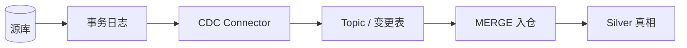

# CDC 变更数据捕获

一句话直觉：CDC 不靠「每晚全表抠」，而是持续捕获源库的插入/更新/删除，让下游近似跟着真相走。

## 直觉讲解

**CDC（Change Data Capture）** 从数据库事务日志（或等价变更流）中读取行级变更，发布为事件或应用到目标表。相对批量快照，CDC 延迟更低、对源库更温和（避免反复全表扫）。

常见形态：

| 形态 | 原理 | 特点 |
|------|------|------|
| 日志型 CDC | 读 binlog / WAL / redo | 主流；需权限与保留期 |
| 触发器型 | 源表触发器写影子表 | 侵入源；少用于新系统 |
| 时间戳轮询 | `updated_at > ?` | 简单但漏软删/时钟问题 |
| 查询差分 | 周期全量对比 | 重；作补充校验 |

关键语义问题：

1. **有序性**：同一主键的变更必须按事务顺序应用。  
2. **删除**：硬删要有 tombstone；软删要有约定字段。  
3. **schema 变更**：加列/改型时管道如何演进。  
4. **初始快照**：CDC 从「现在」开始前，通常要一次一致快照。  
5. **恰好一次**：多为至少一次 + 下游幂等 MERGE。

## 工作示例（数字/场景）

**场景 A：订单进湖仓近实时**

- Connector 读 MySQL binlog → Kafka topic `orders.cdc`  
- 下游每 1–5 分钟 MERGE 入 `orders_silver`  
- AI 「订单状态助手」读 Silver，新鲜度 SLA = 15 分钟  

**场景 B：漏删导致「幽灵库存」**

源硬删了 SKU，CDC 若只处理 upsert 不处理 delete，目标仍显示有货。修复：启用 delete 事件，MERGE 时 `WHEN MATCHED AND deleted THEN DELETE` 或打 `is_deleted`。

**场景 C：回填与断流**

日志保留 3 天，管道挂了 5 天 → 无法靠日志追赶，需重新快照 + 重置偏移。运维手册必须写清。

| 指标 | 例 |
|------|-----|
| 捕获延迟 | 源 commit → 事件可见 < 30s |
| 应用延迟 | 事件 → Silver 可见 < 10min |
| 错失窗口 | 日志保留 ≥ 7 天（按风险定） |

**数字感**：日变更率 2% 的 5 亿行大表，CDC 流量远小于每日全量拷贝；但峰值促销时变更风暴要给下游背压与扩容预案。

## 面试常问取舍

1. **CDC vs 日批快照**  
   - 要近实时、减源压力 → CDC。  
   - 源无法开日志、变更极少、或合规禁止复制 → 快照/受控导出。

2. **推到 Kafka 再入仓 vs 直接入仓**  
   - Kafka 利于多消费者与重放；多一跳运维。  
   - 直接入仓简单，消费模式单一时足够。

3. **时间戳轮询为何危险？**  
   - 时钟回拨、缺 `updated_at`、硬删不可见、同时间戳批量更新漏读。

4. **与 Event Sourcing 区别？**  
   - CDC 是「从现有库导出变更」；事件溯源是「业务先写事件」。别混为一谈。

## FDE 现场怎么用

1. 进场问清：源库类型、能否读日志、保留期、是否允许多副本。  
2. 点名主键与软删策略；无主键的表不适合朴素 CDC。  
3. 定义 AI 用数的新鲜度 SLA，倒推 CDC 与 MERGE 频率。  
4. 演练：停管道超保留期后的重建；schema 加列发布。  
5. 安全：CDC 流常含 PII——加密、ACL、下游脱敏与驻留一并设计。

口条：「近实时不是魔法，是日志权限、保留期与幂等 MERGE 的工程组合。」

## 与本库其他篇的链接

- 同轨：[03-幂等数据管道](./03-幂等数据管道.md)、[08-批处理vs流处理](./08-批处理vs流处理.md)、[07-湖仓Delta与勋章架构](./07-湖仓Delta与勋章架构.md)、[02-数据质量与校验](./02-数据质量与校验.md)  
- 生产：[04-生产系统设计/15-消息队列与PubSub](../04-生产系统设计/15-消息队列与PubSub.md)  
- 安全：[08-AI安全隐私与治理/02-PII处理与脱敏](../08-AI安全隐私与治理/02-PII处理与脱敏.md)  
- 基石：[数据工程基石课程](../../05-能力补强/数据工程基石课程.md)

## 深入：一致性窗口与运维手册

### 快照 + 增量的缝
初始快照与 CDC 启动点必须无缝或可对账。常见做法：快照事务点与 binlog 位点对齐；上线后跑一段时间双轨对比。

### Schema 演进剧本
加列默认值、改类型、改主键——预先演练。下游 MERGE 与类型系统谁先崩要写进手册。

### 监控四件套
1. 源库日志滞后  
2. Connector 错误与重试  
3. 消费滞后  
4. Silver 与源抽样对账差  

### 安全
CDC 流=潜在全量数据复印件。加密、主题 ACL、脱敏投影、驻留区域与源库同等严肃。

### 课堂小结
CDC 的难点在删除语义、位点与 schema，不在「会不会配连接器」。

## 速查清单与一周落地

### 进场 60 秒自检
-  成功 标准是否可测、可告警？
- 失败时能否阻断下游或降级，而不是静默？
- 关键对象是否有明确 owner 与版本？
- 是否存在可演示的回滚/重跑路径？
- 安全与隐私控制是否与功能同迭代，而非上线贴纸？

### 建议一周节奏
| 日 | 动作 |
|----|------|
| D1 | 画现状与爆炸半径；点名权威源/身份/边界 |
| D2 | 定最小验收数字与反例（应失败用例） |
| D3 | 落地最小控制或管道切片 |
| D4 | 用真实量级/红队样本验证 |
| D5 | 写 Runbook、客户沟通点与遗留风险 |

### 面试 60 秒版本
先讲问题的业务爆炸半径，再讲 2–3 个关键控制与可观测证据，最后给回滚/门禁。FDE 分数来自可运营，而不是名词堆叠。

### 常见反模式（再强调）
- 只有快乐路径 Demo，没有否定测试  
- 重试/自动化放大事故（缺幂等或缺开关）  
- 把提示词/文档当唯一强制执行点  
- 指标不可计算或无人看  
- 成本、质量、安全拆成三张互相矛盾的嘴  

### 与上下游的交接句
「这页概念的出口，是可写入 SOW 的门禁与可值班的操作说明；下一篇继续补齐相邻能力。」

## 参考与来源

- 原创综述：面向湖仓与 AI 新鲜度 SLA 的 CDC 决策框架（本篇）。  
- 事务日志型 CDC 的通用原理（具体连接器以 Debezium/厂商文档为准）。  
- 本库消息队列与幂等篇（投递语义对照）。  
- 提醒：没有删除语义与快照策略的「CDC」只是半成品。
