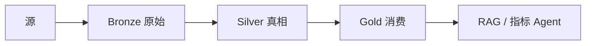

# 湖仓、Delta 与勋章架构

一句话直觉：湖仓把「便宜的原始湖」和「可治理的表抽象」合在一起；勋章（铜银金）用分层质量，让 AI 别直接啃垃圾场。

## 直觉讲解

**数据湖**擅长存百种原始格式，但长期易成沼泽：无 schema 契约、无事务、小文件成灾。**数据仓库**擅长治理与 SQL，但对半结构化与低成本原始归档不友好。**湖仓（Lakehouse）** 在对象存储之上提供表格式（事务、schema、时间旅行），让同一份数据既能便宜存，又能当表用。

**Delta Lake**（及同类 Iceberg / Hudi）提供近似能力：

| 能力 | 现场价值 |
|------|----------|
| ACID 事务 | 并发写不写坏表 |
| Schema 演进 / 强制 | 防脏列 silently 进入 |
| Time travel | 回滚错误写入、审计 |
| Upsert / MERGE | CDC 与维表更新 |
| 优化（compact、Z-Order 等） | 治小文件与裁剪 |

**勋章架构（Medallion：Bronze / Silver / Gold）**：

| 层 | 含义 | AI 可否直连 |
|----|------|-------------|
| Bronze | 原始落地，尽量不可变 | 通常否 |
| Silver | 清洗、去重、键齐的真相 | 受控可以 |
| Gold | 业务指标与主题宽表 | 看板/Agent 常用 |

FDE 检查点：Bronze 能否追溯源文件/批次；Silver 是否有主键与质量规则；Gold 指标是否有口径 owner。

## 工作示例（数字/场景）

**场景 A：政策文档湖仓**

- Bronze：原始 PDF + 解析 JSON，按 `ingest_date` 分区  
- Silver：条款实体表（`doc_id, clause_id, text, acl, version`）去重  
- Gold：面向检索的切片表 + 权限视图  
- Agent 只读 Gold/授权视图；出问题可 time travel 回昨夜 Silver

**场景 B：错误 MERGE 写爆维表**

误把测试作业指向生产，写入脏客户名。依赖 Delta 历史版本恢复到变更前，再修管道。没有表格式时，可能只能从备份痛苦重导。

**场景 C：小文件拖垮查询**

流式每分钟落数百微小文件，查询列出元数据比读数据还慢。定期 compact；控制触发频率与目标文件大小。

| 层 | 示例表 | 质量门 |
|----|--------|--------|
| Bronze | `bronze.orders_raw` | 体积、可读解析率 |
| Silver | `silver.orders` | PK 唯一、新鲜度 |
| Gold | `gold.daily_gmv` | 与财务对账阈值 |

## 面试常问取舍

1. **Delta vs Iceberg vs Hudi？**  
   - 能力重叠大；跟客户已有平台与技能走，少在 POC 打格式战争。  
   - 关注：流批一体、外部引擎兼容、治理工具链。

2. **只要 Bronze+Gold，不要 Silver？**  
   - 短 POC 可以；多消费者与 AI 长期会痛——真相逻辑会复制粘贴分叉。

3. **湖仓是否取代 dbt/数仓？**  
   - 常共存：表格式管存储事务，转换与测试仍要工程化。

4. **AI 能否扫 Bronze？**  
   - 演示可以，生产默认不行：权限、PII、重复与幻觉风险高。

## FDE 现场怎么用

1. 用客户语言画铜银金，避免一上来堆厂商名词。  
2. 为 AI 明确「允许绑定的层与视图」写进 SOW。  
3. 检查 time travel 保留期与存储成本是否被财务理解。  
4. 小文件、schema 漂移、无主 MERGE 作为上线前体检项。  
5. 与质量篇联动：每层门禁不同，别用同一套规则糊弄。

口条：「湖仓不是买了存储就完事，是表格式 + 分层契约 + 消费治理。」

## 与本库其他篇的链接

- 同轨：[04-ETL-vs-ELT](./04-ETL-vs-ELT.md)、[02-数据质量与校验](./02-数据质量与校验.md)、[06-CDC变更数据捕获](./06-CDC变更数据捕获.md)、[11-Spark内部与性能](./11-Spark内部与性能.md)  
- 基石：[数据工程基石课程](../../05-能力补强/数据工程基石课程.md)  
- 能力：[Snowflake与Databricks现场](../../05-能力补强/Snowflake与Databricks现场.md)（若存在）  
- 生产：[04-生产系统设计/19-企业AI参考架构](../04-生产系统设计/19-企业AI参考架构.md)

## 深入：表格式运维与消费契约

### 时间旅行的产品用法
- 误写回滚  
- 重现昨晚 AI 回答所用数据版本  
- 审计「当时真相」  

保留期与存储账单要提前让客户看见。

### 优化作业不是可选装饰
Compact、清理过期版本、Z-Order/聚簇（若适用）应进编排，否则流式入库数周后查询集体变慢。

### 金层指标认证
Gold 不是「又一张宽表」，是带 owner 与认证状态的消费合约。Agent 只绑认证视图。

### 与仓库共存
湖仓不强制驱逐经典数仓；常按主题域渐进。迁移期双写要对账。

### 课堂小结
铜银金是质量叙事；表格式是事务与演化工具。两者缺一，湖仍可能沦为沼泽。

## 速查清单与一周落地

### 进场 60 秒自检
-  成功 标准是否可测、可告警？
- 失败时能否阻断下游或降级，而不是静默？
- 关键对象是否有明确 owner 与版本？
- 是否存在可演示的回滚/重跑路径？
- 安全与隐私控制是否与功能同迭代，而非上线贴纸？

### 建议一周节奏
| 日 | 动作 |
|----|------|
| D1 | 画现状与爆炸半径；点名权威源/身份/边界 |
| D2 | 定最小验收数字与反例（应失败用例） |
| D3 | 落地最小控制或管道切片 |
| D4 | 用真实量级/红队样本验证 |
| D5 | 写 Runbook、客户沟通点与遗留风险 |

### 面试 60 秒版本
先讲问题的业务爆炸半径，再讲 2–3 个关键控制与可观测证据，最后给回滚/门禁。FDE 分数来自可运营，而不是名词堆叠。

### 常见反模式（再强调）
- 只有快乐路径 Demo，没有否定测试  
- 重试/自动化放大事故（缺幂等或缺开关）  
- 把提示词/文档当唯一强制执行点  
- 指标不可计算或无人看  
- 成本、质量、安全拆成三张互相矛盾的嘴  

### 与上下游的交接句
「这页概念的出口，是可写入 SOW 的门禁与可值班的操作说明；下一篇继续补齐相邻能力。」

## 参考与来源

- 原创综述：湖仓表格式与勋章分层在 FDE/AI 备数中的用法（本篇）。  
- 本库：[数据工程基石课程](../../05-能力补强/数据工程基石课程.md) Medallion 小节。  
- Delta / Iceberg / Hudi 公开文档（实现细节以当前版本为准）。  
- 提醒：分层是治理工具，不是文件夹重命名游戏。
