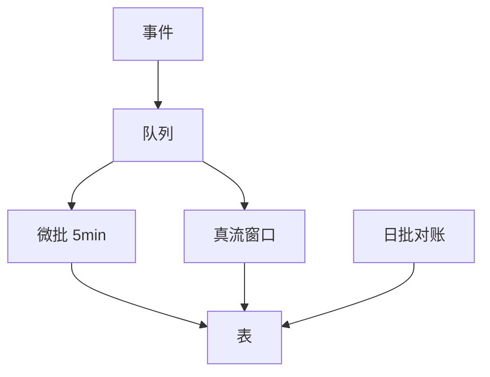

# 批处理 vs 流处理

一句话直觉：批是「切好的时间块再算」；流是「事件来了就动」——选延迟、成本与正确性窗口，而不是选时髦词。

## 直觉讲解

| | 批处理 Batch | 流处理 Streaming |
|--|--------------|------------------|
| 输入 | 有界数据集（某日分区） | 无界事件流 |
| 延迟 | 分钟～天 | 秒～分钟（视设计） |
| 重放 | 天然按分区回填 | 靠保留与检查点 |
| 正确性 | 易做全日对齐 | 要窗、水印、乱序策略 |
| 运维 | 调度 DAG | 长驻作业 + 背压 |

现实多为 **Lambda 思想的简化版** 或 **批流一体**：同一套湖仓表，批负责重算与对账，流负责低延迟中间态。微批（micro-batch）常是实用中间点：每 1–5 分钟跑一小批，运维像批，延迟接近近实时。

关键流概念（面试与现场都有用）：

- **事件时间 vs 处理时间**  
- **水印（watermark）**：多重晚的数据还等  
- **窗口**：滚动 / 滑动 / 会话  
- **恰好一次幻觉**：仍要幂等汇聚  

## 工作示例（数字/场景）

**场景 A：欺诈评分要 30 秒内**

用流：交易事件 → 特征更新 → 模型分。日批特征只能做次日分析，赶不上拦截。

**场景 B：高管日报 GMV**

日批足够；强行上流增加 exactly-once 与乱序成本，却换不来业务价值。用批 + 质量对账更稳。

**场景 C：RAG 索引新鲜度**

政策变更希望 1 小时内可检索：用 CDC/队列触发微批重建切片，不必亚秒流式 embedding（贵且易抖）。

| SLA | 倾向 |
|-----|------|
| T+1 报表 | 日批 |
| 15 分钟运营看板 | 微批 |
| <10 秒触达 | 流 + 简洁汇聚 |
| 法定对账 | 批为权威，流仅预览 |

**数字感**：流作业 24×7 占集群；批可以弹性拉起。若事件率低，流的「空转成本」可能高于微批。

## 面试常问取舍

1. **是不是流一定更先进？**  
   - 否。先进的是「匹配 SLA 的最简架构」。

2. **批流双跑如何避免双真相？**  
   - 指定权威层（通常批校正后的 Silver/Gold）；流输出标 `provisional`。

3. **水印设太大/太小？**  
   - 太大：延迟↑；太小：晚到数据丢或需侧输出修正。按迟到分布定。

4. **Spark Streaming / Flink / 仓内连续管道？**  
   - 跟栈与团队技能；关注语义与运维，不背品牌。

## FDE 现场怎么用

1. 用一张表写清每个数据产品的延迟 SLA 与权威计算路径。  
2. AI 场景默认从微批起步，证明价值再加压到真流。  
3. 要求演示「迟到事件」与「重放一天」——不会这两招的上流方案不接受。  
4. 成本：流的人效与常驻费用写进单位经济，不只报「延迟低」。  
5. 与编排篇衔接：批靠 DAG；流靠健康检查、消费滞后告警。

## 与本库其他篇的链接

- 同轨：[06-CDC变更数据捕获](./06-CDC变更数据捕获.md)、[03-幂等数据管道](./03-幂等数据管道.md)、[10-编排DAG重试回填](./10-编排DAG重试回填.md)、[11-Spark内部与性能](./11-Spark内部与性能.md)  
- 生产：[04-生产系统设计/15-消息队列与PubSub](../04-生产系统设计/15-消息队列与PubSub.md)、[09-熔断与背压](../04-生产系统设计/09-熔断与背压.md)  
- 检索新鲜度：[02-检索与Agent/25-索引新鲜度与陈旧窗口](../02-检索与Agent/25-索引新鲜度与陈旧窗口.md)

## 深入：正确性窗口与双轨真相

### 允许的「错多久」
流式大盘允许与日终权威差 0.5% 吗？写下来。没有书面窗口，流批双轨必吵。

### 会话窗口与 AI
客服会话、Agent 轨迹常用会话窗口：空闲超时切段。超时是产品参数，不是算法玄学。

### 背压
下游 MERGE 慢时，上游不能无限堆积——要丢弃策略（极少）、缓冲扩容或降级采样，并告警。

### 成本对照表（讨论用）
| 方案 | 常驻成本 | 人力 |
|------|----------|------|
| 日批 | 低 | 低 |
| 微批 | 中 | 中 |
| 真流 | 高 | 高 |

### 课堂小结
先签 SLA，再选批/流；用迟到事件与回放演练当验收，不当可选作业。

## 速查清单与一周落地

### 进场 60 秒自检
-  成功 标准是否可测、可告警？
- 失败时能否阻断下游或降级，而不是静默？
- 关键对象是否有明确 owner 与版本？
- 是否存在可演示的回滚/重跑路径？
- 安全与隐私控制是否与功能同迭代，而非上线贴纸？

### 建议一周节奏
| 日 | 动作 |
|----|------|
| D1 | 画现状与爆炸半径；点名权威源/身份/边界 |
| D2 | 定最小验收数字与反例（应失败用例） |
| D3 | 落地最小控制或管道切片 |
| D4 | 用真实量级/红队样本验证 |
| D5 | 写 Runbook、客户沟通点与遗留风险 |

### 面试 60 秒版本
先讲问题的业务爆炸半径，再讲 2–3 个关键控制与可观测证据，最后给回滚/门禁。FDE 分数来自可运营，而不是名词堆叠。

### 常见反模式（再强调）
- 只有快乐路径 Demo，没有否定测试  
- 重试/自动化放大事故（缺幂等或缺开关）  
- 把提示词/文档当唯一强制执行点  
- 指标不可计算或无人看  
- 成本、质量、安全拆成三张互相矛盾的嘴  

### 与上下游的交接句
「这页概念的出口，是可写入 SOW 的门禁与可值班的操作说明；下一篇继续补齐相邻能力。」

## 参考与来源

- 原创综述：按 SLA/成本/正确性窗口选择批、微批与流（本篇）。  
- 流式处理中事件时间与水印的通用概念（各引擎文档细化）。  
- 本库消息队列与 CDC 篇。  
- 提醒：两个延迟数字（捕获延迟 vs 业务可见延迟）要分开报。
