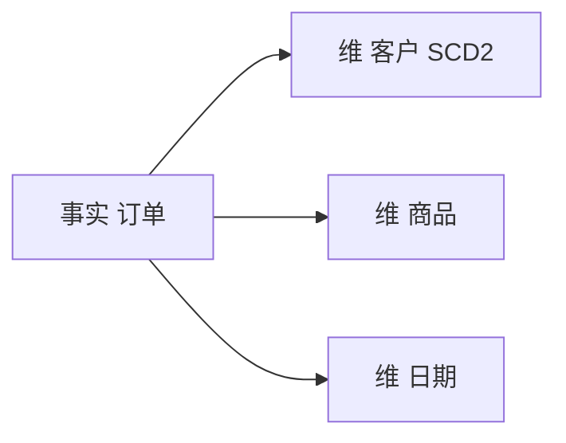

# 维度建模与 SCD

一句话直觉：维度建模把业务过程拆成「事实（度量）+ 维度（描述）」；SCD 回答「维度变了，历史报表还要不要旧标签」。

## 直觉讲解

**星型模型（Star Schema）**：中心是事实表（订单行、支付事件），周围是维度（客户、商品、门店、日期）。分析友好：过滤走维，聚合走事实。

**雪花模型**把维再规范化；更省存储、更多 join。现代仓存储便宜，常偏星型或宽维。

**OBT（One Big Table）** 大宽表降低消费复杂度，但刷新与口径一致性成本高——适合特定消费，不宜当唯一真相。

**SCD（Slowly Changing Dimension，缓慢变化维）** 常见类型：

| 类型 | 策略 | 例 |
|------|------|-----|
| SCD1 | 原地覆盖 | 客户改邮箱，不保留旧邮箱 |
| SCD2 | 增行 + 生效区间 | 客户改会员等级，历史订单仍挂旧等级 |
| SCD3 | 留有限历史列 | `prev_segment` + `current_segment` |

AI/FDE 要点：Agent 回答「去年这个客户是什么等级」依赖 SCD2；若只有 SCD1，历史被抹平。指标口径文档必须写清用哪型。

## 工作示例（数字/场景）

**场景 A：会员等级变更**

客户 C1 在 2026-01-15 从银卡变金卡。

| SCD | 2026-01 订单归因等级 |
|-----|----------------------|
| SCD1 | 全变金卡（含 1 月上旬） |
| SCD2 | 1/1–1/14 银卡；其后金卡 |

财务按「下单时等级」发佣，必须 SCD2 + 事实表挂 `customer_sk`（代理键）而非自然键裸连。

**场景 B：为 RAG 准备「当前有效产品说明」**

对文档维用 SCD2：`valid_from/valid_to`；检索默认 `valid_to IS NULL`（当前）。审计问答可查历史版本。

**场景 C：日期维**

不要用字符串日期到处 join；统一 `date_key`。财年、促销周、是否工作日等属性进日期维，避免每个指标改写日历逻辑。

| 建模选择 | 适合 | 风险 |
|----------|------|------|
| 星型 | BI、指标、受控 AI | 需治理维表 |
| OBT | 单应用速消 | 多口径分叉 |
| 雪花 | 强规范企业模型 | join 复杂 |

## 面试常问取舍

1. **事实表粒度怎么定？**  
   - 先写清「一行代表什么业务过程」（订单行 vs 订单头）。  
   - 粒度错了，后面指标全飘。

2. **自然键 vs 代理键**  
   - 源系统键会变/复用时，代理键 + 映射更安全。  
   - SCD2 几乎总要代理键。

3. **退化维（把订单号放进事实）？**  
   - 可；别为每个码都建空维。

4. **和正规化 3NF 运营库关系？**  
   - OLTP 求写正确；维度模型求读分析。常 ETL/ELT 出来，不互相取代。

## FDE 现场怎么用

1. 进场先找「指标字典」：有没有事实粒度与 SCD 约定；没有就别急着接 AI。  
2. 点名权威维：客户、组织、主数据谁说了算。  
3. 给对话式分析约定默认「当前维」还是「历史真实维」。  
4. POC 用窄星型主题域（一个过程）胜过全家桶 OBT。  
5. 质量规则：SCD2 区间无重叠、无缺口；事实孤儿键率为 0。

口条：「先定粒度与变维策略，再谈看板和 Agent。」

## 与本库其他篇的链接

- 同轨：[01-SQL窗口函数](./01-SQL窗口函数.md)、[07-湖仓Delta与勋章架构](./07-湖仓Delta与勋章架构.md)、[04-ETL-vs-ELT](./04-ETL-vs-ELT.md)、[02-数据质量与校验](./02-数据质量与校验.md)  
- 基石：[数据工程基石课程](../../05-能力补强/数据工程基石课程.md)  
- Ontology 对照：[04-生产系统设计/10-Ontology语义层](../04-生产系统设计/10-Ontology语义层.md)  
- Text-to-SQL：[02-检索与Agent/30-Text-to-SQL](../02-检索与Agent/30-Text-to-SQL.md)

## 深入：代理键、桥接与 AI 口径

### 多对多
用户↔权限组、订单↔促销常用桥接表。Text-to-SQL 若看不见桥，会算爆或算错——语义层要暴露正确路径。

### 晚期事实
事实先到、维未到：进「未知」成员还是延迟挂起？选一种并监控孤儿率。

### SCD2 查询模式
「当前」：`is_current` 或 `valid_to IS NULL`  
「历史点」：`as_of` 落在 `[valid_from, valid_to)`  

AI 默认模式必须写进系统提示与视图注释。

### 指标字典三行
1. 事实粒度  
2. 维变化类型  
3. 空值与未知成员语义  

### 课堂小结
维度模型是指标政治的技术方案；SCD 类型要业务签字，不单是 ETL 偏好。

## 速查清单与一周落地

### 进场 60 秒自检
-  成功 标准是否可测、可告警？
- 失败时能否阻断下游或降级，而不是静默？
- 关键对象是否有明确 owner 与版本？
- 是否存在可演示的回滚/重跑路径？
- 安全与隐私控制是否与功能同迭代，而非上线贴纸？

### 建议一周节奏
| 日 | 动作 |
|----|------|
| D1 | 画现状与爆炸半径；点名权威源/身份/边界 |
| D2 | 定最小验收数字与反例（应失败用例） |
| D3 | 落地最小控制或管道切片 |
| D4 | 用真实量级/红队样本验证 |
| D5 | 写 Runbook、客户沟通点与遗留风险 |

### 面试 60 秒版本
先讲问题的业务爆炸半径，再讲 2–3 个关键控制与可观测证据，最后给回滚/门禁。FDE 分数来自可运营，而不是名词堆叠。

### 常见反模式（再强调）
- 只有快乐路径 Demo，没有否定测试  
- 重试/自动化放大事故（缺幂等或缺开关）  
- 把提示词/文档当唯一强制执行点  
- 指标不可计算或无人看  
- 成本、质量、安全拆成三张互相矛盾的嘴  

### 与上下游的交接句
「这页概念的出口，是可写入 SOW 的门禁与可值班的操作说明；下一篇继续补齐相邻能力。」

## 参考与来源

- 原创综述：星型/SCD 在指标与 AI 历史问答中的现场取舍（本篇）。  
- 经典维度建模思想（Kimball 风格术语作通行语，不逐条复述教材）。  
- 本库数据工程基石与语义层篇。  
- 提醒：SCD 类型是产品决策，不是纯技术偏好。
