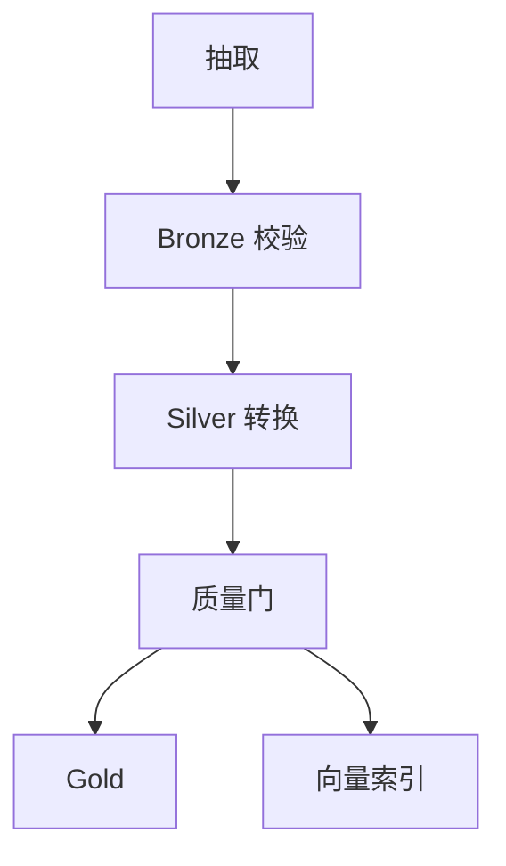

# 编排：DAG、重试与回填

一句话直觉：编排把「一堆作业」收成可依赖、可重试、可回填的 DAG——没有它，数据平台只是定时脚本碰运气。

## 直觉讲解

**编排（Orchestration）** 负责任务何时跑、依赖谁、失败怎么办、历史如何重算。常见抽象是 **DAG（有向无环图）**：节点是任务/资产，边是依赖。

核心能力：

| 能力 | 含义 |
|------|------|
| 调度 | cron / 事件触发 / 传感器等到位 |
| 依赖 | 上游成功才下游；跨 DAG 数据集依赖 |
| 重试 | 临时故障自动再跑（需幂等） |
| 告警 | 失败、超时、SLA 破线 |
| 回填（Backfill） | 对历史逻辑日期批量重跑 |
| 血缘 | 谁产出了这张表 |

工具只是载体（Airflow、Dagster、Prefect、云原生化调度等）。FDE 要盯语义：逻辑日期 `ds`、执行时间 `run_id`、数据间隔，别把「今天跑的」和「跑的是哪天的数据」混谈。

## 工作示例（数字/场景）

**场景 A：质量门失败阻断**

Silver 空值率超阈 → 任务失败 → Gold 与索引不更新 → 看板显示昨日数并打黄条。比静默写出坏 Gold 更安全。

**场景 B：重试放大事故**

无幂等的「发送每日摘要邮件」任务失败重试 5 次 → 客户收 5 封。修复：副作用任务幂等键 + 重试策略区分「可重试/不可重试」。

**场景 C：回填三周**

口径变更：历史 21 天需重算。用回填窗口并行度=4，避开业务高峰；回填后跑对账。注意：回填会打爆源 API 或仓槽位——要限流。

| 参数 | 建议起点 |
|------|----------|
| 临时错误重试 | 3 次，指数退避 |
| SLA | 日出数 08:00 前 |
| 回填并行 | 先 2–4，观察槽位 |
| 超时 | 按历史 P95×2 |

## 面试常问取舍

1. **时间调度 vs 数据感知调度**  
   - 只按钟点：简单但上游迟到会吃空跑。  
   - 等分区就绪：稳，但传感器要可靠。

2. **胖 DAG vs 多小 DAG**  
   - 胖：一览全局，易成巨石。  
   - 小：清晰，但跨图依赖与权限要设计。

3. **编排器里写业务逻辑？**  
   - 薄编排、厚转换（SQL/Spark 作业）。编排只接线与策略。

4. **失败后自动回填？**  
   - 谨慎；先告警人工确认，尤其是对金与对外推送。

## FDE 现场怎么用

1. 画出 AI 相关关键路径的 DAG：源→可用视图/索引。  
2. 每个对外副作用标「可否自动重试」。  
3. 写回填手册：谁有权、如何限流、如何验证。  
4. 把新鲜度 SLA 接到编排告警，而不是只钉在聊天群。  
5. POC 也至少要有「失败可见」——笔记本手工跑不是编排。

口条：「编排的价值是失败可预期、历史可重放，不是 cron 画布好看。」

## 与本库其他篇的链接

- 同轨：[03-幂等数据管道](./03-幂等数据管道.md)、[02-数据质量与校验](./02-数据质量与校验.md)、[08-批处理vs流处理](./08-批处理vs流处理.md)、[04-ETL-vs-ELT](./04-ETL-vs-ELT.md)  
- 生产：[04-生产系统设计/03-重试指数退避与抖动](../04-生产系统设计/03-重试指数退避与抖动.md)  
- 基石：[数据工程基石课程](../../05-能力补强/数据工程基石课程.md)

## 深入：SLA、传感器与变更

### 逻辑日期是一等公民
所有任务日志打印 `ds`/`data_interval`。客诉「数不对」时先确认跑的是哪一天的逻辑。

### 传感器可靠性
文件到达传感器假阳性/假阴性都会制造空跑或假等待。必要时加「源行数>0」二级检查。

### 变更窗口
口径变更=代码变更+回填+沟通。禁止「只改 SQL 不回填」却宣称历史可比。

### 权限
谁能触发生产回填？与仓库写权限分离，防误刷金表。

### 课堂小结
编排的产品是「可信的时间表」；重试与回填是带火药的工具，说明书是幂等与权限。

## 速查清单与一周落地

### 进场 60 秒自检
-  成功 标准是否可测、可告警？
- 失败时能否阻断下游或降级，而不是静默？
- 关键对象是否有明确 owner 与版本？
- 是否存在可演示的回滚/重跑路径？
- 安全与隐私控制是否与功能同迭代，而非上线贴纸？

### 建议一周节奏
| 日 | 动作 |
|----|------|
| D1 | 画现状与爆炸半径；点名权威源/身份/边界 |
| D2 | 定最小验收数字与反例（应失败用例） |
| D3 | 落地最小控制或管道切片 |
| D4 | 用真实量级/红队样本验证 |
| D5 | 写 Runbook、客户沟通点与遗留风险 |

### 面试 60 秒版本
先讲问题的业务爆炸半径，再讲 2–3 个关键控制与可观测证据，最后给回滚/门禁。FDE 分数来自可运营，而不是名词堆叠。

### 常见反模式（再强调）
- 只有快乐路径 Demo，没有否定测试  
- 重试/自动化放大事故（缺幂等或缺开关）  
- 把提示词/文档当唯一强制执行点  
- 指标不可计算或无人看  
- 成本、质量、安全拆成三张互相矛盾的嘴  

### 与上下游的交接句
「这页概念的出口，是可写入 SOW 的门禁与可值班的操作说明；下一篇继续补齐相邻能力。」

## 参考与来源

- 原创综述：DAG/重试/回填在 FDE 数据与 AI 备数中的最小实践（本篇）。  
- 主流编排器文档中的 dataset/dependency 概念（按客户栈选型）。  
- 本库幂等与重试篇。  
- 提醒：没有幂等的自动重试是事故发生器。
