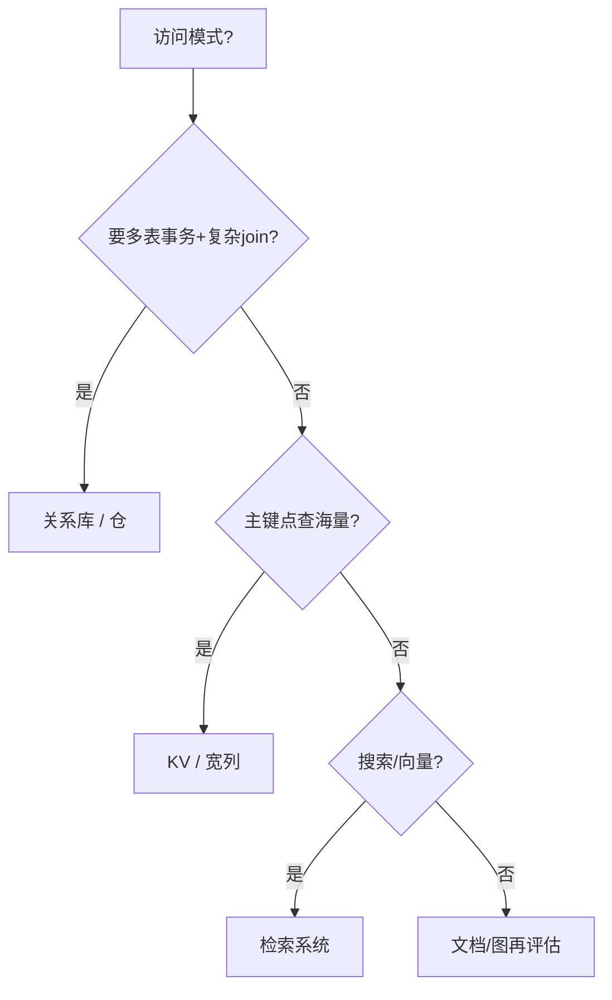

# SQL vs NoSQL 选型

一句话直觉：SQL/关系库擅长结构化事务与连接；NoSQL 家族各自拿延迟、弹性或灵活 schema 换掉一部分通用能力——按访问模式选，不按潮流选。

## 直觉讲解

「NoSQL」不是一种数据库，而是一筐不同模型：

| 类型 | 代表诉求 | 典型适合 |
|------|----------|----------|
| 文档 | 灵活 JSON 文档 | 内容、配置、事件体 |
| KV | 极简高分片键访问 | 会话、缓存、特征在线 |
| 宽列 | 海量写与主键范围扫 | 时序型大表、Inbox |
| 图 | 多跳关系 | 欺诈关联、权限图 |
| 检索 | 倒排/向量 | 搜索、RAG |

关系库（SQL）强项：ACID 事务、丰富声明式查询、成熟治理与人才。弱项：超水平扩展与极端灵活文档模式时工程成本上升（可分库分表，但是复杂度）。

企业现实是 **多存**：OLTP 关系库 + 仓/湖仓分析 + 搜索/向量 + 缓存。FDE 的工作是划边界，防止「一个 Mongo 打天下」或「一切进 Postgres 直到撑不住还假装没事」。

## 工作示例（数字/场景）

**场景 A：工单系统**

工单状态流转、指派、审计要事务 → 关系库。全文搜描述 → 同步到 OpenSearch。别在文档库里手写事务补偿除非团队真的很强。

**场景 B：RAG**

- 切片与元数据 ACL：可关系库或文档  
- 向量近似检索：向量库 / 检索引擎  
- 分析「哪类文档命中率高」：湖仓  

三者职责不同；强行只用一种会痛苦。

**场景 C：特征在线服务**

模型要 5ms 内取用户特征：KV/特征店。离线用 Spark 出特征进湖仓，再同步在线。关系库点查可以，但要验证 QPS 与尾延迟。

| 需求 | 更合适 | 别默认 |
|------|--------|--------|
| 钱与库存事务 | SQL | 最终一致 KV |
| 灵活半结构化日志 | 文档/湖 | 硬拗 3NF |
| 多跳欺诈 | 图或预计算 | 巨型递归 SQL 硬扛在线 |
| 语义检索 | 向量/混合搜 | `LIKE %` |

## 面试常问取舍

1. **NewSQL / 分布式 SQL 呢？**  
   - 想兼顾 SQL 与扩展时的选项；看成熟度、事务模型与运维成本。

2. **Schema-less 更敏捷？**  
   - 灵活在写入，混乱在治理。文档库也需要契约与版本。

3. **CAP 怎么答？**  
   - 用业务可接受的一致性与延迟说话；背三角形不够。见生产轨一致性篇。

4. **能否迁移？**  
   - 双写、影子读、回放验证；迁移成本常高于选型争论本身——第一次选对更重要。

## FDE 现场怎么用

1. 列出 Top 访问模式：QPS、延迟、事务、查询形状、数据寿命。  
2. 对 AI 系统画清：事务源、分析仓、检索索引各自角色。  
3. 拒绝「客户只会一种库就全塞进去」而不写风险。  
4. 成本：许可证、人力、云托管、扫描费用一起比较。  
5. 口条：「先写清查询，再写存储名字。」

## 与本库其他篇的链接

- 同轨：[05-查询优化与执行计划](./05-查询优化与执行计划.md)、[07-湖仓Delta与勋章架构](./07-湖仓Delta与勋章架构.md)、[09-维度建模与SCD](./09-维度建模与SCD.md)  
- 检索：[02-检索与Agent/02-向量数据库](../02-检索与Agent/02-向量数据库.md)  
- 生产：[04-生产系统设计/14-一致性CAP与工作流需求](../04-生产系统设计/14-一致性CAP与工作流需求.md)  
- 基石：[数据工程基石课程](../../05-能力补强/数据工程基石课程.md)

## 深入：多存一致性与演进

### 双写与真相
OLTP 与搜索/向量双写时，定义权威源与同步滞后 SLA。AI 读哪边？不一致时以谁为准？

### 迁移策略
绞杀者：新访问走新存，旧数据批量搬，双读校验，再切。切忌「周末停机一次迁完」而无回滚。

### 向量库是不是 NoSQL？
可归入专用检索存储。选型维度：过滤、混合检索、多租、备份、延迟——见检索轨。

### 决策记录（ADR）模板
问题 / 选项 / 决定 / 后果 / 复审日期。避免三年后无人记得为何上了某库。

### 课堂小结
存储选型是访问模式的函数；多存的税是同步，必须显式预算。

## 速查清单与一周落地

### 进场 60 秒自检
-  成功 标准是否可测、可告警？
- 失败时能否阻断下游或降级，而不是静默？
- 关键对象是否有明确 owner 与版本？
- 是否存在可演示的回滚/重跑路径？
- 安全与隐私控制是否与功能同迭代，而非上线贴纸？

### 建议一周节奏
| 日 | 动作 |
|----|------|
| D1 | 画现状与爆炸半径；点名权威源/身份/边界 |
| D2 | 定最小验收数字与反例（应失败用例） |
| D3 | 落地最小控制或管道切片 |
| D4 | 用真实量级/红队样本验证 |
| D5 | 写 Runbook、客户沟通点与遗留风险 |

### 面试 60 秒版本
先讲问题的业务爆炸半径，再讲 2–3 个关键控制与可观测证据，最后给回滚/门禁。FDE 分数来自可运营，而不是名词堆叠。

### 常见反模式（再强调）
- 只有快乐路径 Demo，没有否定测试  
- 重试/自动化放大事故（缺幂等或缺开关）  
- 把提示词/文档当唯一强制执行点  
- 指标不可计算或无人看  
- 成本、质量、安全拆成三张互相矛盾的嘴  

### 与上下游的交接句
「这页概念的出口，是可写入 SOW 的门禁与可值班的操作说明；下一篇继续补齐相邻能力。」

## 参考与来源

- 原创综述：按访问模式做 SQL/NoSQL/多存选型（本篇）。  
- 本库向量库与一致性概念文。  
- 各存储官方适用场景说明（避免营销页当唯一依据）。  
- 提醒：多存的最大成本是同步与一致性叙事，需显式设计。
