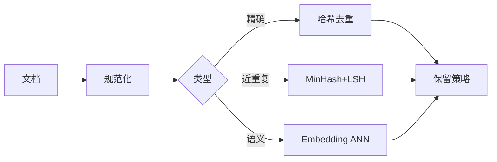

# 去重与 LSH

一句话直觉：精确去重靠稳定键与集合运算；海量「差不多重复」要靠相似度与 LSH 一类近似——先定义「同一条」再选算法。

## 直觉讲解

去重失败是数据质量与 AI 幻觉的常见上游：同一政策 5 个近重复切片，检索全中，模型拼出矛盾答案。

分层：

| 层级 | 问题 | 手段 |
|------|------|------|
| 精确重复 | 字节/规范化后完全相同 | 哈希、`DISTINCT`、唯一约束 |
| 键级重复 | 同一业务键多行 | `ROW_NUMBER` 取最新、MERGE |
| 近重复 | 标题微调、OCR 差异 | 相似度、MinHash/LSH、embedding |
| 实体解析 | 同一客户多名 | 规则+配对模型、主数据 |

**LSH（Locality-Sensitive Hashing）**：让相似项以高概率落入相同桶，从而在亚二次复杂度下找候选对。经典组合：文档 → shingle → MinHash 签名 → LSH 桶 → 对桶内算精确相似度（Jaccard/余弦等）。

与向量 ANN 的分工：LSH/MinHash 偏字面近重复；embedding 偏语义相近。企业语料常两者都要：先字面去重减噪声，再语义检索。

## 工作示例（数字/场景）

**场景 A：知识库入库**

1. HTML 去导航、空白折叠、Unicode 规范化  
2. 对正文算 SHA256 → 精确撞车直接丢弃  
3. MinHash 估计 Jaccard > 0.9 → 标近重复，人工或策略保留「最新权威源」  
4. 其余再切块 embedding  

**场景 B：事件流精确去重**

Kafka at-least-once → 以 `event_id` 唯一约束写入；窗口内布隆过滤器抗热点（注意假阳性）。

**场景 C：客户主数据**

「张三 / 张 三 / +86 手机」——规则归一 + 配对。这不是单纯 LSH，但属于去重家族；FDE 要拉主数据 owner，不在管道里「猜合并」而不留审计。

| 方法 | 复杂度直觉 | 风险 |
|------|------------|------|
| 全对全相似度 | O(n²) | 百万级不可用 |
| LSH 候选 | 近线性～亚二次 | 参数调不好漏/滥 |
| ANN embedding | 近线性 | 语义假友、版本漂移 |

**数字感**：100 万文档两两比≈ 5×10¹¹ 对；LSH 若每文档只比对桶内数十候选，才可工程化。

## 面试常问取舍

1. **为何不全部用 embedding 去重？**  
   - 贵、受模型版本影响、对「改几个字的复制」未必比 MinHash 稳。  
   - 字面与语义分层更稳。

2. **布隆过滤器能当真理吗？**  
   - 可判定「一定没有」；「可能有」需回源确认。勿当唯一账本。

3. **去重保留哪一条？**  
   - 策略先行：最新、权威源、最长、人工指定。算法不负责政治。

4. **Jaccard vs 余弦？**  
   - 集合型 shingle 用 Jaccard；向量空间用余弦/点积。别混指标阈值。

## FDE 现场怎么用

1. 进场抽样测重复率：精确与近重复各报一个数。  
2. 给 AI 语料定「同一文档」规则与保留策略，写进运行手册。  
3. 管道幂等：去重结果表可重跑收敛。  
4. 评测：去重过严会杀合法相似条款（误杀率要测）。  
5. 口条：「先定义同一，再谈哈希。」

## 与本库其他篇的链接

- 同轨：[01-SQL窗口函数](./01-SQL窗口函数.md)、[02-数据质量与校验](./02-数据质量与校验.md)、[03-幂等数据管道](./03-幂等数据管道.md)、[11-Spark内部与性能](./11-Spark内部与性能.md)  
- 检索：[02-检索与Agent/06-ANN近似最近邻](../02-检索与Agent/06-ANN近似最近邻.md)、[04-切块策略Chunking](../02-检索与Agent/04-切块策略Chunking.md)  
- 基石：[数据工程基石课程](../../05-能力补强/数据工程基石课程.md)

## 深入：参数、评测与主数据

### MinHash/LSH 参数直觉
签名长度↑ → 估计更稳、更贵；带宽/行数影响候选召回。用标注近重复集做精度-召回曲线，忌拍脑袋。

### 规范化清单
小写、全半角、去模板页眉页脚、去跟踪参数 URL、代码块哈希策略——规范化决定「精确重复」天花板。

### 与切块顺序
先文档级去重，再切块；反之近重复块会爆炸式污染索引。

### 主数据政治
合并客户实体要可逆与可审计；管道自动「合并」可能制造合规与客服灾难。

### 课堂小结
去重是策略+统计+评测。LSH 只是海量候选生成器，不是最终真理。

## 速查清单与一周落地

### 进场 60 秒自检
-  成功 标准是否可测、可告警？
- 失败时能否阻断下游或降级，而不是静默？
- 关键对象是否有明确 owner 与版本？
- 是否存在可演示的回滚/重跑路径？
- 安全与隐私控制是否与功能同迭代，而非上线贴纸？

### 建议一周节奏
| 日 | 动作 |
|----|------|
| D1 | 画现状与爆炸半径；点名权威源/身份/边界 |
| D2 | 定最小验收数字与反例（应失败用例） |
| D3 | 落地最小控制或管道切片 |
| D4 | 用真实量级/红队样本验证 |
| D5 | 写 Runbook、客户沟通点与遗留风险 |

### 面试 60 秒版本
先讲问题的业务爆炸半径，再讲 2–3 个关键控制与可观测证据，最后给回滚/门禁。FDE 分数来自可运营，而不是名词堆叠。

### 常见反模式（再强调）
- 只有快乐路径 Demo，没有否定测试  
- 重试/自动化放大事故（缺幂等或缺开关）  
- 把提示词/文档当唯一强制执行点  
- 指标不可计算或无人看  
- 成本、质量、安全拆成三张互相矛盾的嘴  

### 与上下游的交接句
「这页概念的出口，是可写入 SOW 的门禁与可值班的操作说明；下一篇继续补齐相邻能力。」

## 参考与来源

- 原创综述：精确/近重复/实体层去重与 LSH 在 AI 语料治理中的用法（本篇）。  
- MinHash / LSH 经典思想（实现库与参数以项目为准）。  
- 本库 ANN 与切块篇。  
- 提醒：去重是产品策略加算法，缺任一侧都会翻车。
