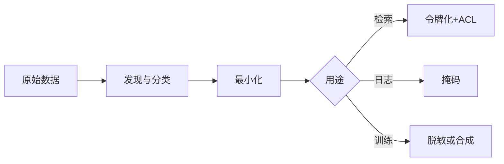

# PII 处理与脱敏

一句话直觉：PII 不是「有个隐私政策就行」——要识别、分类、最小化、脱敏/加密，并保证进模型与日志的路径可审计。

## 直觉讲解

**PII（Personally Identifiable Information）** 可直接或间接识别个人：姓名、证件号、手机、邮箱、精确位置、人脸等。企业还常扩到 **敏感个人数据**（健康、财务）与 **商业秘密**。

处理链路：

| 步骤 | 动作 |
|------|------|
| 发现 | 扫描语料、日志、训练集、提示缓存 |
| 分类 | 级别（公开/内部/机密/受限）与法规标签 |
| 最小化 | 能不采就不采；能聚合不留明细 |
| 脱敏 | 掩码、哈希、令牌化、泛化、合成替换 |
| 用途限定 | 训练/评测/检索/客服分流策略不同 |
| 留存 | TTL、删除权、被遗忘流程 |

**脱敏 ≠ 匿名**：可逆令牌化便于客服回查；真匿名难，且与效用冲突。选技术前先选威胁模型（内部滥用、外包、模型厂商、日志泄漏）。

## 工作示例（数字/场景）

**场景 A：客服对话进 RAG**

- 入库前：手机号掩码 `138****5678`，证件号不进索引  
- 工单号令牌化，客服系统可逆映射  
- 评测集用合成对话，不用生产原样外带  

**场景 B：日志打满 PII**

模型调试把完整提示打到 ELK，含身份证。事故响应：缩限访问、轮换、清理索引、改采样日志策略（结构化字段白名单）。

**场景 C：第三方模型 API**

合同与技术双控：零保留、区域端点、DPA；仍对提示做最小化——厂商承诺不是唯一控制。

| 技术 | 可逆 | 适用 |
|------|------|------|
| 掩码 | 否 | 展示/日志 |
| 哈希（带盐） | 否 | 联结同一人而不存明文 |
| 格式保留令牌化 | 是（经金库） | 需回流业务 |
| 泛化（城市级） | 否 | 分析 |

## 面试常问取舍

1. **全加密是否等于合规？**  
   - 加密解决机密性一层；用途限定、同意、删除、访问控制仍要。  

2. **NER 自动刮 PII 可靠吗？**  
   - 辅助可；高敏感域要规则+模型+抽检，接受漏检预算。  

3. **差分隐私呢？**  
   - 适合统计发布/部分训练；不是对话脱敏银弹。见下篇。  

4. **员工微调用了生产邮件？**  
   - 典型违规路径；训练数据要准入门禁。  

## FDE 现场怎么用

1. 数据地图：PII 出现在哪些系统与 AI 路径。  
2. 分类标签进元数据，RAG 权限与驻留依赖它。  
3. 默认：生产日志不含原始提示全文，或经脱敏管道。  
4. 客户法务/安全评审前准备「数据流图 + 脱敏说明」。  
5. 口条：「进模型的每个字段都要有用途与级别。」

## 与本库其他篇的链接

- 同轨：[03-差分隐私](./03-差分隐私.md)、[11-数据驻留与主权](./11-数据驻留与主权.md)、[04-审计轨迹与可追溯](./04-审计轨迹与可追溯.md)、[15-Secrets管理](./15-Secrets管理.md)  
- OWASP：[../../07-外文精读/07-OWASP-LLM应用风险Top10.md](../../07-外文精读/07-OWASP-LLM应用风险Top10.md)  
- 权限 RAG：[02-检索与Agent/18-权限感知RAG](../02-检索与Agent/18-权限感知RAG.md)

## 深入：用途矩阵与删除权

### 用途 × 控制矩阵
| 用途 | 明文？ | 控制 |
|------|--------|------|
| 在线客服屏 | 部分 | 掩码+工单权限 |
| RAG 索引 | 尽量否 | 令牌/剥离 |
| 模型训练 | 否 | 脱敏/合成/拒用 |
| 调试日志 | 否 | 采样+字段白名单 |

### 被遗忘与更正
用户行使删除权时：索引切片、备份、评测集、微调语料是否覆盖？流程要有清单与 SLA。

### 供应商流向
DPA、子处理方、保留期、区域——与驻留篇交叉。

### 误脱敏
掩码过度导致客服无法核身；令牌金库可用性进 SLO。

### 课堂小结
PII 工作是数据地图加用途矩阵；技术脱敏只是其中一格。

## 速查清单与一周落地

### 进场 60 秒自检
-  成功 标准是否可测、可告警？
- 失败时能否阻断下游或降级，而不是静默？
- 关键对象是否有明确 owner 与版本？
- 是否存在可演示的回滚/重跑路径？
- 安全与隐私控制是否与功能同迭代，而非上线贴纸？

### 建议一周节奏
| 日 | 动作 |
|----|------|
| D1 | 画现状与爆炸半径；点名权威源/身份/边界 |
| D2 | 定最小验收数字与反例（应失败用例） |
| D3 | 落地最小控制或管道切片 |
| D4 | 用真实量级/红队样本验证 |
| D5 | 写 Runbook、客户沟通点与遗留风险 |

### 面试 60 秒版本
先讲问题的业务爆炸半径，再讲 2–3 个关键控制与可观测证据，最后给回滚/门禁。FDE 分数来自可运营，而不是名词堆叠。

### 常见反模式（再强调）
- 只有快乐路径 Demo，没有否定测试  
- 重试/自动化放大事故（缺幂等或缺开关）  
- 把提示词/文档当唯一强制执行点  
- 指标不可计算或无人看  
- 成本、质量、安全拆成三张互相矛盾的嘴  

### 与上下游的交接句
「这页概念的出口，是可写入 SOW 的门禁与可值班的操作说明；下一篇继续补齐相邻能力。」

## 参考与来源

- 原创综述：PII 发现-分类-最小化-脱敏在 AI 路径上的落地（本篇）。  
- 各国个保法规概念层（GDPR/个保法等，以法务解释为准）。  
- 本库 OWASP LLM 精读中的数据相关风险。  
- 提醒：FDE 给技术方案，不给法律意见；升级法务/DPO。
