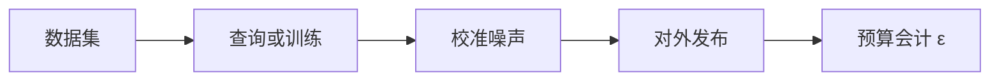

# 差分隐私

一句话直觉：差分隐私用「可量化的噪声」限制「有你没你」对输出的影响——换的是隐私预算，不是口号式匿名。

## 直觉讲解

**差分隐私（Differential Privacy, DP）**：一种数学定义——对相邻数据集（仅差一条个体记录），机制输出分布的差异被参数 **ε（及通常 δ）** 约束。ε 越小，隐私越强，效用通常越差。

直觉：查询/模型发布的结果里，攻击者难以确认「某个人是否在数据集中」。

| 概念 | 含义 |
|------|------|
| ε (epsilon) | 隐私预算；越小越严 |
| δ | 允许极小失败概率的松弛 |
| 机制 | Laplace / Gaussian 等加噪，或 DP-SGD |
| 组合 | 多次查询消耗预算，需会计 |

适用：统计报表发布、部分联邦/中心训练（DP-SGD）、遥测聚合。不适用幻想：对单条客服对话「加一点噪」就宣称 DP——定义与威胁模型不对则无效。

## 工作示例（数字/场景）

**场景 A：医院发布科室就诊量表**

小科室人数极少，精确计数可能反推个体。对计数加 Laplace 噪声，并设最小阈值（过小单元合并）。公布 ε 与用途。

**场景 B：遥测「功能使用率」**

客户端本地随机响应（RAPPOR 类思想）或服务端聚合加噪，避免精确用户轨迹出厂。产品看趋势，不看「某用户周一 9:03 点了啥」。

**场景 C：DP-SGD 微调**

对梯度裁剪+加噪，使训练过程满足 DP。代价：收敛变慢、效果可能下降；要评测效用是否仍达标。企业常仅对高敏感语料子集启用。

| 选择 | 影响 |
|------|------|
| ε=0.1 | 很严，效用伤大 |
| ε=1～10 | 常见工程讨论区，仍需论证 |
| 无会计乱查 | 「假 DP」 |

**数字感**：同一报表查 1000 次若不会计，预算耗尽，名义 ε 无意义。发布管道要有查询限与组合会计。

## 面试常问取舍

1. **DP vs 脱敏/匿名化？**  
   - 脱敏是工程控制；DP 是可证明的发布风险上界（在模型假设下）。可叠加。  

2. **ε 取多少合格？**  
   - 无普适魔法数；看数据敏感度、威胁、效用。需安全/法务/业务共定。  

3. **本地 DP vs 中心 DP？**  
   - 本地：数据出设备前已噪，更强，效用更伤。  
   - 中心：信任聚合方，效用较好。  

4. **能否保护模型不泄漏训练句？**  
   - DP-SGD 有帮助；还要配成员推断评测与输出过滤，不单靠 DP。  

## FDE 现场怎么用

1. 先问：对外发布的是统计还是明细？明细优先访问控制，不是硬套 DP。  
2. 若客户提 DP，要求写清：机制、ε/δ、组合会计、评测效用。  
3. AI 助手直接读行级数据 ≠ DP 场景；别把词当贴纸。  
4. 与联邦学习组合时，分清「数据不出域」与「DP」是不同控制。  
5. 口条：「没有预算会计的差分隐私，只是加了噪的安慰剂。」

## 与本库其他篇的链接

- 同轨：[02-PII处理与脱敏](./02-PII处理与脱敏.md)、[05-联邦学习](./05-联邦学习.md)、[08-AI治理SOC2-EU-AI-Act](./08-AI治理SOC2-EU-AI-Act.md)  
- 评测：[03-评测与ML基础](../03-评测与ML基础/README.md)（效用权衡）  
- OWASP：[../../07-外文精读/07-OWASP-LLM应用风险Top10.md](../../07-外文精读/07-OWASP-LLM应用风险Top10.md)

## 深入：会计、效用与误用

### 组合会计
顺序组合、并行组合规则不同；工程上要用库做隐私会计，不要口算 ε。

### 效用评测
同一业务指标在无噪/有噪下的误差带；业务签字「可接受误差」。

### 常见误用
1. 对已公开个体标识加噪却仍发布可联结键  
2. 声称 DP 却每次查询改机制无预算  
3. 把 DP 当行级访问控制替代  

### 与联邦叠加
FL+DP 是研究与少数生产组合；复杂度高，先确认真需要。

### 课堂小结
DP 是带预算的发布阀门；阀门参数是治理决策，不是模型调参游戏。

## 速查清单与一周落地

### 进场 60 秒自检
-  成功 标准是否可测、可告警？
- 失败时能否阻断下游或降级，而不是静默？
- 关键对象是否有明确 owner 与版本？
- 是否存在可演示的回滚/重跑路径？
- 安全与隐私控制是否与功能同迭代，而非上线贴纸？

### 建议一周节奏
| 日 | 动作 |
|----|------|
| D1 | 画现状与爆炸半径；点名权威源/身份/边界 |
| D2 | 定最小验收数字与反例（应失败用例） |
| D3 | 落地最小控制或管道切片 |
| D4 | 用真实量级/红队样本验证 |
| D5 | 写 Runbook、客户沟通点与遗留风险 |

### 面试 60 秒版本
先讲问题的业务爆炸半径，再讲 2–3 个关键控制与可观测证据，最后给回滚/门禁。FDE 分数来自可运营，而不是名词堆叠。

### 常见反模式（再强调）
- 只有快乐路径 Demo，没有否定测试  
- 重试/自动化放大事故（缺幂等或缺开关）  
- 把提示词/文档当唯一强制执行点  
- 指标不可计算或无人看  
- 成本、质量、安全拆成三张互相矛盾的嘴  

### 与上下游的交接句
「这页概念的出口，是可写入 SOW 的门禁与可值班的操作说明；下一篇继续补齐相邻能力。」

## 参考与来源

- 原创综述：DP 定义直觉、预算与 FDE 适用边界（本篇）。  
- Dwork 等差分隐私基础定义（学术源头）。  
- DP-SGD 与业界部署案例作概念参考。  
- 提醒：本篇不替代密码学/合规签署；参数需专家评审。
