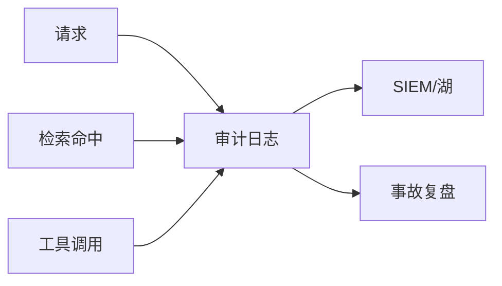

# 审计轨迹与可追溯

一句话直觉：审计轨迹让「谁在何时对何数据用何模型做了什么」可证明——可追溯是治理与事故复盘的氧气。

## 直觉讲解

**审计轨迹（Audit Trail）**：按时间顺序记录安全相关事件，且足够完整、防篡改、可检索。AI 系统至少要覆盖：

| 对象 | 记什么 |
|------|--------|
| 身份 | 用户/服务/Agent 身份、租户、模拟切换 |
| 请求 | 会话 id、时间、端点、工具名与参数摘要 |
| 数据访问 | 检索 doc_id、行级策略版本、是否命中拒绝 |
| 模型 | 模型名/版本、提示模板版本、解码参数 |
| 输出 | 答案哈希、是否含外发、人工覆盖 |
| 管理面 | 密钥轮换、策略变更、索引重建 |

**可追溯（Traceability）**：从一条对客回答能回溯到证据片段、策略版本与模型版本；从一次工具调用能回溯到授权决策。

注意：完整提示原文可能含 PII——审计要「够用」与「最小化」平衡：存引用 id 与哈希，必要时密令牌访问原文。

## 工作示例（数字/场景）

**场景 A：错误退款复盘**

业务投诉：Agent 乱退款。审计显示：

1. 用户 X，工具 `refund`，金额 899  
2. 当时策略版本 v3 允许 <100 自动，≥100 需人审——但旗标 `skip_hitl=true` 被误开  
3. 关联变更单：谁在何时改旗标  

没有审计则变成互相指责。

**场景 B：权限对穿调查**

用户不应看到人事文档。日志显示检索返回了 `doc_id=HR-..`——再查是元数据缺 ACL 还是过滤被绕过。

**场景 C：合规抽检**

SOC2/客户审计要抽样 25 条高风险对话：导出审计包（身份、时间、模型版本、工具、人工确认记录），不含不必要明文 PII。

| 字段 | 建议 |
|------|------|
| request_id | 全局唯一 |
| actor | 用户与服务主体 |
| resource | 数据/工具 |
| decision | allow/deny 原因码 |
| versions | 模型/策略/索引 |
| ts | UTC |

## 面试常问取舍

1. **日志会不会反而泄漏？**  
   - 会；故分级存储、访问控制、脱敏、留存期。  

2. **链路追踪（trace）能替代审计吗？**  
   - Trace 利排障；审计强调安全事件完整性与防篡改，宜配合。  

3. **要不要存全部 token？**  
   - 默认不；成本与隐私双爆。按风险抽样或对象存储冷备。  

4. **区块链审计？**  
   - 多数企业用 WORM/对象锁/SIEM 即可；别为叙事上链。  

## FDE 现场怎么用

1. 上线门禁：无审计的高危工具不准开。  
2. 字段字典与法务/安全共建。  
3. 演练「从一条错误回答追溯到根因」≤30 分钟。  
4. 与可观测性分工：metrics/trace 看健康，audit 看责任。  
5. 口条：「不能追溯的智能，只是不可追责的自动化。」

## 与本库其他篇的链接

- 同轨：[14-AI事件响应](./14-AI事件响应.md)、[08-AI治理SOC2-EU-AI-Act](./08-AI治理SOC2-EU-AI-Act.md)、[10-RBAC-ABAC与Agent运行时身份](./10-RBAC-ABAC与Agent运行时身份.md)、[01-提示注入与防御](./01-提示注入与防御.md)  
- 生产：[04-生产系统设计/06-AI系统可观测性](../04-生产系统设计/06-AI系统可观测性.md)  
- OWASP：[../../07-外文精读/07-OWASP-LLM应用风险Top10.md](../../07-外文精读/07-OWASP-LLM应用风险Top10.md)

## 深入：防篡改与留存

### 防篡改选项
WORM 对象存储、只追加日志、SIEM 校验和、分离账户写审计。应用自己的 DB 表可被同权用户改——不够。

### 留存
安全审计与产品分析日志分离 TTL。合规要长留的，脱敏后冷存。

### 关联 ID
`trace_id` / `request_id` / `session_id` / `tenant_id` 贯穿网关、检索、模型、工具。缺一环就断追责链。

### 抽检节奏
每月随机抽 20 条高危操作，人工核对策略是否被绕过。

### 课堂小结
可追溯是设计属性：字段、存储、权限、演练四件套。

## 速查清单与一周落地

### 进场 60 秒自检
-  成功 标准是否可测、可告警？
- 失败时能否阻断下游或降级，而不是静默？
- 关键对象是否有明确 owner 与版本？
- 是否存在可演示的回滚/重跑路径？
- 安全与隐私控制是否与功能同迭代，而非上线贴纸？

### 建议一周节奏
| 日 | 动作 |
|----|------|
| D1 | 画现状与爆炸半径；点名权威源/身份/边界 |
| D2 | 定最小验收数字与反例（应失败用例） |
| D3 | 落地最小控制或管道切片 |
| D4 | 用真实量级/红队样本验证 |
| D5 | 写 Runbook、客户沟通点与遗留风险 |

### 面试 60 秒版本
先讲问题的业务爆炸半径，再讲 2–3 个关键控制与可观测证据，最后给回滚/门禁。FDE 分数来自可运营，而不是名词堆叠。

### 常见反模式（再强调）
- 只有快乐路径 Demo，没有否定测试  
- 重试/自动化放大事故（缺幂等或缺开关）  
- 把提示词/文档当唯一强制执行点  
- 指标不可计算或无人看  
- 成本、质量、安全拆成三张互相矛盾的嘴  

### 与上下游的交接句
「这页概念的出口，是可写入 SOW 的门禁与可值班的操作说明；下一篇继续补齐相邻能力。」

## 参考与来源

- 原创综述：AI 系统审计最小字段与可追溯验收（本篇）。  
- SOC2/ISO 等审计证据思路（控制目标层）。  
- 本库可观测性与 OWASP 精读。  
- 提醒：审计本身是敏感系统，按最高水位防护。
