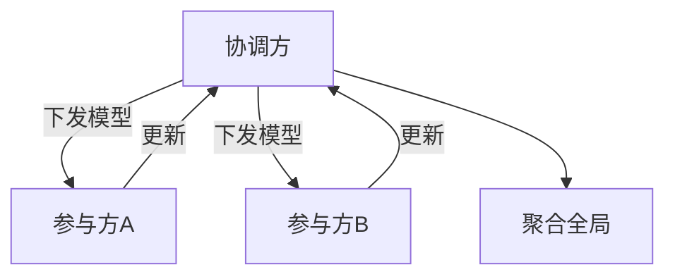

# 联邦学习

一句话直觉：联邦学习让模型「走出去学」、数据「尽量留在本地」——但不是零风险，梯度与聚合仍可能泄漏，工程与治理一样重。

## 直觉讲解

**联邦学习（Federated Learning, FL）**：多方在本地用私有数据训练，只上传模型更新（梯度/权重差分），由协调方聚合（如 FedAvg）得到全局模型。动机：数据驻留、竞争隔离、合规限制「原始数据出境/出域」。

| 角色 | 职责 |
|------|------|
| 参与方 | 本地训练、质量门、安全信道 |
| 协调方 | 选型聚合、参与方选择、全局版本 |
| 安全层 | 传输加密、可选安全聚合、DP |

分类直觉：跨设备（手机海量）vs 跨机构（医院/银行少数参与方）。企业 FDE 多见跨机构：参与方少、每方数据质量与法务条款更关键。

FL **不自动等于**合规通过：仍要协议、审计、投毒防御、成员推断评估。

## 工作示例（数字/场景）

**场景 A：三家医院联合做影像辅助模型**

原始影像不出院；每院本地训练，周级上传更新。协调方在可信环境聚合。合同写明：更新保留期、退出权、事故责任。

**场景 B：投毒**

恶意参与方上传有毒更新，污染全局。缓解：更新裁剪、异常检测、可信参与方准入、安全聚合降低单方观察。

**场景 C：其实不需要 FL**

客户只是「怕数据给厂商」。若可在客户 VPC 内中心训练（数据不出客户边界），往往比 FL 简单一个数量级。FL 是工具不是勋章。

| 方案 | 数据位置 | 复杂度 |
|------|----------|--------|
| 中心训练（客户 VPC） | 客户内 | 中 |
| 脱敏后中心 | 视脱敏 | 中 |
| 联邦 | 多方本地 | 高 |
| 仅提示/RAG | 不出训练 | 相对低 |

## 面试常问取舍

1. **FL vs 差分隐私？**  
   - 可叠加：本地/中心 DP 限制更新信息量；单独 FL 不做 DP 仍可能泄漏。  

2. **安全聚合是什么？**  
   - 协调方只能看聚合结果、难看单方更新；实现与性能有成本。  

3. **非 IID 数据？**  
   - 各方分布差异大时全局模型可能差；需联邦算法与评估设计。  

4. **和机密计算关系？**  
   - TEE/机密计算可强化协调方信任；又是另一层工程。  

## FDE 现场怎么用

1. 先验证「数据不能集中」是否为真约束；假约束别上 FL。  
2. 写清威胁模型：半诚实协调方？恶意参与方？  
3. 试点用横向表格/小模型验证工程链路，再谈 LLM 级联邦（极少必要）。  
4. 治理：参与方准入、退出、审计与模型所有权。  
5. 口条：「联邦减的是原始数据移动，不是安全工作量。」

## 与本库其他篇的链接

- 同轨：[03-差分隐私](./03-差分隐私.md)、[11-数据驻留与主权](./11-数据驻留与主权.md)、[08-AI治理SOC2-EU-AI-Act](./08-AI治理SOC2-EU-AI-Act.md)、[06-多租户与数据隔离](./06-多租户与数据隔离.md)  
- 部署：[04-生产系统设计/18-部署模型SaaS-BYOC-OnPrem-气隙](../04-生产系统设计/18-部署模型SaaS-BYOC-OnPrem-气隙.md)

## 深入：激励、评测与退出

### 参与方激励
谁出算力、谁拥有全局模型、商业如何分成——非技术问题却决定 FL 死活。

### 横向 vs 纵向
特征对齐（纵向）与样本对齐（横向）工程差异大；先画数据示意图再选算法名词。

### 退出与投毒善后
参与方退出后，历史更新是否可从模型「遗忘」？现实中很难完美；合同与再训练策略要写明。

### 何时对 FDE 说不
若目标是「让 LLM 用三家私有语料变聪明」而数据可集中到客户可信环境，优先 VPC 训练/RAG，不上 FL。

### 课堂小结
联邦是约束驱动的架构，不是简历关键词。

## 速查清单与一周落地

### 进场 60 秒自检
-  成功 标准是否可测、可告警？
- 失败时能否阻断下游或降级，而不是静默？
- 关键对象是否有明确 owner 与版本？
- 是否存在可演示的回滚/重跑路径？
- 安全与隐私控制是否与功能同迭代，而非上线贴纸？

### 建议一周节奏
| 日 | 动作 |
|----|------|
| D1 | 画现状与爆炸半径；点名权威源/身份/边界 |
| D2 | 定最小验收数字与反例（应失败用例） |
| D3 | 落地最小控制或管道切片 |
| D4 | 用真实量级/红队样本验证 |
| D5 | 写 Runbook、客户沟通点与遗留风险 |

### 面试 60 秒版本
先讲问题的业务爆炸半径，再讲 2–3 个关键控制与可观测证据，最后给回滚/门禁。FDE 分数来自可运营，而不是名词堆叠。

### 常见反模式（再强调）
- 只有快乐路径 Demo，没有否定测试  
- 重试/自动化放大事故（缺幂等或缺开关）  
- 把提示词/文档当唯一强制执行点  
- 指标不可计算或无人看  
- 成本、质量、安全拆成三张互相矛盾的嘴  

### 与上下游的交接句
「这页概念的出口，是可写入 SOW 的门禁与可值班的操作说明；下一篇继续补齐相邻能力。」

## 参考与来源

- 原创综述：联邦学习适用边界与企业跨机构场景取舍（本篇）。  
- FedAvg 等经典聚合思想（概念层）。  
- 本库驻留与差分隐私篇。  
- 提醒：LLM 全参数联邦在多数 FDE 项目不现实；先问清目标模型形态。
