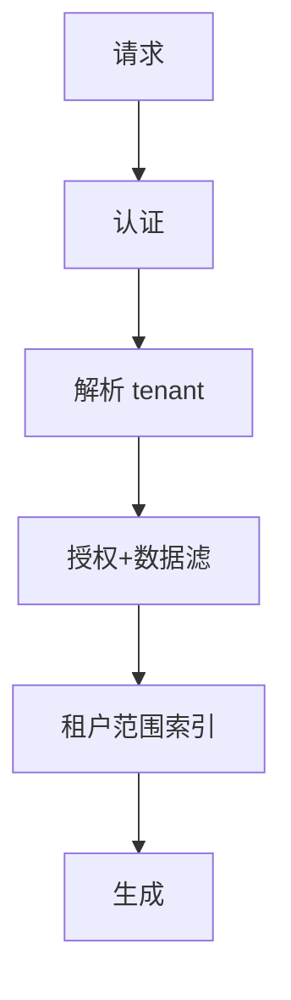

# 多租户与数据隔离

一句话直觉：多租户省的是成本，漏的是邻居数据——隔离要在身份、数据、计算与运维四面同时成立。

## 直觉讲解

**多租户（Multi-tenancy）**：同一套软件服务多个租户（公司/事业部），并保证租户间资源与数据按契约隔离。隔离光谱：

| 级别 | 形态 | 隔离强度 | 成本 |
|------|------|----------|------|
| 共享一切靠行级 | 单库 `tenant_id` | 靠应用正确性 | 低 |
| 共享计算分存储 | 独立 schema/桶 | 中 | 中 |
| 独立运行时 | 每租户集群/项目 | 高 | 高 |
| 独立部署 | 专有实例 | 最高 | 最高 |

AI 特有爆炸点：

1. 向量索引混租未带过滤 → 语义检索串租  
2. 提示缓存键未含租户 → 缓存串味  
3. 微调/记忆未分租户 → 知识串味  
4. 运维角色超级权限无断路  

## 工作示例（数字/场景）

**场景 A：SaaS 知识库助手**

错误：全局一个向量集合，只在提示里写「只回答本租户」。攻击者或 bug 即可跨租。正确：索引分区或强制 metadata filter `tenant_id=` 且在存储层不可绕过；测试「跨租查询必空」。

**场景 B：单元格级隔离**

同租户内事业部再隔离：ABAC 属性 `bu=HR`。多租 + 行级叠加，测矩阵要覆盖。

**场景 C：吵闹邻居**

租户 A 批处理打满 GPU 队列，租户 B 延迟爆炸。需配额、限流、优先级——隔离也含性能隔离。

| 控制面 | 检查项 |
|--------|--------|
| 身份 | JWT/会话含租户，防头伪造 |
| 存储 | 桶策略/库 schema/密钥分租户 |
| 检索 | 强制滤 + 否定测试 |
| 缓存 | 键含租户与权限版本 |
| 运维 | break-glass 审计 |

## 面试常问取舍

1. **行级够不够？**  
   - 看威胁：受监管客户常要求更强隔离或专有实例。  

2. **专有实例是否永远更好？**  
   - 安全叙事强，成本与版本漂移高。用分级套餐匹配。  

3. **提示词隔离？**  
   - 必要但不足；数据面硬隔离优先。  

4. **与 VPC/气隙关系？**  
   - 部署模型决定默认隔离上限；见生产部署篇。  

## FDE 现场怎么用

1. 进场问清：SaaS 共享还是专有；合同隔离条款原文。  
2. 写「串租」否定测试进 CI/验收。  
3. 缓存、记忆、评测集、日志全部标租户。  
4. 运维 break-glass 流程与审计。  
5. 口条：「隔离是架构属性，不是提示词形容词。」

## 与本库其他篇的链接

- 同轨：[10-RBAC-ABAC与Agent运行时身份](./10-RBAC-ABAC与Agent运行时身份.md)、[11-数据驻留与主权](./11-数据驻留与主权.md)、[01-提示注入与防御](./01-提示注入与防御.md)、[12-IAM与最小权限](./12-IAM与最小权限.md)  
- 能力：[企业SSO与权限模型](../../05-能力补强/企业SSO与权限模型.md)  
- 部署：[04-生产系统设计/18-部署模型SaaS-BYOC-OnPrem-气隙](../04-生产系统设计/18-部署模型SaaS-BYOC-OnPrem-气隙.md)  
- 权限 RAG：[02-检索与Agent/18-权限感知RAG](../02-检索与Agent/18-权限感知RAG.md)

## 深入：测试矩阵与运维面

### 否定测试矩阵
| 操作 | 期望 |
|------|------|
| 租户A令牌读B索引 | 空/403 |
| 缓存键缺租户 | 禁止部署 |
| 管理员跨租支持 | 审计+工单号 |

### 配置即隔离
特性旗标、提示模板、模型路由按租户配置，防止「改全局影响所有人」。

### 备份恢复
恢复演练勿把租户A备份抽到租户B环境。

### 定价与隔离套餐
共享 / 专池 / 专实例对应不同合同——销售承诺前找工程确认。

### 课堂小结
串租是 SEV1；用否定测试与运维面设计托底。

## 速查清单与一周落地

### 进场 60 秒自检
-  成功 标准是否可测、可告警？
- 失败时能否阻断下游或降级，而不是静默？
- 关键对象是否有明确 owner 与版本？
- 是否存在可演示的回滚/重跑路径？
- 安全与隐私控制是否与功能同迭代，而非上线贴纸？

### 建议一周节奏
| 日 | 动作 |
|----|------|
| D1 | 画现状与爆炸半径；点名权威源/身份/边界 |
| D2 | 定最小验收数字与反例（应失败用例） |
| D3 | 落地最小控制或管道切片 |
| D4 | 用真实量级/红队样本验证 |
| D5 | 写 Runbook、客户沟通点与遗留风险 |

### 面试 60 秒版本
先讲问题的业务爆炸半径，再讲 2–3 个关键控制与可观测证据，最后给回滚/门禁。FDE 分数来自可运营，而不是名词堆叠。

### 常见反模式（再强调）
- 只有快乐路径 Demo，没有否定测试  
- 重试/自动化放大事故（缺幂等或缺开关）  
- 把提示词/文档当唯一强制执行点  
- 指标不可计算或无人看  
- 成本、质量、安全拆成三张互相矛盾的嘴  

### 与上下游的交接句
「这页概念的出口，是可写入 SOW 的门禁与可值班的操作说明；下一篇继续补齐相邻能力。」

## 参考与来源

- 原创综述：多租户隔离光谱与 AI 串租风险（本篇）。  
- 本库：[企业SSO与权限模型](../../05-能力补强/企业SSO与权限模型.md)。  
- SaaS 隔离常见模式（共享/池化/桥接）。  
- 提醒：否定测试（必须失败的用例）比快乐路径更重要。
