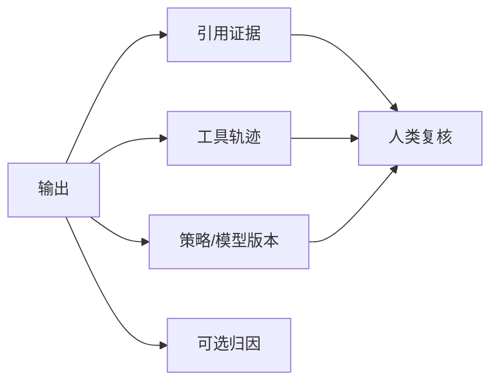

# 机制可解释性

一句话直觉：可解释性不是「再让模型解释一遍」那么简单——要分清事后说辞、特征归因与机制级理解，并匹配监管与运维用途。

## 直觉讲解

**可解释性（Explainability）/ 可解释 AI（XAI）** 帮助人类理解系统为何给出某输出。层次不同：

| 层次 | 含义 | 例 |
|------|------|-----|
| 透明设计 | 模型本身简单 | 线性模型、规则 |
| 事后归因 | 近似哪些输入重要 | 注意力可视化、SHAP/IG、特征消融 |
| 证据式 | 指向外部依据 | RAG 引用条款 |
| 机制级 | 内部电路/特征语义 | 研究向；生产少见完备 |
| 流程级 | 人可审计的步骤 | Agent 轨迹、工具日志 |

对 LLM，**「模型自述原因」不可当忠实解释**——它可能是另一段流畅幻觉。企业更可控的是：**检索证据 + 工具轨迹 + 策略版本 + 人工要点**。

监管语境（如高风险 AI）常要求可追溯与人类监督，不等于要求打开每个神经元。

## 工作示例（数字/场景）

**场景 A：信贷辅助拒绝**

监管要「主要理由」。实践：用可审计特征（收入、负债比、逾期次数）+ 规则/校准模型出拒绝码；LLM 只生成用户可读说明且**不得新增事实**。说明模板绑定拒绝码表。

**场景 B：RAG 客服**

解释=引用 `[政策 3.1]` 回源，而非「因为我是专家」。验收：无引用不得高置信作答。

**场景 C：Agent 误操作**

复盘看轨迹：Thought/Action/Observation 链与权限决策。这是流程可解释，比热力图有用。

| 手段 | 忠实度风险 | 成本 |
|------|------------|------|
| 模型自述 | 高 | 低 |
| RAG 引用 | 中低（若强制校验） | 中 |
| 特征归因 | 中（近似） | 中 |
| 完整机制解析 | 研究向 | 极高 |

## 面试常问取舍

1. **注意力权重=解释？**  
   - 不总是；可能不准或不完整。慎用。  

2. **是否必须白盒模型？**  
   - 看风险等级。高风险决策常要可审计特征与人类批准，不必教条禁 LLM。  

3. **可解释 vs 性能？**  
   - 真有张力；用混合架构：关键决策走可审计路径，LLM 做界面与摘要。  

4. **和校准关系？**  
   - 置信度校准帮助「知不知道」；解释帮助「为什么」。不同。  

## FDE 现场怎么用

1. 问清客户要解释给谁：用户、审计、还是科学家。  
2. 默认交付「证据+轨迹+版本」，别承诺打开 GPT 黑箱。  
3. 高风险域：决策逻辑与话术生成分离。  
4. 评测「解释忠实度」：人为改证据看说法是否变。  
5. 口条：「可引用的证据，胜过自信的叙事。」

## 与本库其他篇的链接

- 同轨：[04-审计轨迹与可追溯](./04-审计轨迹与可追溯.md)、[08-AI治理SOC2-EU-AI-Act](./08-AI治理SOC2-EU-AI-Act.md)、[14-AI事件响应](./14-AI事件响应.md)  
- 评测：[03-评测与ML基础/07-校准与不确定性](../03-评测与ML基础/07-校准与不确定性.md)、[24-忠实度vs答案相关性](../03-评测与ML基础/24-忠实度vs答案相关性.md)  
- RAG：[02-检索与Agent/01-RAG检索增强生成](../02-检索与Agent/01-RAG检索增强生成.md)

## 深入：交付物分层

### 对用户
短理由 + 可点击证据；忌长链「思维」冒充实质。

### 对审计
决策码、特征快照、模型版本、人类批准者。

### 对工程师
轨迹、检索分数、护栏命中、消融实验。

### 评测「忠实解释」
改证据中的关键数字，解释是否跟着变；不变则解释不忠实。

### 课堂小结
可解释性产品化=证据系统+流程日志；别承诺打开专有大模型黑箱。

## 速查清单与一周落地

### 进场 60 秒自检
-  成功 标准是否可测、可告警？
- 失败时能否阻断下游或降级，而不是静默？
- 关键对象是否有明确 owner 与版本？
- 是否存在可演示的回滚/重跑路径？
- 安全与隐私控制是否与功能同迭代，而非上线贴纸？

### 建议一周节奏
| 日 | 动作 |
|----|------|
| D1 | 画现状与爆炸半径；点名权威源/身份/边界 |
| D2 | 定最小验收数字与反例（应失败用例） |
| D3 | 落地最小控制或管道切片 |
| D4 | 用真实量级/红队样本验证 |
| D5 | 写 Runbook、客户沟通点与遗留风险 |

### 面试 60 秒版本
先讲问题的业务爆炸半径，再讲 2–3 个关键控制与可观测证据，最后给回滚/门禁。FDE 分数来自可运营，而不是名词堆叠。

### 常见反模式（再强调）
- 只有快乐路径 Demo，没有否定测试  
- 重试/自动化放大事故（缺幂等或缺开关）  
- 把提示词/文档当唯一强制执行点  
- 指标不可计算或无人看  
- 成本、质量、安全拆成三张互相矛盾的嘴  

### 与上下游的交接句
「这页概念的出口，是可写入 SOW 的门禁与可值班的操作说明；下一篇继续补齐相邻能力。」

## 参考与来源

- 原创综述：企业 AI 可解释性分层与 LLM 现场可行交付物（本篇）。  
- XAI 常见归因方法概念（SHAP 等作对照，不展开公式）。  
- 本库忠实度与审计篇。  
- 提醒：自解释输出必须经事实校验，否则是双倍幻觉。
