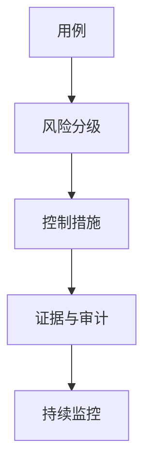

# AI 治理：SOC2 与 EU AI Act

一句话直觉：治理把「模型能做什么」关进政策、控制与证据里——SOC2 偏服务组织控制证明，EU AI Act 偏风险分级与义务；FDE 要会翻译成门禁，不当律师。

## 直觉讲解

**AI 治理（AI Governance）**：组织如何决策、记录、监控与问责 AI 系统全生命周期——用途批准、数据、模型、风险、人力监督、事故。

**SOC 2**：面向服务组织的信任服务标准（安全、可用、机密、处理完整、隐私等原则，按范围裁剪）。客户常要 SOC2 Type II 报告证明控制持续有效。AI 产品并入已有控制：访问、变更、日志、供应商、事件响应；并补模型/数据特有控制。

**EU AI Act**：欧盟人工智能法规，按风险分级（不可接受/高风险/有限风险/最小等，细节以正式文本与适用时间为准）。高风险系统有数据治理、日志、人类监督、透明度等义务。即使团队不在欧盟，客户产品进欧盟市场也可能传导要求。

FDE 角色：把法规/审计语言落成 **架构控制 + 运行证据**，并升级法务/合规 owner，不代替其签署。

## 工作示例（数字/场景）

**场景 A：SOC2 审计问 AI 客服**

审计员抽问：谁能改系统提示？如何记录生产变更？第三方模型供应商如何评估？你要出示：变更单、RBAC、审计日志样例、供应商 SOC/DPA、事件演练记录。

**场景 B：高风险用工筛选助手**

若落入高风险用途叙事：需要数据质量、偏见评估、人类最终决定、日志留存、用户告知。产品设计从「全自动拒信」改为「建议+人审」。

**场景 C：有限风险透明义务**

对用户披露「正在与 AI 对话」；深度伪造类内容标记——产品文案与 UI 要预留。

| 框架 | FDE 可落地证据例 |
|------|------------------|
| SOC2 安全 | SSO、最小权限、密钥、审计 |
| SOC2 变更 | 提示/模型/索引版本变更审批 |
| AI Act 高风险 | 风险档案、人类监督设计、日志 |
| 通用 | 事件响应、供应商清单 |

## 面试常问取舍

1. **有 SOC2 是否等于 AI Act 合规？**  
   - 否。重叠在安全控制，义务集合不同。  

2. **开源模型自己托管是否避开治理？**  
   - 否；责任常更大（你成运营商）。  

3. **治理会不会拖死创新？**  
   - 分级治理：低风险快路径，高风险重门禁。  

4. **FDE 如何回答「合不合规」？**  
   - 「控制已映射，最终意见属合规/法务」——边界清晰反而加分。  

## FDE 现场怎么用

1. 项目启动做用途风险分级（内部简易量表即可）。  
2. 对照客户已有 SOC2 控制，列 AI 缺口清单。  
3. 合同与架构同步：驻留、子处理方、日志、人审。  
4. 准备「审计一页纸」：数据流、模型、控制、owner。  
5. 口条：「治理是可审计的门禁，不是 PPT 价值观。」

## 与本库其他篇的链接

- 同轨：[04-审计轨迹与可追溯](./04-审计轨迹与可追溯.md)、[14-AI事件响应](./14-AI事件响应.md)、[11-数据驻留与主权](./11-数据驻留与主权.md)、[02-PII处理与脱敏](./02-PII处理与脱敏.md)  
- OWASP：[../../07-外文精读/07-OWASP-LLM应用风险Top10.md](../../07-外文精读/07-OWASP-LLM应用风险Top10.md)  
- 生产：[04-生产系统设计/01-从POC到生产](../04-生产系统设计/01-从POC到生产.md)

## 深入：控制映射表示例

### 映射表示意
| 义务/原则 | 控制 | 证据 |
|-----------|------|------|
| 访问安全 | SSO+RBAC | 配置截图/导出 |
| 变更管理 | 提示/模型PR | 工单号 |
| 监测 | 审计+告警 | 仪表盘 |
| 人类监督 | HITL 工具 | 设计说明+抽样 |
| 供应商 | 清单+DPA | 合同 |

### 风险分级工作坊
半日工作坊：列用例 → 初分级 → 缺口 → 排期。输出进 SOW。

### 跨国产品
按最严销售区域设计默认，用配置放松低要求区域——反向更难。

### 课堂小结
治理交付物是映射表与证据夹，不是价值观海报。

## 速查清单与一周落地

### 进场 60 秒自检
-  成功 标准是否可测、可告警？
- 失败时能否阻断下游或降级，而不是静默？
- 关键对象是否有明确 owner 与版本？
- 是否存在可演示的回滚/重跑路径？
- 安全与隐私控制是否与功能同迭代，而非上线贴纸？

### 建议一周节奏
| 日 | 动作 |
|----|------|
| D1 | 画现状与爆炸半径；点名权威源/身份/边界 |
| D2 | 定最小验收数字与反例（应失败用例） |
| D3 | 落地最小控制或管道切片 |
| D4 | 用真实量级/红队样本验证 |
| D5 | 写 Runbook、客户沟通点与遗留风险 |

### 面试 60 秒版本
先讲问题的业务爆炸半径，再讲 2–3 个关键控制与可观测证据，最后给回滚/门禁。FDE 分数来自可运营，而不是名词堆叠。

### 常见反模式（再强调）
- 只有快乐路径 Demo，没有否定测试  
- 重试/自动化放大事故（缺幂等或缺开关）  
- 把提示词/文档当唯一强制执行点  
- 指标不可计算或无人看  
- 成本、质量、安全拆成三张互相矛盾的嘴  

### 与上下游的交接句
「这页概念的出口，是可写入 SOW 的门禁与可值班的操作说明；下一篇继续补齐相邻能力。」

## 参考与来源

- 原创综述：将 SOC2 与 AI Act 风险叙事翻译为 FDE 门禁与证据（本篇）。  
- AICPA SOC 2 与 EU AI Act 公开信息（以正式文本/顾问意见为准）。  
- 本库 OWASP LLM 精读（技术风险互补）。  
- 提醒：法规时效性强，交付前核对适用版本与地域。
