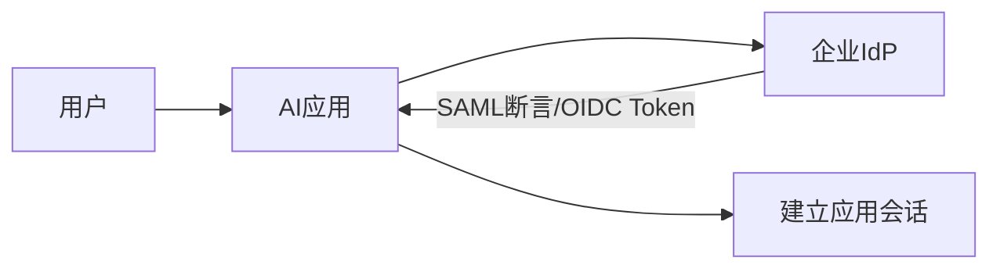

# 企业 SSO：SAML 与 OIDC

一句话直觉：企业要的是「用公司账号登录、离职即失效」——SAML/OIDC 是把身份真相交给 IdP，应用只消费断言/令牌。

## 直觉讲解

**SSO（Single Sign-On）**：用户一次登录，访问多家应用。企业 IdP（Okta、Entra ID、Keycloak 等）是身份权威。

| 协议 | 常见场景 | 凭证形态 |
|------|----------|----------|
| SAML 2.0 | 传统企业 SaaS | XML 断言 |
| OIDC | 现代应用/API/SPA | ID Token（JWT）+ 常配 OAuth2 访问令牌 |
| OAuth2 | 授权委派 | Access/Refresh Token（不是认证协议本身） |

FDE 要点：

1. **强制 SSO**：关掉本地永久密码或仅作 break-glass  
2. **SCIM/入离调**：账号生命周期  
3. **声明映射**：邮箱、部门、组 → 应用角色  
4. **会话与登出**：SLO 支持参差，要测  

细节与权限模型展开见能力补强文；本篇抓 AI 产品对接要点。

## 工作示例（数字/场景）

**场景 A：试点 50 人接 Entra ID**

OIDC 授权码 + PKCE；声明 `groups` 映射应用角色 `ai.admin` / `ai.user`。离职后 IdP 禁用，刷新令牌失效——验证「次日无法用」。

**场景 B：只做了社交登录**

客户安全拒收：必须企业 IdP。POC 重构登录，工期常超预期——尽早对齐。

**场景 C：SAML 与 OIDC 并存**

老 BI 走 SAML，新 Agent 控制台走 OIDC；同一 IdP，两套应用集成。角色声明保持同名，减少双头管理。

| 集成项 | 验收 |
|--------|------|
| SP/Client 配置 | 正确 ACS/redirect URI |
| 签名/加密 | 验断言签名 |
| 声明 | 组/角色齐全 |
| 时钟 | 容忍漂移配置 |
| 离职 | 访问拒绝测通 |

## 面试常问取舍

1. **SAML 还是 OIDC？**  
   - 新应用偏 OIDC；客户只提供 SAML 就适配。别意识形态开战。  

2. **JWT 当会话直接存浏览器？**  
   - 注意窃取与吊销；企业常用短 access + 服务端会话/刷新策略。  

3. **服务到服务也走 SSO？**  
   - 用户 SSO ≠ 服务凭证；见 OAuth2/JWT 与服务凭证篇。  

4. **与 MFA？**  
   - MFA 在 IdP 策略执行；应用可要求 `amr` 等声明。  

## FDE 现场怎么用

1. 第一周确认 IdP 类型与是否必须 SSO。  
2. 角色声明谁维护（IdP 组还是应用内）写进 RACI。  
3. AI 管理面（改提示、导出日志）必须进 SSO+强角色。  
4. 参阅本库能力补强全文做字段级设计。  
5. 口条：「身份权威在 IdP，应用别私建用户宇宙。」

## 与本库其他篇的链接

- 能力补强：[企业SSO与权限模型](../../05-能力补强/企业SSO与权限模型.md)  
- 同轨：[10-RBAC-ABAC与Agent运行时身份](./10-RBAC-ABAC与Agent运行时身份.md)、[13-OAuth2-JWT与服务凭证](./13-OAuth2-JWT与服务凭证.md)、[12-IAM与最小权限](./12-IAM与最小权限.md)  
- 生产：[04-生产系统设计/08-VPC与气隙部署](../04-生产系统设计/08-VPC与气隙部署.md)

## 深入：故障与声明

### 高频故障
时钟漂移、证书过期、ACS URL 环境写错、属性名不一致、用户尚未被赋予组。

### 声明设计
最小：稳定主体 ID、邮箱、组/角色。避免把敏感 HR 属性塞进前端可见令牌。

### 登出
SP 发起登出与 IdP 会话关系测清楚；AI 管理面会话超时要短。

### 与应用角色同步
SCIM 推送 vs 登录时即时映射；延迟同步会造成「已加组仍403」。

### 课堂小结
SSO 是项目关键路径；并行于模型选型，不要留到最后一周。

## 速查清单与一周落地

### 进场 60 秒自检
-  成功 标准是否可测、可告警？
- 失败时能否阻断下游或降级，而不是静默？
- 关键对象是否有明确 owner 与版本？
- 是否存在可演示的回滚/重跑路径？
- 安全与隐私控制是否与功能同迭代，而非上线贴纸？

### 建议一周节奏
| 日 | 动作 |
|----|------|
| D1 | 画现状与爆炸半径；点名权威源/身份/边界 |
| D2 | 定最小验收数字与反例（应失败用例） |
| D3 | 落地最小控制或管道切片 |
| D4 | 用真实量级/红队样本验证 |
| D5 | 写 Runbook、客户沟通点与遗留风险 |

### 面试 60 秒版本
先讲问题的业务爆炸半径，再讲 2–3 个关键控制与可观测证据，最后给回滚/门禁。FDE 分数来自可运营，而不是名词堆叠。

### 常见反模式（再强调）
- 只有快乐路径 Demo，没有否定测试  
- 重试/自动化放大事故（缺幂等或缺开关）  
- 把提示词/文档当唯一强制执行点  
- 指标不可计算或无人看  
- 成本、质量、安全拆成三张互相矛盾的嘴  

### 与上下游的交接句
「这页概念的出口，是可写入 SOW 的门禁与可值班的操作说明；下一篇继续补齐相邻能力。」

## 参考与来源

- 原创综述：企业 SSO 与 SAML/OIDC 在 AI 产品对接中的要点（本篇）。  
- 本库：[企业SSO与权限模型](../../05-能力补强/企业SSO与权限模型.md)。  
- OIDC/SAML 公开规范（实现以 IdP 文档为准）。  
- 提醒：时钟与证书轮换是现场高频故障，写进 Runbook。
