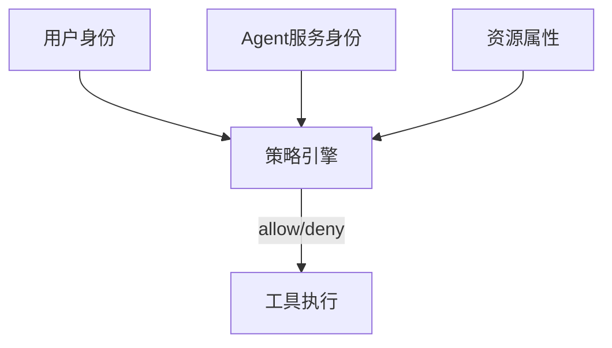

# RBAC、ABAC 与 Agent 运行时身份

一句话直觉：RBAC 按角色发权限；ABAC 按属性做细粒度判决；Agent 还必须有「运行时身份」——它以谁的名义行动，能借多大权。

## 直觉讲解

**RBAC（基于角色）**：用户 → 角色 → 权限。简单、好审计，易角色爆炸。

**ABAC（基于属性）**：用主体、资源、环境、动作属性写策略（如「部门=HR 且 资源标签=HR 且 时间=工作日」）。适合行级/文档级，复杂度更高。

**Agent 运行时身份** 额外问题：

| 模式 | 含义 | 风险 |
|------|------|------|
| 用户委派 | Agent 持用户令牌行事 | 权限过大则爆炸半径=用户 |
| 服务身份 | Agent 用自己的机器身份 | 需细权+模拟用户读数据 |
| 双身份 | 服务认证 + 用户授权上下文 | 常见稳健设计 |

反模式：Agent 共用万能服务账号读全公司；或把用户 JWT 原样交给不可信工具链。

## 工作示例（数字/场景）

**场景 A：权限感知 RAG**

检索前用 ABAC：`user.clearance >= doc.clearance AND doc.tenant == user.tenant`。Agent 无独立「升权」通道。

**场景 B：工具调用**

`create_ticket` 允许；`wire_transfer` 要求角色 `finance.approver` + 金额 < 限额 + HITL。Agent 身份不能因为「会说话」就获批。

**场景 C：角色爆炸**

为每客户定制 80 个角色。治理改为：基础 RBAC + 资源属性标签，策略中心化。

| 决策 | 建议 |
|------|------|
| 粗粒度管理面 | RBAC |
| 文档/行级 | ABAC/ReBAC |
| 高危工具 | 显式允许列表+人审 |
| 模拟用户 | 短时、审计、不可用于提权 |

## 面试常问取舍

1. **只要 RBAC？**  
   - 管理面可以；数据面多不够。  

2. **Agent 该不该有比用户更大权限？**  
   - 默认否。例外需书面风险接受。  

3. **ReBAC（关系型）？**  
   - Google Zanzibar 类；适合复杂共享关系，引入成本高。  

4. **策略写在提示词？**  
   - 仅作说明；强制执行在策略引擎/数据层。  

## FDE 现场怎么用

1. 画身份图：用户、Agent、工具、数据四格。  
2. 每个工具标注所需权限与身份模式。  
3. 接企业 SSO 声明 → 角色/属性。  
4. 串权与提权测试进验收。  
5. 口条：「Agent 是主体，不是宇宙管理员。」

详设参考本库 [企业SSO与权限模型](../../05-能力补强/企业SSO与权限模型.md)。

## 与本库其他篇的链接

- 能力：[企业SSO与权限模型](../../05-能力补强/企业SSO与权限模型.md)  
- 同轨：[09-企业SSO-SAML-OIDC](./09-企业SSO-SAML-OIDC.md)、[12-IAM与最小权限](./12-IAM与最小权限.md)、[16-Agent沙箱与执行隔离](./16-Agent沙箱与执行隔离.md)、[06-多租户与数据隔离](./06-多租户与数据隔离.md)  
- 检索：[02-检索与Agent/18-权限感知RAG](../02-检索与Agent/18-权限感知RAG.md)、[20-有界自主与人在回路](../02-检索与Agent/20-有界自主与人在回路.md)

## 深入：策略引擎与测试

### 策略即代码
用可测策略语言/引擎（或中心服务），附单元测试：给定主体属性与资源，期望 allow/deny。

### 令牌交换
用户 → Agent 服务的 token exchange 限定受众与范围，防令牌被拿到浏览器乱用。

### 紧急提权
break-glass 角色有时限与告警；禁止「长期上帝 Agent」。

### 与检索
ABAC 决策应在检索前；提示词里的「不要看别人文件」无效。

### 课堂小结
运行时身份设计先于工具清单；工具清单先于提示词文采。

## 速查清单与一周落地

### 进场 60 秒自检
-  成功 标准是否可测、可告警？
- 失败时能否阻断下游或降级，而不是静默？
- 关键对象是否有明确 owner 与版本？
- 是否存在可演示的回滚/重跑路径？
- 安全与隐私控制是否与功能同迭代，而非上线贴纸？

### 建议一周节奏
| 日 | 动作 |
|----|------|
| D1 | 画现状与爆炸半径；点名权威源/身份/边界 |
| D2 | 定最小验收数字与反例（应失败用例） |
| D3 | 落地最小控制或管道切片 |
| D4 | 用真实量级/红队样本验证 |
| D5 | 写 Runbook、客户沟通点与遗留风险 |

### 面试 60 秒版本
先讲问题的业务爆炸半径，再讲 2–3 个关键控制与可观测证据，最后给回滚/门禁。FDE 分数来自可运营，而不是名词堆叠。

### 常见反模式（再强调）
- 只有快乐路径 Demo，没有否定测试  
- 重试/自动化放大事故（缺幂等或缺开关）  
- 把提示词/文档当唯一强制执行点  
- 指标不可计算或无人看  
- 成本、质量、安全拆成三张互相矛盾的嘴  

### 与上下游的交接句
「这页概念的出口，是可写入 SOW 的门禁与可值班的操作说明；下一篇继续补齐相邻能力。」

## 参考与来源

- 原创综述：RBAC/ABAC 与 Agent 双身份设计（本篇）。  
- 本库企业 SSO 与权限模型长文。  
- OWASP LLM 中不安全输出与权限相关条目。  
- 提醒：权限测试要用「应该失败」的用例度量。
