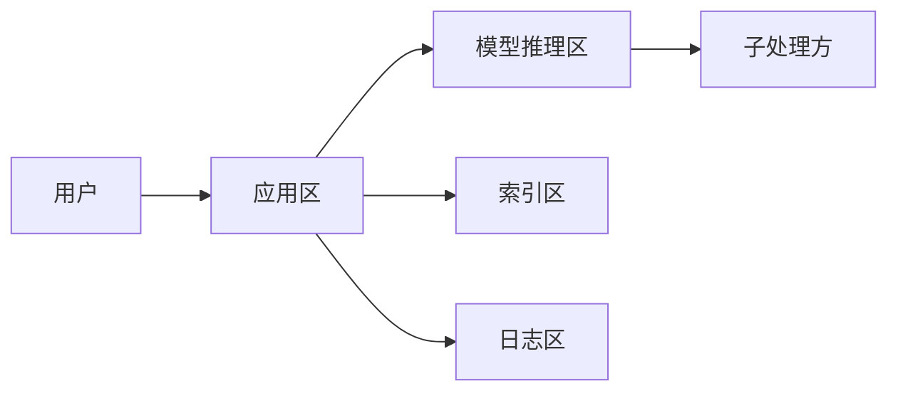

# 数据驻留与主权

一句话直觉：驻留问「数据躺在哪」；主权问「谁管辖、跨境是否合法」——AI 把提示、日志、嵌入与供应商子处理方全部拉进版图。

## 直觉讲解

**数据驻留（Data Residency）**：数据存储与处理发生在约定地理区域（如「仅欧盟区域」）。

**数据主权（Data Sovereignty）**：更强调法律管辖与控制权——即便物理在某国，访问主体、执法请求、运维人员国籍/位置也可能触发合规问题。合同与架构要一起看。

AI 路径上的数据面：

| 资产 | 常被忽略 |
|------|----------|
| 提示与回答 | 厂商保留/日志 |
| 向量索引 | 副本区域 |
| 评测集 | 笔记本与对象存储 |
| 微调权重 | 可能含数据痕迹 |
| 支持导出 | 工单附件出境 |

部署模型（SaaS / BYOC / 本地 / 气隙）直接决定默认可承诺的驻留强度。

## 工作示例（数字/场景）

**场景 A：客户要求「数据不出境」**

核查：API 端点区域、备份区域、DR、支持人员远程访问、CDN、错误上报 SaaS。任一环节在境外即需披露或改架构。

**场景 B：向量库在 A 区，对象存储原件在 B 区**

驻留叙事破裂。统一区域或拆分租户。

**场景 C：开源模型客户 VPC**

原始文档不出 VPC，但若用境外镜像拉模型/遥测，仍可能违规——供应链也要入图。

| 承诺级别 | 典型手段 |
|----------|----------|
| 软偏好 | 选区域端点 |
| 合同驻留 | 区域绑定+审计权 |
| 强控制 | BYOC/本地+禁用外发 |
| 气隙 | 无外联，更新走人工介质 |

## 面试常问取舍

1. **加密是否等于驻留合规？**  
   - 加密很重要，但不自动满足驻留/跨境法。  

2. **欧盟个人数据一定不能出欧？**  
   - 取决于机制（充分性、条款等）——交法务；工程提供选项。  

3. **多区域活跃-活跃？**  
   - 提高可用性，挑战驻留；或按租户钉区域。  

4. **与联邦学习？**  
   - FL 解决「训练数据出门」一类问题；推理与日志仍要驻留设计。  

## FDE 现场怎么用

1. 画「数据出境图」含所有子处理方。  
2. SOW 写清区域、备份、支持访问、训练是否使用客户数据。  
3. 评测与 CI 数据同样遵守驻留，勿用个人笔记本当例外。  
4. 供应商问卷纳入选型分。  
5. 口条：「驻留是架构+合同+运维三人四脚。」

## 与本库其他篇的链接

- 同轨：[02-PII处理与脱敏](./02-PII处理与脱敏.md)、[05-联邦学习](./05-联邦学习.md)、[08-AI治理SOC2-EU-AI-Act](./08-AI治理SOC2-EU-AI-Act.md)、[06-多租户与数据隔离](./06-多租户与数据隔离.md)  
- 部署：[04-生产系统设计/18-部署模型SaaS-BYOC-OnPrem-气隙](../04-生产系统设计/18-部署模型SaaS-BYOC-OnPrem-气隙.md)、[08-VPC与气隙部署](../04-生产系统设计/08-VPC与气隙部署.md)

## 深入：子处理方与支持访问

### 子处理方清单
模型 API、日志 SaaS、邮件、错误追踪、工单——逐个标区域与数据类别。

### 支持访问
境外 L2 是否可开隧道看生产？若否，要本地区支持或客户自持。

### 训练用途开关
合同写死「默认不用于训练」；技术上独立租户密钥与保留策略佐证。

### DR 矛盾
异地灾备 vs 驻留——提前让合规选：可用性优先还是区域优先。

### 课堂小结
驻留图上画全才算数；漏画一个遥测 SDK 就可能破功。

## 速查清单与一周落地

### 进场 60 秒自检
-  成功 标准是否可测、可告警？
- 失败时能否阻断下游或降级，而不是静默？
- 关键对象是否有明确 owner 与版本？
- 是否存在可演示的回滚/重跑路径？
- 安全与隐私控制是否与功能同迭代，而非上线贴纸？

### 建议一周节奏
| 日 | 动作 |
|----|------|
| D1 | 画现状与爆炸半径；点名权威源/身份/边界 |
| D2 | 定最小验收数字与反例（应失败用例） |
| D3 | 落地最小控制或管道切片 |
| D4 | 用真实量级/红队样本验证 |
| D5 | 写 Runbook、客户沟通点与遗留风险 |

### 面试 60 秒版本
先讲问题的业务爆炸半径，再讲 2–3 个关键控制与可观测证据，最后给回滚/门禁。FDE 分数来自可运营，而不是名词堆叠。

### 常见反模式（再强调）
- 只有快乐路径 Demo，没有否定测试  
- 重试/自动化放大事故（缺幂等或缺开关）  
- 把提示词/文档当唯一强制执行点  
- 指标不可计算或无人看  
- 成本、质量、安全拆成三张互相矛盾的嘴  

### 与上下游的交接句
「这页概念的出口，是可写入 SOW 的门禁与可值班的操作说明；下一篇继续补齐相邻能力。」

## 参考与来源

- 原创综述：AI 数据面的驻留/主权工程化清单（本篇）。  
- 本库部署模型篇。  
- 跨境传输法律机制由法务解释。  
- 提醒：口头「我们用某云国内区」不等于证据；要看实际资源配置。
