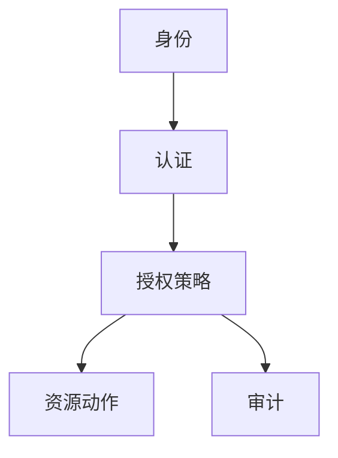

# IAM 与最小权限

一句话直觉：IAM 决定「谁能碰什么」；最小权限意味着默认拒绝，只开完成任务所需的最短特权——对人和对 Agent 一体适用。

## 直觉讲解

**IAM（Identity and Access Management）** 覆盖身份生命周期、认证、授权、特权管理与审计。云 IAM（角色、策略、条件键）与应用 RBAC 是两层，常同时存在。

**最小权限（Least Privilege）**：主体仅获必要权限，限时间、限资源、限动作。对立面是共享管理员、长期 AK/SK、「*:*」策略。

AI 系统特权面：

| 主体 | 常见过度授权 |
|------|----------------|
| 数据科学家 | 生产对象存储只读变读写 |
| CI 管道 | 云账号管理员 |
| Agent 运行时 | 全表查询、任意出网 |
| 向量管道 | 读所有桶 |
| 支持人员 | 无审计看生产提示 |

特权提升应走 JIT（即时）、审批、过期；break-glass 有双人与复盘。

## 工作示例（数字/场景）

**场景 A：Agent 查仓**

错误：服务账号 `SELECT` 任意库。正确：仅 `views.ai_safe_*`；行级策略；语句超时与扫描上限。

**场景 B：密钥扫库**

CI 误打打印环境变量，IAM 密钥泄漏。缓解：短命凭证、OIDC 联邦上云（无长期密钥）、泄漏扫描。

**场景 C：权限膨胀半年**

项目结束未收回角色。定期访问评审（季度）砍权限；指标：人类与机器身份的特权数。

| 实践 | 说明 |
|------|------|
| 默认拒绝 | 显式允许 |
| 分离职责 | 改策略者 ≠ 审批者 |
| 短命凭证 | 小时级 |
| 条件策略 | IP/VPC/时间/MFA |
| 持续发现 | 未用权限收缩 |

## 面试常问取舍

1. **开发图快给 Admin？**  
   - POC 可临时，入生产必须收回并写风险。  

2. **ABAC 条件 vs 多角色？**  
   - 条件减角色爆炸；过复杂难审。  

3. **人与机器身份？**  
   - 分开管理；机器用工作负载身份。  

4. **与零信任？**  
   - 最小权限是零信任支柱之一；还要持续验证。  

## FDE 现场怎么用

1. 列出所有人类/机器身份与其云+应用权限。  
2. Agent/工具单独角色，禁止借用个人云密钥。  
3. 上线前 privilege review；上线后 30 天再砍。  
4. 对接 SSO 组，避免本地永久管理员。  
5. 口条：「权限是负债，能少则少，能短则短。」

## 与本库其他篇的链接

- 同轨：[09-企业SSO-SAML-OIDC](./09-企业SSO-SAML-OIDC.md)、[10-RBAC-ABAC与Agent运行时身份](./10-RBAC-ABAC与Agent运行时身份.md)、[13-OAuth2-JWT与服务凭证](./13-OAuth2-JWT与服务凭证.md)、[15-Secrets管理](./15-Secrets管理.md)  
- 能力：[企业SSO与权限模型](../../05-能力补强/企业SSO与权限模型.md)  
- OWASP：[../../07-外文精读/07-OWASP-LLM应用风险Top10.md](../../07-外文精读/07-OWASP-LLM应用风险Top10.md)

## 深入：机器身份与评审

### 工作负载身份
K8s SA → 云 IAM 角色；禁节点级万能角色。Agent 部署单独 SA。

### 权限分析
用云「最后使用」时间收缩策略；季度访问评审会议有纪要。

### 策略测试
IAM 模拟器/干跑：发布前确认不会误杀生产只读路径，也不会放开写。

### 人类账户
个人云账号与生产分离；生产用联邦登录+MFA。

### 课堂小结
最小权限是持续过程：授予、使用、收缩、再授予。

## 速查清单与一周落地

### 进场 60 秒自检
-  成功 标准是否可测、可告警？
- 失败时能否阻断下游或降级，而不是静默？
- 关键对象是否有明确 owner 与版本？
- 是否存在可演示的回滚/重跑路径？
- 安全与隐私控制是否与功能同迭代，而非上线贴纸？

### 建议一周节奏
| 日 | 动作 |
|----|------|
| D1 | 画现状与爆炸半径；点名权威源/身份/边界 |
| D2 | 定最小验收数字与反例（应失败用例） |
| D3 | 落地最小控制或管道切片 |
| D4 | 用真实量级/红队样本验证 |
| D5 | 写 Runbook、客户沟通点与遗留风险 |

### 面试 60 秒版本
先讲问题的业务爆炸半径，再讲 2–3 个关键控制与可观测证据，最后给回滚/门禁。FDE 分数来自可运营，而不是名词堆叠。

### 常见反模式（再强调）
- 只有快乐路径 Demo，没有否定测试  
- 重试/自动化放大事故（缺幂等或缺开关）  
- 把提示词/文档当唯一强制执行点  
- 指标不可计算或无人看  
- 成本、质量、安全拆成三张互相矛盾的嘴  

### 与上下游的交接句
「这页概念的出口，是可写入 SOW 的门禁与可值班的操作说明；下一篇继续补齐相邻能力。」

## 参考与来源

- 原创综述：IAM 最小权限在 AI/Agent 交付中的检查清单（本篇）。  
- 云厂商 IAM 最佳实践（按客户云裁剪）。  
- 本库权限与 SSO 文。  
- 提醒：策略即代码，走 PR 与计划差异（policy diff）。
