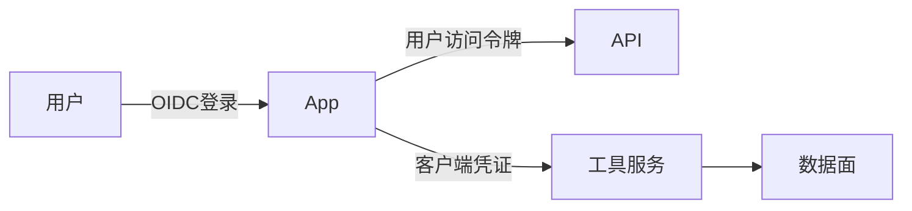

# OAuth2、JWT 与服务凭证

一句话直觉：OAuth2 管「授权委派」；OIDC 在其上管「登录是谁」；JWT 是常见令牌格式；服务凭证则是机器之间的信任——别把它们糊成一团。

## 直觉讲解

**OAuth 2.0**：授权框架。资源所有者同意后，客户端获得 **Access Token** 访问受保护 API。常见许可：授权码（+PKCE）、客户端凭证、设备码等。

**OIDC**：在 OAuth2 上加 **ID Token** 表达用户认证。企业 SSO 现代应用多用 OIDC。

**JWT（JSON Web Token）**：签名（可加密）的声明包，常作 ID/Access Token。注意：JWT 自包含，**吊销需额外机制**（短 TTL、黑名单、版本号）。

**服务凭证**：`client_id/secret`、云 IAM 角色、mTLS 证书、工作负载身份。用于 Agent↔工具、后端↔模型网关。

反模式：长期把用户密码存 Agent；在提示词里塞 secret；用同一 client secret 打所有环境。

## 工作示例（数字/场景）

**场景 A：Agent 调企业内部 API**

用户登录拿委托令牌（或 token exchange）；Agent 后端用 **自己的** 服务身份调 API，并传用户上下文声明。API 验两层：调用方服务 + 用户权限。

**场景 B：JWT 太大塞满头**

把权限树塞进 JWT 导致头 20KB。改为薄令牌 + 服务端策略查询。

**场景 C：泄漏的 client secret**

Git 历史发现 secret。立即轮换、失效旧凭证、查审计。改用密钥管理与扫描门禁。

| 凭证 | TTL 建议感 | 存放 |
|------|------------|------|
| Access Token | 分钟～小时 | 内存/安全存储 |
| Refresh | 更长 | HttpOnly/服务器 |
| Client Secret | 可轮换 | Secrets 管理器 |
| 云角色 | 临时 STS | 无长期密钥 |

## 面试常问取舍

1. **JWT vs 不透明 token？**  
   - JWT 减查表；吊销与体积是代价。网关密集校验场景常用。  

2. **客户端凭证会不会被滥用？**  
   - 会；最小范围、网络限制、mTLS、轮换。  

3. **把 Access Token 给前端 Agent.js？**  
   - 公有客户端风险高；尽量 BFF 模式，密钥留服务器。  

4. **与 API Key 差别？**  
   - API Key 简单但粗；OAuth 范围与委托更清晰。遗留系统可能并存。  

## FDE 现场怎么用

1. 分清三张图：用户登录、用户委派、服务间。  
2. 所有 secret 进 Secrets 管理器；仓库扫描。  
3. 模型网关用短命服务凭证，不用个人 Key。  
4. 记录 `client_id`、范围、用户子于审计。  
5. 口条：「令牌是权力的复印件，复印件要能作废。」

## 与本库其他篇的链接

- 同轨：[09-企业SSO-SAML-OIDC](./09-企业SSO-SAML-OIDC.md)、[12-IAM与最小权限](./12-IAM与最小权限.md)、[15-Secrets管理](./15-Secrets管理.md)、[10-RBAC-ABAC与Agent运行时身份](./10-RBAC-ABAC与Agent运行时身份.md)  
- 能力：[企业SSO与权限模型](../../05-能力补强/企业SSO与权限模型.md)  
- 生产：[04-生产系统设计/12-集成用REST-API设计](../04-生产系统设计/12-集成用REST-API设计.md)

## 深入：范围、受众与轮换

### audience / scope
令牌受众绑到具体 API；范围粒度为 `tool:refund` 而非 `admin`。

### 刷新与吊销
用户离职：IdP 会话废，刷新令牌废，网关黑名单短 TTL 残余。

### mTLS
高敏感服务间可叠加互认证书，降低被盗 bearer 的重放。

### 环境隔离
dev/staging/prod 不同 client；防开发调生产。

### 课堂小结
分清登录、委派、服务凭证三条链；每条链有 TTL 与轮换剧本。

## 速查清单与一周落地

### 进场 60 秒自检
-  成功 标准是否可测、可告警？
- 失败时能否阻断下游或降级，而不是静默？
- 关键对象是否有明确 owner 与版本？
- 是否存在可演示的回滚/重跑路径？
- 安全与隐私控制是否与功能同迭代，而非上线贴纸？

### 建议一周节奏
| 日 | 动作 |
|----|------|
| D1 | 画现状与爆炸半径；点名权威源/身份/边界 |
| D2 | 定最小验收数字与反例（应失败用例） |
| D3 | 落地最小控制或管道切片 |
| D4 | 用真实量级/红队样本验证 |
| D5 | 写 Runbook、客户沟通点与遗留风险 |

### 面试 60 秒版本
先讲问题的业务爆炸半径，再讲 2–3 个关键控制与可观测证据，最后给回滚/门禁。FDE 分数来自可运营，而不是名词堆叠。

### 常见反模式（再强调）
- 只有快乐路径 Demo，没有否定测试  
- 重试/自动化放大事故（缺幂等或缺开关）  
- 把提示词/文档当唯一强制执行点  
- 指标不可计算或无人看  
- 成本、质量、安全拆成三张互相矛盾的嘴  

### 与上下游的交接句
「这页概念的出口，是可写入 SOW 的门禁与可值班的操作说明；下一篇继续补齐相邻能力。」

## 参考与来源

- 原创综述：OAuth2/OIDC/JWT/服务凭证在 AI 集成中的边界（本篇）。  
- OAuth 2.0 / OIDC 公开规范。  
- 本库 SSO 与 Secrets 篇。  
- 提醒：复制粘贴「JWT 最安全」是错的；安全在于签发、存储、TTL 与验证完整链路。
